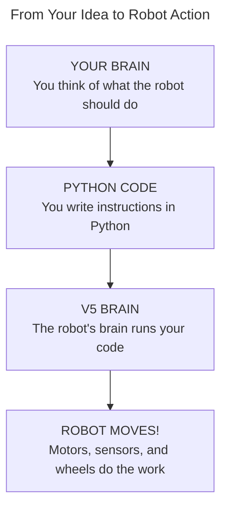
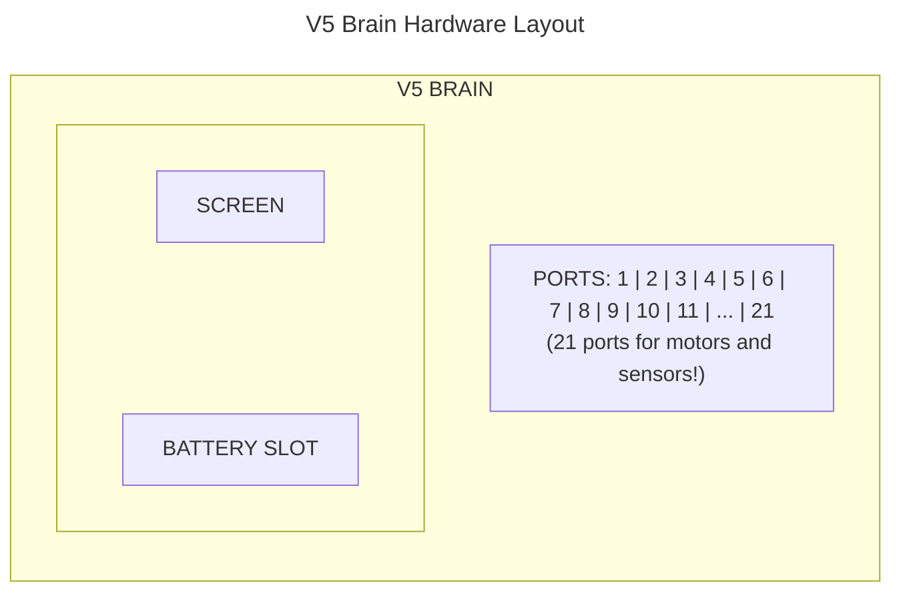

# Tutorial 0: Welcome to VEX V5 Robotics!

**Time:** ~15 minutes
**Prerequisites:** None! Just bring your curiosity.

---

## What is VEX V5 Robotics?

Imagine building a robot from scratch, then telling it exactly what to do using code you write yourself. That's VEX V5 robotics!



**VEX V5** is a robotics system used by students worldwide in competitions. You build robots from metal parts, motors, and sensors, then program them using Python (a beginner-friendly programming language).

## You Already Know More Than You Think!

Before you worry about coding being "too hard," let's see what you already know:

| What You Know | How It Helps |
|---------------|--------------|
| Video game controllers | You know joysticks control movement! |
| Pushing a shopping cart | You understand force and resistance |
| Riding a bicycle | You've used gears (low gear for hills!) |
| Following a recipe | That's basically what coding is! |
| Playing strategy games | You can think ahead and plan |

See? You're already halfway there!

## What You'll Learn in This Tutorial Series

By the end of these tutorials, you will be able to:

- [ ] Understand basic physics concepts like force, torque, and friction
- [ ] Know every part of your VEX V5 robot
- [ ] Write Python code from scratch
- [ ] Control your robot with a game controller
- [ ] Program autonomous routines (robot drives itself!)
- [ ] Develop winning strategies for the Push Back competition

## Meet Your Robot's Code Files

Let's take a tour of the code files you'll be working with. They're all in the `src/` folder:

```
src/
├── main.py            ← The starting point (like pressing "Start" in a game)
├── robot_config.py    ← Where you tell the code about your motors
├── autonomous.py      ← Code that runs WITHOUT a driver (15 seconds!)
├── driver_control.py  ← Code that reads your joystick inputs
└── utils.py           ← Helper functions (like a toolkit)
```

### main.py - The Starting Point

When you download code to your robot, this is what runs first:

```python
# This is the FIRST thing that runs!
def main():
    brain.screen.print("Robot Ready!")
    driver_control_loop()  # Start listening for controller
```

Think of it like the main menu of a video game - it sets everything up and then starts the action.

### robot_config.py - Your Robot's Blueprint

This file describes your robot's hardware:

```python
# Left motors on ports 1 and 2
left_motor_front = Motor(Ports.PORT1)
left_motor_back = Motor(Ports.PORT2)

# Right motors on ports 3 and 4 (reversed!)
right_motor_front = Motor(Ports.PORT3, reversed=True)
right_motor_back = Motor(Ports.PORT4, reversed=True)
```

Why are right motors "reversed"? We'll explain in the Robot Anatomy tutorial!

### driver_control.py - You're the Driver!

This is where joystick movements become motor movements:

```python
while True:
    # Read joystick positions
    left_speed = controller.axis3.position()   # Left stick up/down
    right_speed = controller.axis2.position()  # Right stick up/down

    # Move the motors!
    left_motors.spin(left_speed)
    right_motors.spin(right_speed)
```

It's a continuous loop - constantly reading your inputs and moving motors.

### autonomous.py - Robot Drives Itself!

For the first 15 seconds of a match, no human control allowed:

```python
def autonomous_routine():
    # Drive forward 500mm
    drivetrain.drive_for(FORWARD, 500, MM)

    # Turn right 90 degrees
    drivetrain.turn_for(RIGHT, 90, DEGREES)

    # Drive forward again
    drivetrain.drive_for(FORWARD, 300, MM)
```

You write these instructions BEFORE the match. The robot follows them exactly!

### utils.py - Your Toolkit

Helper functions that make coding easier:

```python
def deadband(value, threshold=5):
    """
    If joystick is barely moved, treat it as zero.
    Prevents drift from joystick that's not perfectly centered.
    """
    if abs(value) < threshold:
        return 0
    return value
```

You'll learn to write functions like this yourself!

## The VEX V5 Hardware

Here's what you're working with:



```
    +--------------------------------------------------+
    |                  V5 CONTROLLER                    |
    |                                                   |
    |        [L1]                        [R1]          |
    |        [L2]                        [R2]          |
    |                                                   |
    |     +-------+                  +-------+          |
    |     | LEFT  |    [BUTTONS]     | RIGHT |          |
    |     | STICK |    [A][B]        | STICK |          |
    |     +-------+    [X][Y]        +-------+          |
    |                                                   |
    |         [UP]                                      |
    |   [LEFT] [X] [RIGHT]                             |
    |         [DOWN]                                    |
    +--------------------------------------------------+
```

**V5 Brain:** The robot's computer. Runs your code, displays info, connects to motors.

**V5 Controller:** Your game controller. Joysticks, buttons, bumpers - just like Xbox or PlayStation!

## Setting Up Your Environment

### Step 1: Open VS Code

1. Launch VS Code on your computer
2. Go to **File → Open Folder**
3. Navigate to this project folder (where you see `src/`, `tests/`, etc.)
4. Click **Open**

### Step 2: Check the VEX Extension

Look in the left sidebar for the VEX icon:

```
    [📁 Explorer]
    [🔍 Search]
    [🔀 Git]
    [▶️ VEX]      <-- You should see this!
    [🧩 Extensions]
```

If you don't see it, install the "VEX Robotics" extension from the Extensions tab.

### Step 3: Activate the Virtual Environment

Open the terminal in VS Code (View → Terminal) and type:

**Mac/Linux:**
```bash
source venv/bin/activate
```

**Windows:**
```bash
venv\Scripts\activate
```

You'll see `(venv)` at the start of your command line - that means it's working!

### Step 4: Run the Tests

Let's make sure everything is set up correctly:

```bash
make test
```

You should see something like:

```
============= 48 passed in 0.04s =============
```

All 48 tests passing means your environment is ready!

## What's Next?

Now that you've met your code files and set up your environment, you're ready to learn the fundamentals.

### Your Learning Path

```
[✓] Tutorial 0: Welcome (You are here!)
[ ] Tutorial 1: Physics Foundations
[ ] Tutorial 2: Robot Anatomy
[ ] Tutorial 3: Python Basics
[ ] Tutorial 4: Drive Control
[ ] Tutorial 5: Autonomous Programming
[ ] Tutorial 6: Competition Strategy
[ ] Tutorial 7: Advanced Topics
```

## Before You Go: Quick Quiz

Test your understanding! (Answers at bottom)

1. Which file runs first when you download code to the robot?
2. How many ports does the V5 Brain have?
3. What does `autonomous.py` do?
4. Why might right motors be "reversed"?

---

## Exercise: Explore the Code

Open each of these files in VS Code and just look around:

1. `src/main.py` - Can you find where it prints "Robot Ready!"?
2. `src/robot_config.py` - What port numbers are the motors on?
3. `src/utils.py` - Can you find the `deadband` function?

Don't worry about understanding everything yet - that's what the next tutorials are for!

---

**[Next: Tutorial 1 - Physics Foundations →](../01-physics-foundations/01-forces-and-motion.md)**

---

### Quiz Answers

1. `main.py` - it's the entry point
2. 21 ports for motors and sensors
3. Contains code that runs during the 15-second autonomous period (no driver!)
4. Because right-side motors are mounted as a mirror of left-side motors, so they need to spin the opposite direction to move forward
