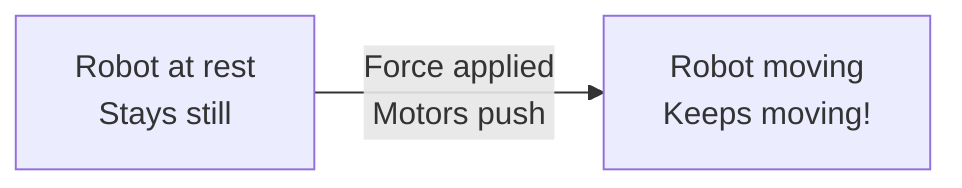
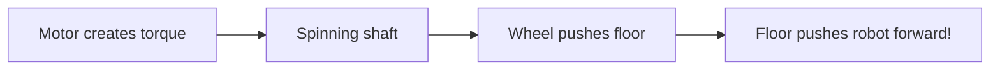

# Tutorial 1.1: Forces and Motion

**Time:** ~15 minutes
**Prerequisites:** Tutorial 0: Welcome

---

## The Shopping Cart Analogy

Imagine you're at a grocery store with a shopping cart.

```
    Empty Cart                    Full Cart

    +-------+                     +-------+
    |       |  LIGHT              |███████|  HEAVY
    |       |  Easy to push       |███████|  Hard to push
    +---+---+                     +---+---+
        |                             |
       [O]                           [O]
```

**Question:** Which cart is easier to push? Why?

The empty cart is easier because it has less **mass** (weight). You need less **force** to move it.

This simple observation is the foundation of physics that makes robots work!

## Newton's Three Laws (The Simple Version)

Sir Isaac Newton figured out the rules of motion about 400 years ago. Here's what they mean for your robot:

### Law 1: Objects Stay Put (or Keep Moving)

> "An object at rest stays at rest, and an object in motion stays in motion, unless a force acts on it."

**For your robot:**
- Your robot won't move unless motors push it
- Your robot won't stop unless you tell it to (or friction slows it)



### Law 2: Force = Mass × Acceleration (F = m × a)

> "The force needed to move something depends on how heavy it is and how fast you want it to go."

**For your robot:**
- Heavier robot = need more motor power
- Want faster acceleration = need more motor power
- This is why we choose motor gear ratios carefully!

```
    SAME FORCE, DIFFERENT MASS:

    Light Robot                Heavy Robot
    +--------+                 +===========+
    |   5kg  |  →→→→→→→→      |    15kg   |  →→
    +--[O][O]+                 +===[O][O]==+

    Accelerates FAST          Accelerates SLOW
```

### Law 3: Every Action Has a Reaction

> "When you push something, it pushes back."

**For your robot:**
- When wheels push against the floor, the floor pushes your robot forward
- When you push an opponent, they push back on you
- This is why heavier robots are harder to push around!

```
    Your Robot     Opponent

    +--------+    +--------+
    |  PUSH →|    |← PUSHES|
    |        |    |  BACK! |
    +--[O][O]+    +--[O][O]+

    Action        Reaction
```

## How This Applies to Robot Motors

Your VEX V5 motors create **force** by spinning. That spinning force is called **torque**.



### The Force Equation in Practice

Let's say your robot weighs **5 kg** and you want it to accelerate at **2 m/s²**:

```
Force = Mass × Acceleration
Force = 5 kg × 2 m/s²
Force = 10 Newtons
```

Your motors need to provide at least 10 Newtons of force!

> **Note:** VEX motors are rated in torque (Newton-meters), not Newtons directly. We'll cover torque in the next tutorial!

## Why Robot Weight Matters

In the **Push Back** competition, you might need to push opponents or resist being pushed:

```
    Pushing Match:

    Light Robot (5kg)        Heavy Robot (15kg)
    +--------+               +============+
    |        |  →→→          |            |
    +--[O][O]+               +===[O][O]===+

    Light robot pushes...    Heavy robot barely moves!

    But gets pushed back!    And can push light robot around!

    ←←←←←←←←                 →→→→→→→→→→→→→→→
```

**Trade-off:**
- Heavy robot = hard to push, but slower and needs more battery
- Light robot = fast and agile, but easier to push around

For Push Back, you'll need to decide what's more important for your strategy!

## Code Connection: Limiting Force

Look at `src/utils.py`:

```python
def clamp(value, min_val, max_val):
    """
    Clamp a value between minimum and maximum bounds.
    """
    return max(min_val, min(value, max_val))
```

This function limits values - like limiting how much force a motor can apply!

**Example:**
```python
motor_power = 150  # Someone requested 150% power
clamped_power = clamp(motor_power, -100, 100)  # But max is 100%
# Result: clamped_power = 100
```

Why do we clamp? Because:
1. Motors have maximum power limits
2. Too much power can damage mechanisms
3. You might want to limit speed for safety

## Friction: The Hidden Force

Friction is the force that resists motion. It happens whenever two surfaces touch.

```
    Robot on smooth floor    Robot on carpet

    +--------+               +--------+
    |        |               |        |
    +--[O][O]+               +--[O][O]+
    ═════════════           ~~~~~~~~~~~~
    Low friction            High friction

    Easy to slide           Hard to move
```

**For your robot:**
- **Too little friction** = wheels spin but robot doesn't move (like on ice)
- **Too much friction** = motors work hard, battery drains fast
- **Just right** = wheels grip and robot moves efficiently

This is why we choose different wheel types:
- **Traction wheels** = high friction for pushing
- **Omni wheels** = can slide sideways (we'll explain why that's useful!)

## Momentum: Why Heavy Things Are Hard to Stop

**Momentum = Mass × Velocity**

```
    Slow, heavy robot           Fast, light robot

    +============+              +--------+
    |   15kg    |  → (2 m/s)   |  5kg   |  →→→→ (6 m/s)
    +===[O][O]==+              +--[O][O]+

    Momentum = 30 kg·m/s       Momentum = 30 kg·m/s

    SAME momentum, but the heavy robot is harder to dodge!
```

In Push Back, a heavy robot moving slowly has lots of momentum - hard to stop or redirect!

---

## Summary

| Concept | What It Means | For Your Robot |
|---------|---------------|----------------|
| Mass | How heavy something is | Affects speed and pushing ability |
| Force | Push or pull | Motors create force to move robot |
| Acceleration | How fast speed changes | More force = faster acceleration |
| Friction | Resistance between surfaces | Wheels need friction to grip |
| Momentum | Mass × velocity | Hard to stop heavy/fast objects |

---

## Exercise: Force Calculations

**Problem 1:** Your robot weighs 8 kg. How much force do you need to accelerate at 3 m/s²?

```
F = m × a
F = ___ × ___
F = ___ Newtons
```

**Problem 2:** You have two robots:
- Robot A: 6 kg, moving at 4 m/s
- Robot B: 12 kg, moving at 2 m/s

Which has more momentum? Which would be harder to stop?

**Problem 3:** Look at the `clamp()` function in `src/utils.py`. What would `clamp(-150, -100, 100)` return?

---

## Answers

**Problem 1:** F = 8 × 3 = 24 Newtons

**Problem 2:**
- Robot A momentum: 6 × 4 = 24 kg·m/s
- Robot B momentum: 12 × 2 = 24 kg·m/s
- Same momentum! But Robot B has more mass, so it's harder to redirect.

**Problem 3:** `clamp(-150, -100, 100)` returns `-100` (the minimum allowed value)

---

**[← Previous: Welcome](../00-welcome/index.md)** | **[Next: Gears and Torque →](02-gears-and-torque.md)**
