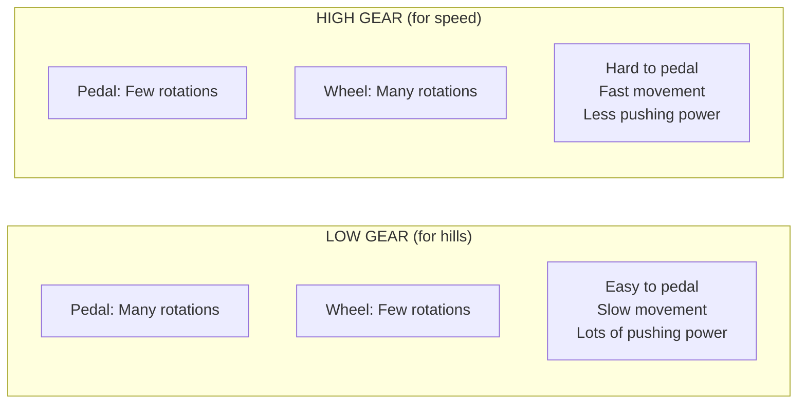

# Tutorial 1.2: Gears and Torque

**Time:** ~15 minutes
**Prerequisites:** Tutorial 1.1: Forces and Motion

---

## The Bicycle Analogy

Have you ever ridden a bicycle with gears? Think about what happens when you switch gears:



This is exactly how robot motor gears work!

## What is Torque?

**Torque** is rotational (spinning) force. Instead of pushing in a straight line, torque pushes in a circle.

```
    Force (Linear)              Torque (Rotational)

         →→→                         ⟳
    ════════════                  ┌──────┐
    Pushes straight               | Motor|
                                  └──────┘
                                  Spins around
```

**Torque** is measured in **Newton-meters (N·m)** or **inch-pounds (in·lb)**.

Think of torque as "twisting strength" - how hard the motor can twist.

## VEX V5 Motor Gear Cartridges

VEX V5 Smart Motors can use different **gear cartridges** that change the torque vs. speed trade-off:

| Cartridge | RPM | Torque | Best For |
|-----------|-----|--------|----------|
| BLUE (6:1) | 600 | Low | Flywheel, intake |
| GREEN (18:1) | 200 | Medium | Drivetrain |
| RED (36:1) | 100 | High | Lifting, pushing |

### Understanding the Ratios

**6:1 ratio** means: For every 6 rotations of the motor, the output spins 1 time.
- Motor spins fast → output spins fast
- Less mechanical advantage → less torque

**36:1 ratio** means: For every 36 rotations of the motor, the output spins 1 time.
- Motor spins fast → output spins slow
- More mechanical advantage → more torque

```
    6:1 (Blue)                   36:1 (Red)

    Motor: ⟳⟳⟳⟳⟳⟳              Motor: ⟳⟳⟳⟳⟳⟳⟳⟳⟳⟳....(36 times)
    Output: ⟳                    Output: ⟳

    FAST, weak                   SLOW, strong
```

## Torque vs. Speed: The Trade-Off

You can't have both maximum speed AND maximum torque. It's a trade-off:

```
    TORQUE ↑
           │
    RED────┼────────────●
    (36:1) │            │
           │            │
           │       ●────┼──── You can be somewhere
           │       │    │     in between!
           │       │    │
    GREEN──┼───●───┘    │
    (18:1) │   │        │
           │   │        │
           │   │        │
    BLUE───┼───┼────────┼───────────● ──→ SPEED
    (6:1)  │   │        │
           │   │        │
           └───┴────────┴──────────────────→
```

### Which Should You Choose?

| Mechanism | Recommended | Why |
|-----------|-------------|-----|
| **Drivetrain** | GREEN (18:1) | Balance of speed and pushing power |
| **Intake rollers** | BLUE (6:1) | Need to spin fast to grab blocks |
| **Lift arm** | RED (36:1) | Need strength to lift heavy loads |
| **Flywheel** | BLUE (6:1) | Need maximum speed for launching |

## The Math Behind Gear Ratios

Here's the formula:

```
Output Torque = Input Torque × Gear Ratio
Output Speed = Input Speed ÷ Gear Ratio
```

**Example with GREEN (18:1):**
- Motor provides 1 N·m of torque
- Output torque = 1 × 18 = **18 N·m** (18× stronger!)
- Motor spins at 3600 RPM internally
- Output speed = 3600 ÷ 18 = **200 RPM**

**Example with BLUE (6:1):**
- Motor provides 1 N·m of torque
- Output torque = 1 × 6 = **6 N·m**
- Motor spins at 3600 RPM internally
- Output speed = 3600 ÷ 6 = **600 RPM** (3× faster than green!)

## Code Connection: Gear Settings in robot_config.py

Look at `src/robot_config.py`, lines 19-30:

```python
# Gear Settings:
#   RATIO_6_1  = 600 RPM (blue cartridge)  - high speed, low torque
#   RATIO_18_1 = 200 RPM (green cartridge) - balanced (default)
#   RATIO_36_1 = 100 RPM (red cartridge)   - high torque, low speed

# Left side motors (not reversed - standard mounting)
left_motor_front = Motor(Ports.PORT1, GearSetting.RATIO_18_1, False)
left_motor_back = Motor(Ports.PORT2, GearSetting.RATIO_18_1, False)

# Right side motors (reversed - mirror mounting spins opposite)
right_motor_front = Motor(Ports.PORT3, GearSetting.RATIO_18_1, True)
right_motor_back = Motor(Ports.PORT4, GearSetting.RATIO_18_1, True)
```

See how all four drive motors use `RATIO_18_1` (green)? That's the balanced choice for a drivetrain!

### Changing Gear Cartridges

If you want to change to RED for more pushing power:

```python
# Change GearSetting.RATIO_18_1 to GearSetting.RATIO_36_1
left_motor_front = Motor(Ports.PORT1, GearSetting.RATIO_36_1, False)
```

> :warning: **Important:** You must also physically swap the cartridge inside the motor! The code just tells the Brain what to expect.

## External Gear Ratios

Besides the internal cartridge, you can add external gears between the motor and wheel:

```
    Motor Gear (12 teeth)      Wheel Gear (60 teeth)
          ┌──┐                      ┌────────┐
          │⟳ │ ────── chain ─────── │   ⟳    │
          └──┘                      └────────┘
          Small                     Big

    Ratio = 60 ÷ 12 = 5:1

    Motor spins 5 times → Wheel spins 1 time
    = More torque, less speed
```

This is configured in `robot_config.py`:

```python
EXTERNAL_GEAR_RATIO = 1   # Change if using external gearing
```

If you have a 60:12 external ratio, you'd set:
```python
EXTERNAL_GEAR_RATIO = 5   # 60 ÷ 12 = 5
```

## Torque and Wheel Size

Bigger wheels cover more distance per rotation, but need more torque to accelerate:

```
    Small Wheel (2")              Large Wheel (4")

         ⟳                             ⟳
        [O]                          [  O  ]
    ════════════                ════════════════════

    Circumference:              Circumference:
    2" × π = 6.28"              4" × π = 12.57"

    Less distance per spin      More distance per spin
    Needs less torque           Needs more torque
```

Your robot uses **4-inch wheels**:

```python
# From robot_config.py
# 4" omni wheel circumference = 4 * pi * 25.4 = 319.19 mm
WHEEL_TRAVEL_MM = 319.19
```

Each wheel rotation moves the robot 319.19 mm forward!

## Calculating Robot Speed

With all the pieces, we can calculate maximum robot speed:

```
Given:
- GREEN cartridge = 200 RPM
- 4" wheel circumference = 319.19 mm
- External gear ratio = 1 (direct drive)

Wheel RPM = Motor RPM ÷ External Ratio
          = 200 ÷ 1 = 200 RPM

Distance per minute = 200 × 319.19 mm = 63,838 mm = 63.8 m

Speed = 63.8 m ÷ 60 s = 1.06 m/s (about 3.5 ft/s)
```

That's walking speed - fast enough for a robot!

---

## Summary

| Term | Definition | Trade-off |
|------|------------|-----------|
| **Torque** | Rotational force | More torque = less speed |
| **Gear Ratio** | How much the motor is geared down | Higher ratio = more torque |
| **Blue (6:1)** | High speed, low torque | For fast mechanisms |
| **Green (18:1)** | Balanced | For drivetrains |
| **Red (36:1)** | High torque, low speed | For lifting/pushing |

---

## Exercise: Gear Selection Challenge

**Scenario 1:** You're building an intake mechanism that needs to spin rubber rollers really fast to grab blocks quickly. Which cartridge?

**Scenario 2:** Your robot has a lift arm that needs to raise 2 kg of blocks. Which cartridge?

**Scenario 3:** You're in a pushing match and your opponent keeps pushing you backward. What could you change?

**Bonus:** Calculate your robot's speed if you switched to RED (100 RPM) cartridges.

---

## Answers

**Scenario 1:** BLUE (6:1) - you need speed, not torque

**Scenario 2:** RED (36:1) - you need torque to lift heavy loads

**Scenario 3:** Options:
- Switch to RED cartridges for more torque
- Add weight to your robot (more mass = harder to push)
- Use traction wheels instead of omni (more friction)

**Bonus:**
```
Speed = (100 RPM × 319.19 mm) ÷ 60 s
      = 31,919 mm ÷ 60 s
      = 532 mm/s = 0.53 m/s (about 1.7 ft/s)
```
Half the speed of green, but much more pushing power!

---

**[← Previous: Forces and Motion](01-forces-and-motion.md)** | **[Next: Friction and Traction →](03-friction-and-traction.md)**
