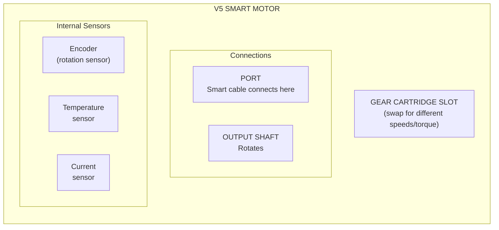

# Tutorial 2.2: Motors and Gears

**Time:** ~10 minutes
**Prerequisites:** Tutorial 2.1: Brain and Controller

---

## The V5 Smart Motor

The V5 Smart Motor is the most important component of your robot. It converts electrical power into rotational motion.



### Smart Features

Unlike simple motors, V5 Smart Motors have built-in sensors:

| Sensor | What It Measures | Why It's Useful |
|--------|------------------|-----------------|
| **Encoder** | Rotation count | Know how far you've traveled |
| **Temperature** | Motor heat | Prevent overheating |
| **Current** | Power usage | Detect stalls/resistance |
| **Velocity** | Speed | Accurate speed control |

## Motor Configuration in Code

Let's look at `src/robot_config.py`:

```python
# Left side motors (not reversed - standard mounting)
left_motor_front = Motor(Ports.PORT1, GearSetting.RATIO_18_1, False)
left_motor_back = Motor(Ports.PORT2, GearSetting.RATIO_18_1, False)

# Right side motors (reversed - mirror mounting spins opposite)
right_motor_front = Motor(Ports.PORT3, GearSetting.RATIO_18_1, True)
right_motor_back = Motor(Ports.PORT4, GearSetting.RATIO_18_1, True)
```

### The Motor() Constructor

```python
Motor(port, gear_setting, reversed)
```

| Parameter | What It Means | Your Values |
|-----------|---------------|-------------|
| `port` | Which port on Brain | PORT1, PORT2, PORT3, PORT4 |
| `gear_setting` | Cartridge type | RATIO_18_1 (green) |
| `reversed` | Spin direction | False (left), True (right) |

## Why Are Right Motors Reversed?

This is one of the most common questions! Look at how motors are mounted:

```
    TOP VIEW OF ROBOT:

         FRONT
           ↑
    ┌─────────────┐
    │             │
    │  LF     RF  │
    │  [→]   [←]  │  ← Motors face OUTWARD
    │             │
    │  LB     RB  │
    │  [→]   [←]  │
    │             │
    └─────────────┘

    Left motors:  Clockwise = Forward
    Right motors: Clockwise = BACKWARD (opposite!)
```

**Solution:** Tell the code to reverse right motors:

```python
# Left: clockwise = forward (normal)
left_motor_front = Motor(Ports.PORT1, GearSetting.RATIO_18_1, False)

# Right: clockwise = backward, so REVERSE it!
right_motor_front = Motor(Ports.PORT3, GearSetting.RATIO_18_1, True)
```

Now when you tell both motors to spin "forward," they actually move the robot forward!

## Motor Groups

Individual motors are useful, but for a drivetrain, we want to control multiple motors together:

```python
# Group left motors together
left_motors = MotorGroup(left_motor_front, left_motor_back)

# Group right motors together
right_motors = MotorGroup(right_motor_front, right_motor_back)
```

### Why Use Motor Groups?

```python
# WITHOUT MotorGroup (tedious):
left_motor_front.spin(FORWARD, 50, PERCENT)
left_motor_back.spin(FORWARD, 50, PERCENT)

# WITH MotorGroup (simple):
left_motors.spin(FORWARD, 50, PERCENT)
```

One command controls both motors at once!

## Common Motor Methods

### Setting Velocity

```python
# Set speed (doesn't start spinning yet)
motor.set_velocity(50, PERCENT)   # 50% of max speed

# Different units:
motor.set_velocity(200, RPM)      # 200 rotations per minute
motor.set_velocity(100, DPS)      # 100 degrees per second
```

### Spinning the Motor

```python
# Start spinning
motor.spin(FORWARD)               # Spin forward at set velocity
motor.spin(REVERSE)               # Spin backward

# Spin with specific velocity
motor.spin(FORWARD, 75, PERCENT)  # 75% speed forward
```

### Stopping the Motor

```python
motor.stop()                      # Stop with default mode

# Stop modes:
motor.set_stopping(COAST)         # Free-spin to stop
motor.set_stopping(BRAKE)         # Active braking
motor.set_stopping(HOLD)          # Hold position firmly
```

```
    COAST                BRAKE                HOLD

    ⟳ → ⟳ → ⟳ → stop     ⟳ → ⟳ → X           ⟳ → X (locked!)
    Slowly coasts        Quick stop           Resists movement
```

### Reading Motor Values

```python
motor.velocity(PERCENT)           # Current speed
motor.position(DEGREES)           # Total rotation in degrees
motor.temperature(FAHRENHEIT)     # Motor temperature
motor.current()                   # Current power draw
```

## The DriveTrain Class

For easier autonomous movement, we wrap everything in a DriveTrain:

```python
drivetrain = DriveTrain(
    left_motors,           # Left MotorGroup
    right_motors,          # Right MotorGroup
    WHEEL_TRAVEL_MM,       # Wheel circumference (319.19mm)
    TRACK_WIDTH_MM,        # Distance between wheels (295mm)
    WHEEL_BASE_MM,         # Front-to-back distance (200mm)
    MM,                    # Units
    EXTERNAL_GEAR_RATIO    # External gearing (1 = direct)
)
```

### DriveTrain Methods

```python
# Autonomous movements
drivetrain.drive_for(FORWARD, 500, MM)     # Drive 500mm forward
drivetrain.turn_for(RIGHT, 90, DEGREES)    # Turn 90° right

# Speed settings
drivetrain.set_drive_velocity(50, PERCENT)  # Set drive speed
drivetrain.set_turn_velocity(30, PERCENT)   # Set turn speed

# Stopping mode
drivetrain.set_stopping(BRAKE)
```

---

## Motor Wiring Diagram

Here's how your robot is wired:

```
    V5 BRAIN PORTS:

    [1]──────┐     ┌──────[3]
    Left     │     │     Right
    Front    │     │     Front
             │     │     (reversed)
    [2]──────┤     ├──────[4]
    Left     │     │     Right
    Back     │     │     Back
             │     │     (reversed)
             ↓     ↓

         LEFT SIDE    RIGHT SIDE

         [LF] [LB]    [RF] [RB]
           ↓   ↓        ↓   ↓
         +--------+  +--------+
         |        |  |        |
         +--[O][O]+  +[O][O]--+

              ROBOT (top view)
```

---

## Summary

| Concept | Purpose | Code |
|---------|---------|------|
| **Motor** | Single motor object | `Motor(port, gear, reversed)` |
| **Reversed** | Flip direction | `True` for right side motors |
| **MotorGroup** | Control multiple | `MotorGroup(motor1, motor2)` |
| **DriveTrain** | High-level driving | `drivetrain.drive_for()` |
| **spin()** | Start motor | `motor.spin(FORWARD)` |
| **stop()** | Stop motor | `motor.stop()` |

---

## Exercise: Add a Fifth Motor

**Goal:** Add an intake motor to `robot_config.py`

Imagine you're adding a motor on Port 5 for an intake mechanism:
- It should spin at high speed (use BLUE cartridge)
- It doesn't need to be reversed

**Write the code:**

```python
# Add this line to robot_config.py:
intake_motor = Motor(_____, GearSetting._____, _____)
```

**Bonus:** How would you make it spin forward when button R1 is pressed?

---

## Answers

```python
intake_motor = Motor(Ports.PORT5, GearSetting.RATIO_6_1, False)
```

**Bonus - Button control:**
```python
# In driver_control.py, inside the while loop:
if controller.buttonR1.pressing():
    intake_motor.spin(FORWARD, 100, PERCENT)
else:
    intake_motor.stop()
```

---

**[← Previous: Brain and Controller](01-brain-and-controller.md)** | **[Next: Sensors Overview →](03-sensors-overview.md)** | **[Review Q&A](04-review-qa.md)**
