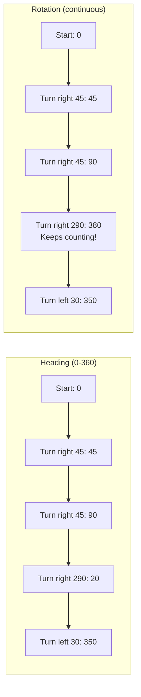

# Tutorial 2.3: Sensors Overview

**Time:** ~10 minutes
**Prerequisites:** Tutorial 2.2: Motors and Gears

---

## What Are Sensors?

Sensors let your robot "see" and "feel" the world around it. Without sensors, your robot is blind - it just follows instructions without knowing what's actually happening.

```
    Without Sensors:              With Sensors:

    "Drive forward 1000mm"        "Drive until you see a wall"

    +--------+                    +--------+
    |  BLIND |  →→→→→ CRASH!      |  👁️    |  →→→→ STOP!
    +--[O][O]+                    +--[O][O]+
                                       ↑
                                  "I see something!"
```

## Available VEX V5 Sensors

### Inertial Sensor (IMU)
**Like a compass + tilt sensor combined**

```
    ┌─────────────┐
    │   INERTIAL  │
    │   SENSOR    │
    │             │
    │  Measures:  │
    │  - Heading  │  ← Which way you're pointing
    │  - Rotation │  ← How much you've turned
    │  - Tilt     │  ← Are you level?
    │  - Accel    │  ← Are you moving?
    └─────────────┘
```

**Best for:** Accurate turning in autonomous, detecting collisions

### Distance Sensor
**Like robot sonar - measures how far away things are**

```
    +--------+
    |        |  →→→→→→→→→→→→→ WALL
    | DIST   |       ↑
    | SENSOR |   "Distance: 500mm"
    +--------+
```

**Best for:** Wall following, stopping before obstacles

### Optical Sensor
**Detects colors and light levels**

```
    +--------+
    |OPTICAL | ↓ (points down at field)
    +--------+
        ↓
    ▓▓▓▓▓▓▓▓  ← Object color detected!
```

**Best for:** Detecting block colors, line following

### GPS Sensor
**Knows exactly where you are on the field**

```
    FIELD MAP:

    +-----------------+
    |        N        |
    |                 |
    | W      📍     E |  ← "Position: (300mm, 450mm)"
    |                 |
    |        S        |
    +-----------------+
```

**Best for:** Precise autonomous navigation, returning to positions

## Code Connection: Sensor Setup

Look at `src/robot_config.py` (lines 67-74):

```python
# =============================================================================
# SENSORS (add as needed)
# =============================================================================
# Uncomment and configure sensors when you add them:
#
# inertial_sensor = Inertial(Ports.PORT5)
# distance_sensor = Distance(Ports.PORT6)
# optical_sensor = Optical(Ports.PORT7)
# gps_sensor = Gps(Ports.PORT8)
```

These are commented out because the basic robot doesn't have sensors installed yet. When you add a sensor, uncomment the line and update the port number.

## Using the Inertial Sensor

The inertial sensor is the most useful for competition robots:

```python
# Setup
inertial_sensor = Inertial(Ports.PORT5)

# IMPORTANT: Calibrate before use!
inertial_sensor.calibrate()
wait(3, SECONDS)  # Wait for calibration

# Read heading (0-360 degrees)
heading = inertial_sensor.heading()  # Returns 0-359.99

# Read rotation (continuous, can be negative)
rotation = inertial_sensor.rotation()  # Can be -999999 to +999999
```



### SmartDrive: DriveTrain + Inertial

When you add an inertial sensor, you can upgrade to SmartDrive:

```python
# From robot_config.py (commented):
# smart_drivetrain = SmartDrive(
#     left_motors,
#     right_motors,
#     inertial_sensor,       # ← The magic ingredient!
#     WHEEL_TRAVEL_MM,
#     TRACK_WIDTH_MM,
#     WHEEL_BASE_MM,
#     MM,
#     EXTERNAL_GEAR_RATIO
# )
```

SmartDrive automatically uses the inertial sensor for more accurate turns!

## Using the Distance Sensor

```python
# Setup
distance_sensor = Distance(Ports.PORT6)

# Read distance
dist = distance_sensor.object_distance(MM)  # Distance in mm

# Example: Stop before hitting a wall
while True:
    if distance_sensor.object_distance(MM) < 100:
        drivetrain.stop()
    else:
        drivetrain.drive(FORWARD)
```

```
    Distance Sensor Range:

    CLOSE            MEDIUM           FAR
    < 100mm          100-500mm        500-2000mm

    +--------+        +--------+      +--------+
    | DIST   |→       | DIST   |→→→   | DIST   |→→→→→→→
    +--------+        +--------+      +--------+
```

## Using the Optical Sensor

```python
# Setup
optical_sensor = Optical(Ports.PORT7)

# Turn on the light for color detection
optical_sensor.set_light_power(100)
optical_sensor.set_light(LedStateType.ON)

# Detect if object is present
if optical_sensor.is_near_object():
    # Read the color
    color = optical_sensor.color()

    if color == Color.RED:
        print("Red block detected!")
    elif color == Color.BLUE:
        print("Blue block detected!")
```

## Sensor Comparison Table

| Sensor | Measures | Best For | Ports Used |
|--------|----------|----------|------------|
| **Inertial** | Rotation, tilt, acceleration | Accurate turns | 1 |
| **Distance** | Distance to objects (mm) | Wall detection | 1 |
| **Optical** | Color, light level | Block detection | 1 |
| **GPS** | X, Y position on field | Field navigation | 1 |
| **Limit Switch** | Contact (pressed/not) | Arm limits | 1 3-wire |
| **Bumper** | Contact (pressed/not) | Wall touch | 1 3-wire |

---

## Why Sensors Matter for Push Back

In Push Back, sensors can give you an edge:

```
    Without Inertial:               With Inertial:

    "Turn right 90°"                "Turn until heading = 90°"

    Might turn 85° or 95°           Always turns exactly 90°
    (motor slip, friction)          (sensor confirms angle)
```

### Sensor Ideas for Push Back

| Sensor | Competition Use |
|--------|-----------------|
| **Inertial** | Accurate autonomous turns, detect being pushed |
| **Distance** | Detect goals, detect blocks nearby |
| **Optical** | Know if block is your color or opponent's |
| **GPS** | Return to specific field positions |

---

## Summary

| Sensor | Setup Code | Main Method |
|--------|------------|-------------|
| **Inertial** | `Inertial(Ports.PORT#)` | `.heading()`, `.rotation()` |
| **Distance** | `Distance(Ports.PORT#)` | `.object_distance(MM)` |
| **Optical** | `Optical(Ports.PORT#)` | `.color()`, `.is_near_object()` |
| **GPS** | `Gps(Ports.PORT#)` | `.x_position()`, `.y_position()` |

---

## Exercise: Add an Inertial Sensor

**Goal:** Modify `robot_config.py` to add an inertial sensor on Port 5.

**Step 1:** Find this line in `robot_config.py`:
```python
# inertial_sensor = Inertial(Ports.PORT5)
```

**Step 2:** Uncomment it by removing the `#`:
```python
inertial_sensor = Inertial(Ports.PORT5)
```

**Step 3:** Write code to display the heading on the brain screen:
```python
# In main.py or a test file:
inertial_sensor.calibrate()
wait(3, SECONDS)

while True:
    brain.screen.clear_screen()
    brain.screen.set_cursor(1, 1)
    heading = inertial_sensor.heading()
    brain.screen.print("Heading: " + str(heading))
    wait(100, MSEC)
```

**Question:** What happens to the heading value when you rotate the robot?

---

## Answer

When you rotate the robot:
- Clockwise (right): Heading increases (0 → 90 → 180 → 270 → 0)
- Counter-clockwise (left): Heading decreases (0 → 270 → 180 → 90 → 0)
- Heading always stays between 0 and 360 degrees

---

**Ready to test your knowledge? Check out the [Python Q&A Review](04-review-qa.md)!**

---

**[← Previous: Motors and Gears](02-motors-and-gears.md)** | **[Next: Thinking with Flowcharts →](../03-python-basics/00-flowchart.md)**
