# Tutorial 3.0: Thinking with Flowcharts

**Time:** ~20 minutes
**Prerequisites:** None - this is where your programming journey begins!

---

## Why Start with Flowcharts?

Before you write a single line of code, you need to **think like a programmer**. Programmers don't just type - they plan, visualize, and break problems into steps.

A **flowchart** is a visual map that shows:
- What steps to take
- What order to take them
- What decisions to make along the way

Think of it like GPS directions for solving problems!

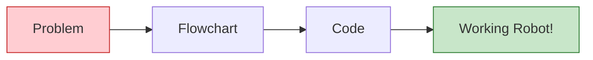
```mermaid
flowchart LR
    A["Problem"] --> B["Flowchart"]
    B --> C["Code"]
    C --> D["Working Robot!"]

    style A fill:#ffcdd2,stroke:#c62828
    style D fill:#c8e6c9,stroke:#2e7d32
```

---

## What is a Flowchart?

A flowchart is a diagram that shows the **steps** to solve a problem, connected by **arrows** that show the order.

### Real-World Example: Making Toast

You do this without thinking, but there ARE steps:

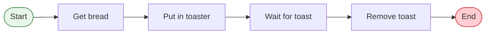
```mermaid
flowchart LR
    A([Start]) --> B[Get bread]
    B --> C[Put in toaster]
    C --> D[Wait for toast]
    D --> E[Remove toast]
    E --> F([End])

    style A fill:#e8f5e9,stroke:#2e7d32
    style F fill:#ffcdd2,stroke:#c62828
```

See? Even making toast is a **sequence of steps**. Programming is the same - just with different steps!

---

## Flowchart Symbols

Every shape in a flowchart has a meaning:

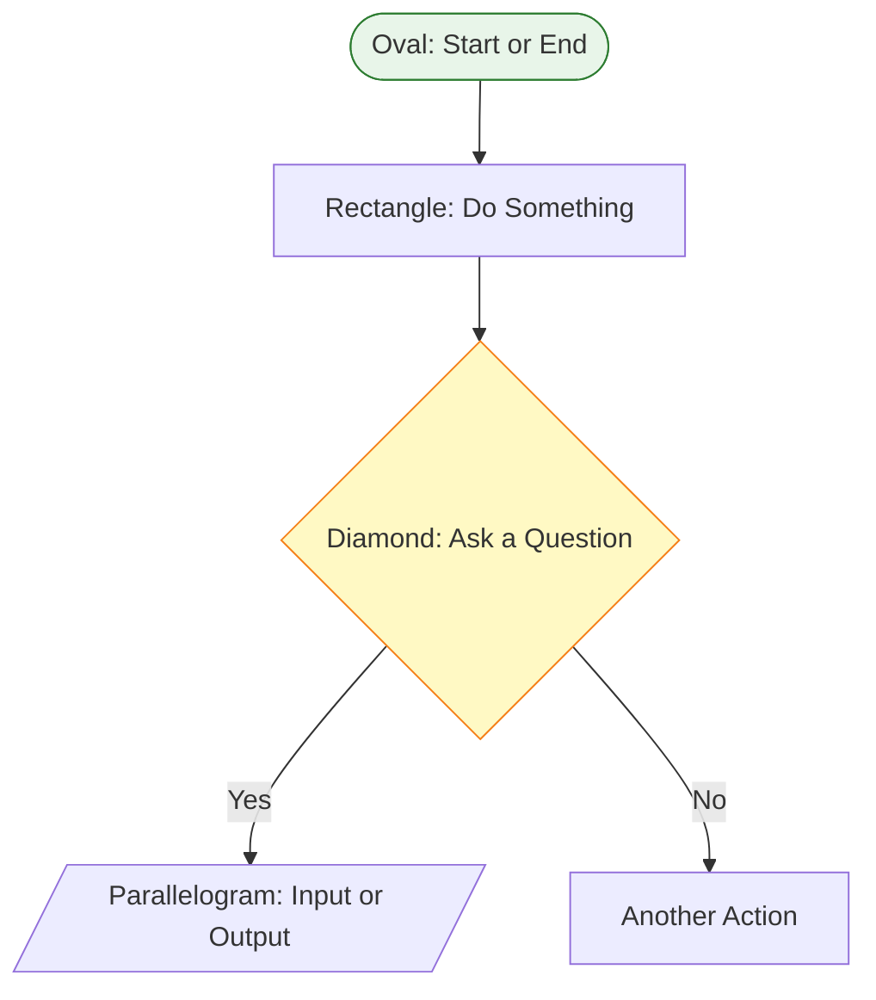
```mermaid
flowchart TD
    A([Oval: Start or End]) --> B[Rectangle: Do Something]
    B --> C{Diamond: Ask a Question}
    C -->|Yes| D[/Parallelogram: Input or Output/]
    C -->|No| E[Another Action]

    style A fill:#e8f5e9,stroke:#2e7d32
    style C fill:#fff9c4,stroke:#f57f17
```

### Symbol Reference

| Shape | Name | What It Means | Example |
|-------|------|---------------|---------|
| Oval `([...])` | Terminal | Start or End of program | `([Start])`, `([End])` |
| Rectangle `[...]` | Process | An action or step | `[Set motor speed]` |
| Diamond `{...}` | Decision | Yes/No question | `{Is button pressed?}` |
| Parallelogram `[/.../]` | Input/Output | Get or show data | `[/Read joystick/]` |
| Arrow `-->` | Flow | Order of steps | Shows what comes next |

---

## Part 1: Sequential Flow (Steps in Order)

The simplest flowcharts are **sequential** - one step after another, like following a recipe.

### Example 1: Robot Moves Forward

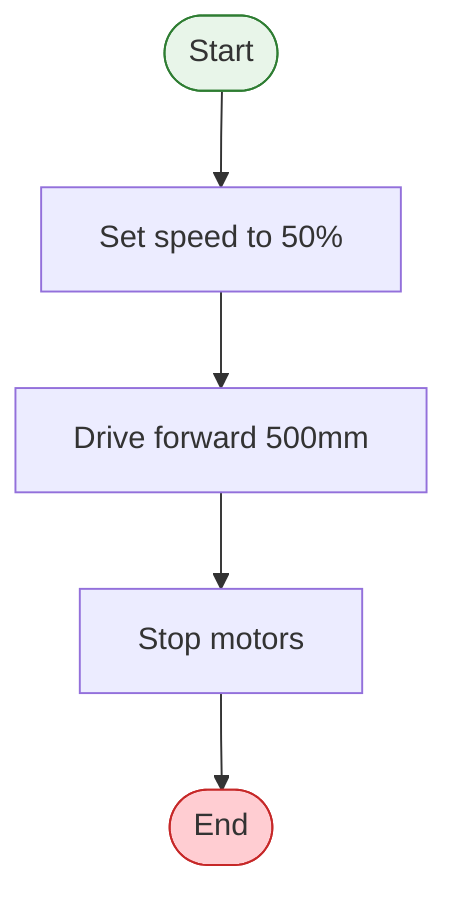
```mermaid
flowchart TD
    A([Start]) --> B[Set speed to 50%]
    B --> C[Drive forward 500mm]
    C --> D[Stop motors]
    D --> E([End])

    style A fill:#e8f5e9,stroke:#2e7d32
    style E fill:#ffcdd2,stroke:#c62828
```

This is exactly how autonomous robot code works - do this, then this, then this!

### The Code It Becomes

```python
# Sequential steps - just like the flowchart!
def simple_autonomous():
    drivetrain.set_velocity(50, PERCENT)    # Set speed to 50%
    drivetrain.drive_for(FORWARD, 500, MM)  # Drive forward 500mm
    drivetrain.stop()                        # Stop motors
```

---

## Coding Question #1 (Easy)

**Convert this flowchart to English steps:**

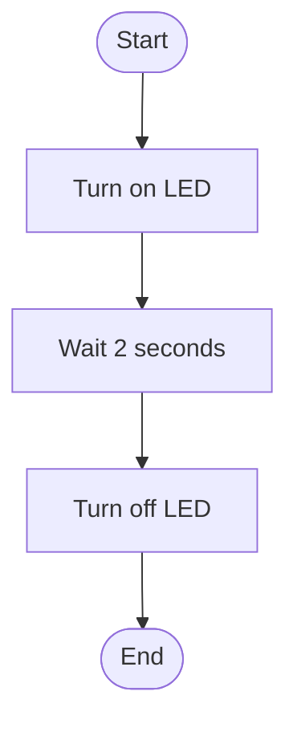
```mermaid
flowchart TD
    A([Start]) --> B[Turn on LED]
    B --> C[Wait 2 seconds]
    C --> D[Turn off LED]
    D --> E([End])
```

<details>
<summary>Click to see answer</summary>

**English Steps:**
1. Start the program
2. Turn on the LED
3. Wait for 2 seconds
4. Turn off the LED
5. End the program

</details>

---

## Part 2: Decision Making (If/Else)

Real programs make **decisions**. The diamond shape asks a Yes/No question, and the answer determines which path to take.

### Example 2: Should I Bring an Umbrella?

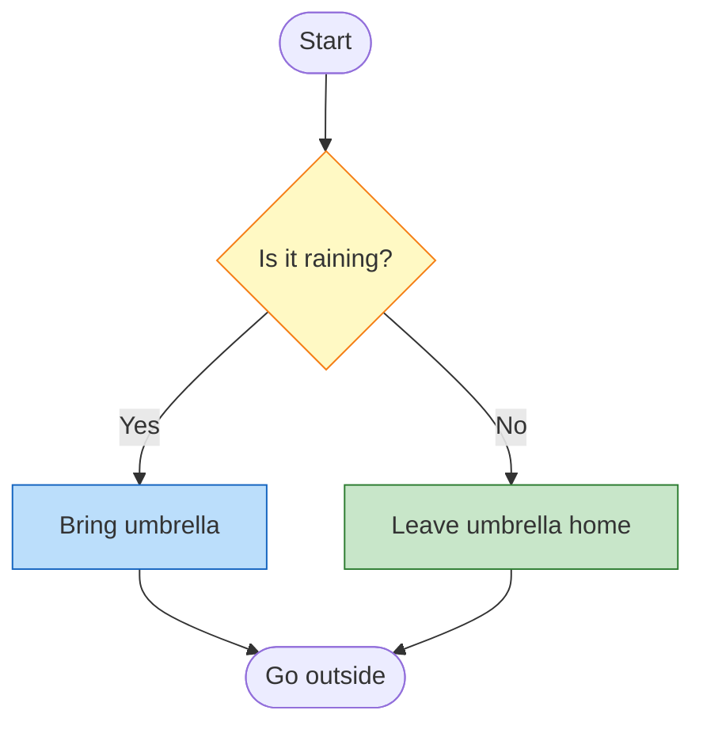
```mermaid
flowchart TD
    A([Start]) --> B{Is it raining?}
    B -->|Yes| C[Bring umbrella]
    B -->|No| D[Leave umbrella home]
    C --> E([Go outside])
    D --> E

    style B fill:#fff9c4,stroke:#f57f17
    style C fill:#bbdefb,stroke:#1565c0
    style D fill:#c8e6c9,stroke:#2e7d32
```

The diamond asks a question. **Yes** goes one way, **No** goes another.

### Example 3: Robot Button Detection

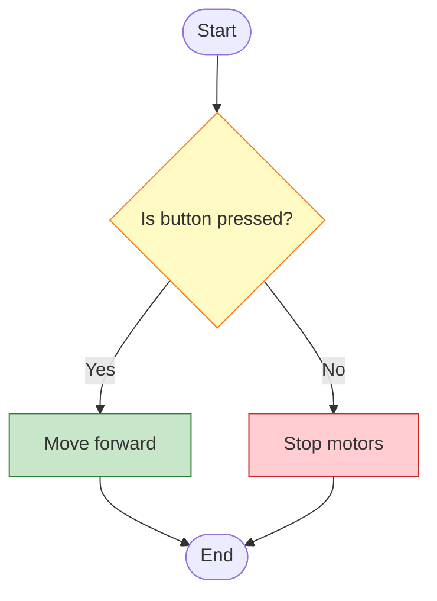
```mermaid
flowchart TD
    A([Start]) --> B{Is button pressed?}
    B -->|Yes| C[Move forward]
    B -->|No| D[Stop motors]
    C --> E([End])
    D --> E

    style B fill:#fff9c4,stroke:#f57f17
    style C fill:#c8e6c9,stroke:#2e7d32
    style D fill:#ffcdd2,stroke:#c62828
```

### The Code It Becomes

```python
if controller.buttonA.pressing():
    drivetrain.drive(FORWARD)   # Button pressed - move!
else:
    drivetrain.stop()           # No button - stop!
```

---

### Example 4: Multiple Decisions (If/Elif/Else)

Sometimes you need to check multiple conditions. This is called **if/elif/else**:

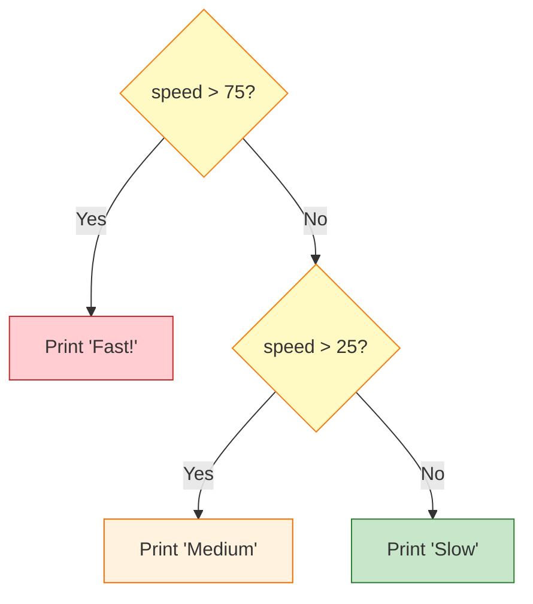
```mermaid
flowchart TD
    A{speed > 75?} -->|Yes| B["Print 'Fast!'"]
    A -->|No| C{speed > 25?}
    C -->|Yes| D["Print 'Medium'"]
    C -->|No| E["Print 'Slow'"]

    style A fill:#fff9c4,stroke:#f57f17
    style C fill:#fff9c4,stroke:#f57f17
    style B fill:#ffcdd2,stroke:#c62828
    style D fill:#fff3e0,stroke:#ef6c00
    style E fill:#c8e6c9,stroke:#2e7d32
```

### The Code It Becomes

```python
if speed > 75:
    print("Fast!")
elif speed > 25:
    print("Medium")
else:
    print("Slow")
```

---

## Coding Question #2 (Easy)

**Draw a flowchart for this problem:**

"If score > 80, print 'You win!', else print 'Try again'"

<details>
<summary>Click to see answer</summary>

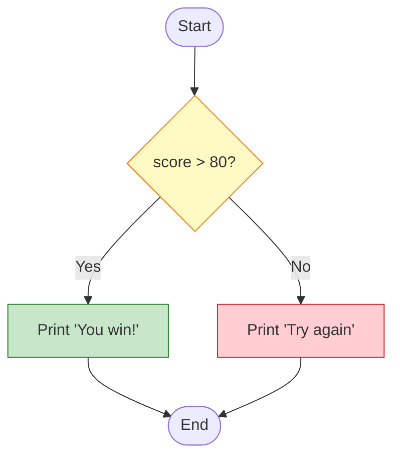
```mermaid
flowchart TD
    A([Start]) --> B{score > 80?}
    B -->|Yes| C["Print 'You win!'"]
    B -->|No| D["Print 'Try again'"]
    C --> E([End])
    D --> E

    style B fill:#fff9c4,stroke:#f57f17
    style C fill:#c8e6c9,stroke:#2e7d32
    style D fill:#ffcdd2,stroke:#c62828
```

</details>

---

## Coding Question #3 (Medium)

**Convert this flowchart to Python if/elif/else:**

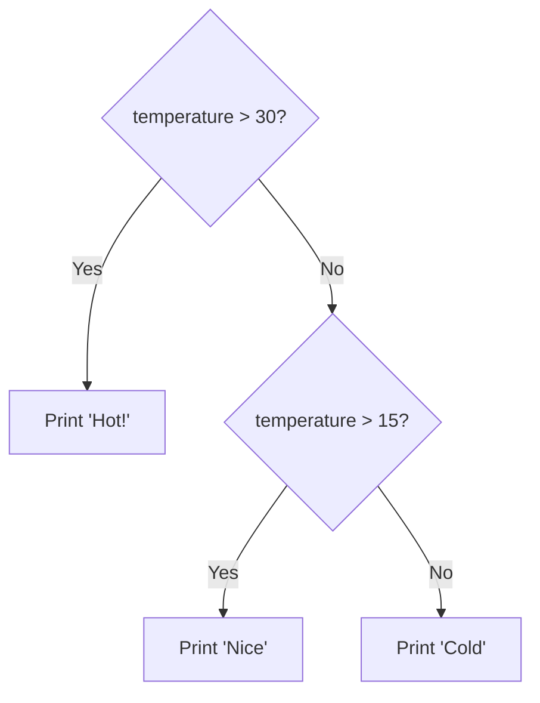
```mermaid
flowchart TD
    A{temperature > 30?} -->|Yes| B["Print 'Hot!'"]
    A -->|No| C{temperature > 15?}
    C -->|Yes| D["Print 'Nice'"]
    C -->|No| E["Print 'Cold'"]
```

<details>
<summary>Click to see answer</summary>

```python
if temperature > 30:
    print("Hot!")
elif temperature > 15:
    print("Nice")
else:
    print("Cold")
```

</details>

---

## Part 3: Loops (Repetition)

Sometimes you need to repeat steps. In flowcharts, we show this with **arrows that loop back**.

### Example 5: Count to 5

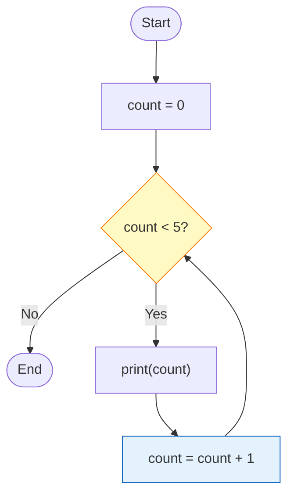
```mermaid
flowchart TD
    A([Start]) --> B[count = 0]
    B --> C{count < 5?}
    C -->|No| D([End])
    C -->|Yes| E["print(count)"]
    E --> F[count = count + 1]
    F --> C

    style C fill:#fff9c4,stroke:#f57f17
    style F fill:#e3f2fd,stroke:#1565c0
```

Notice how the arrow from F goes **back up** to C? That's the loop!

### The Code It Becomes

```python
count = 0
while count < 5:
    print(count)
    count = count + 1
# Output: 0, 1, 2, 3, 4
```

---

### Example 6: Driver Control Loop (Forever Loop)

Robot driver control runs **forever** during a match:

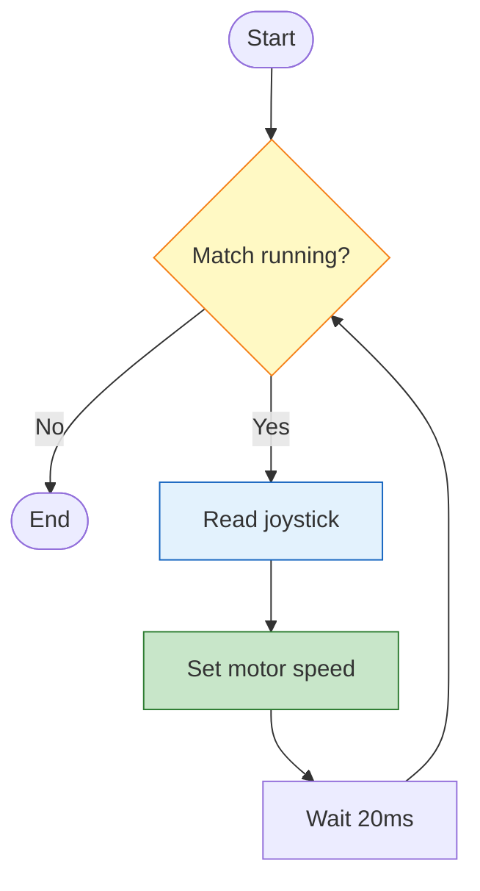
```mermaid
flowchart TD
    A([Start]) --> B{Match running?}
    B -->|No| C([End])
    B -->|Yes| D[Read joystick]
    D --> E[Set motor speed]
    E --> F[Wait 20ms]
    F --> B

    style B fill:#fff9c4,stroke:#f57f17
    style D fill:#e3f2fd,stroke:#1565c0
    style E fill:#c8e6c9,stroke:#2e7d32
```

### The Code It Becomes

```python
while True:  # Forever loop!
    left_speed = controller.axis3.position()
    right_speed = controller.axis2.position()
    left_motors.spin(FORWARD, left_speed, PERCENT)
    right_motors.spin(FORWARD, right_speed, PERCENT)
    wait(20, MSEC)
```

---

## Coding Question #4 (Medium)

**Write the Python code for this "count to 5" flowchart:**

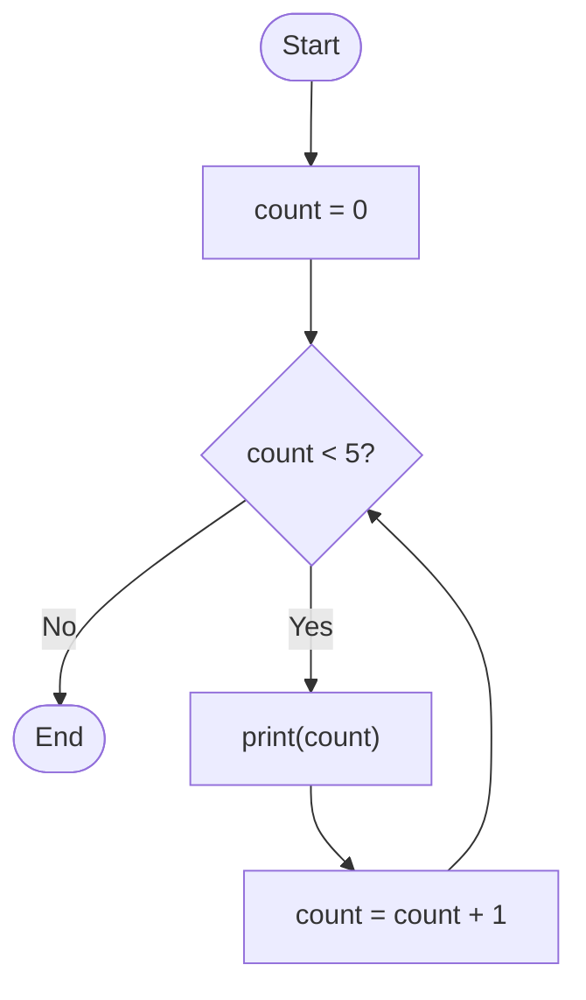
```mermaid
flowchart TD
    A([Start]) --> B[count = 0]
    B --> C{count < 5?}
    C -->|No| D([End])
    C -->|Yes| E["print(count)"]
    E --> F[count = count + 1]
    F --> C
```

<details>
<summary>Click to see answer</summary>

```python
count = 0
while count < 5:
    print(count)
    count = count + 1
```

**Output:**
```
0
1
2
3
4
```

</details>

---

## Coding Question #5 (Medium)

**Draw a flowchart for:**

"Keep asking for a password until it equals 'secret'"

<details>
<summary>Click to see answer</summary>

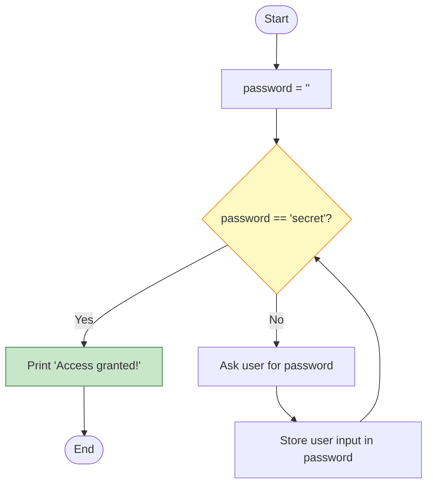
```mermaid
flowchart TD
    A([Start]) --> B[password = '']
    B --> C{password == 'secret'?}
    C -->|Yes| D["Print 'Access granted!'"]
    D --> E([End])
    C -->|No| F["Ask user for password"]
    F --> G[Store user input in password]
    G --> C

    style C fill:#fff9c4,stroke:#f57f17
    style D fill:#c8e6c9,stroke:#2e7d32
```

**The Python code:**
```python
password = ""
while password != "secret":
    password = input("Enter password: ")
print("Access granted!")
```

</details>

---

## Part 4: Combining Decisions and Loops

Real robot programs use **BOTH** decisions and loops together!

### Example 7: Push Back Turbo Mode

During driver control, check if the turbo button is pressed:

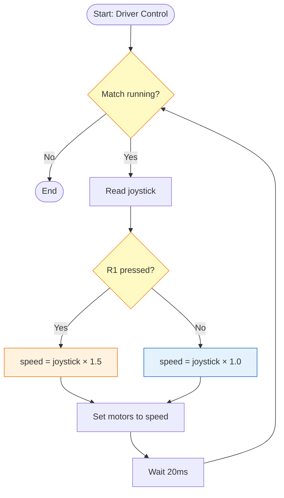
```mermaid
flowchart TD
    A([Start: Driver Control]) --> B{Match running?}
    B -->|No| C([End])
    B -->|Yes| D[Read joystick]
    D --> E{R1 pressed?}
    E -->|Yes| F["speed = joystick × 1.5"]
    E -->|No| G["speed = joystick × 1.0"]
    F --> H[Set motors to speed]
    G --> H
    H --> I[Wait 20ms]
    I --> B

    style B fill:#fff9c4,stroke:#f57f17
    style E fill:#fff9c4,stroke:#f57f17
    style F fill:#fff3e0,stroke:#ef6c00
    style G fill:#e3f2fd,stroke:#1565c0
```

**Key insight:** The decision (R1 pressed?) happens **inside** the loop!

---

## Coding Question #6 (Hard)

**Convert the Push Back turbo mode flowchart to Python:**

<details>
<summary>Click to see answer</summary>

```python
def driver_control_with_turbo():
    while True:  # Match running loop
        # Read joystick
        left_joy = controller.axis3.position()
        right_joy = controller.axis2.position()

        # Check for turbo button
        if controller.buttonR1.pressing():
            left_speed = left_joy * 1.5   # Turbo mode
            right_speed = right_joy * 1.5
        else:
            left_speed = left_joy * 1.0   # Normal mode
            right_speed = right_joy * 1.0

        # Clamp to valid range
        left_speed = clamp(left_speed, -100, 100)
        right_speed = clamp(right_speed, -100, 100)

        # Set motors
        left_motors.spin(FORWARD, left_speed, PERCENT)
        right_motors.spin(FORWARD, right_speed, PERCENT)

        wait(20, MSEC)
```

</details>

---

## Part 5: Problem-Solving Process

When you face a programming problem, follow these steps:

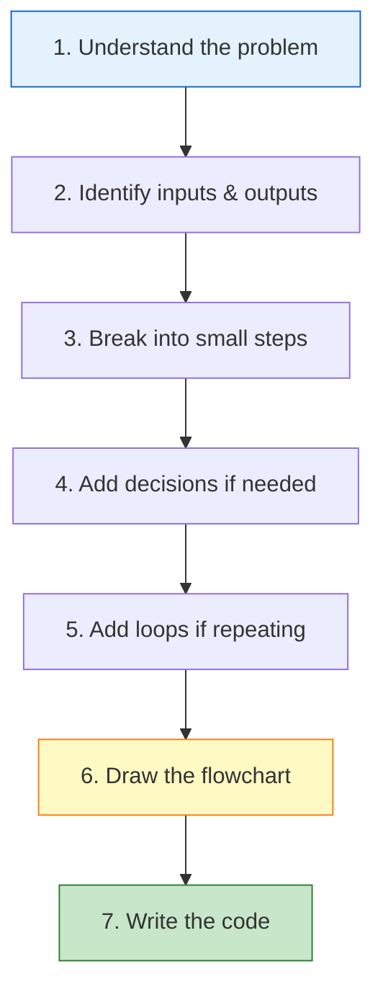
```mermaid
flowchart TD
    A["1. Understand the problem"] --> B["2. Identify inputs & outputs"]
    B --> C["3. Break into small steps"]
    C --> D["4. Add decisions if needed"]
    D --> E["5. Add loops if repeating"]
    E --> F["6. Draw the flowchart"]
    F --> G["7. Write the code"]

    style A fill:#e3f2fd,stroke:#1565c0
    style F fill:#fff9c4,stroke:#f57f17
    style G fill:#c8e6c9,stroke:#2e7d32
```

### Example: "Robot Avoids Wall"

**Problem:** Robot drives forward. If distance sensor sees something closer than 200mm, turn right. Otherwise, keep going.

**Step 1:** Understand - Robot should avoid walls
**Step 2:** Inputs: distance sensor. Outputs: motor commands
**Step 3:** Steps: read sensor, decide, move/turn
**Step 4:** Decision: is distance < 200mm?
**Step 5:** Loop: keep checking forever

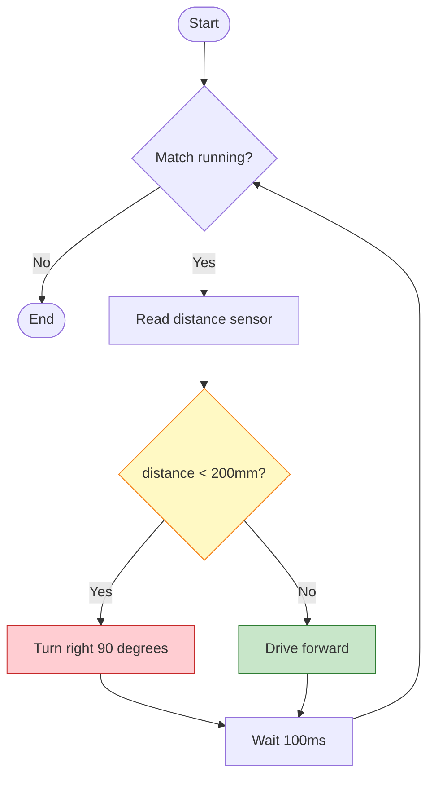
```mermaid
flowchart TD
    A([Start]) --> B{Match running?}
    B -->|No| C([End])
    B -->|Yes| D[Read distance sensor]
    D --> E{distance < 200mm?}
    E -->|Yes| F[Turn right 90 degrees]
    E -->|No| G[Drive forward]
    F --> H[Wait 100ms]
    G --> H
    H --> B

    style E fill:#fff9c4,stroke:#f57f17
    style F fill:#ffcdd2,stroke:#c62828
    style G fill:#c8e6c9,stroke:#2e7d32
```

---

## Coding Question #7 (Medium)

**Create a flowchart for:**

"Robot follows a line. If sensor sees black, go straight. If sensor sees white, turn right."

<details>
<summary>Click to see answer</summary>

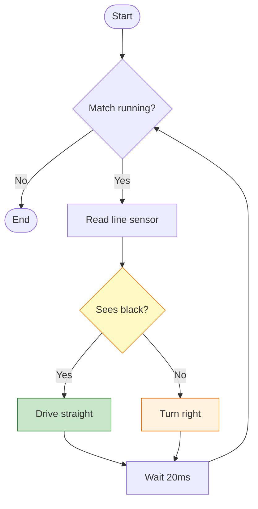
```mermaid
flowchart TD
    A([Start]) --> B{Match running?}
    B -->|No| C([End])
    B -->|Yes| D[Read line sensor]
    D --> E{Sees black?}
    E -->|Yes| F[Drive straight]
    E -->|No| G[Turn right]
    F --> H[Wait 20ms]
    G --> H
    H --> B

    style E fill:#fff9c4,stroke:#f57f17
    style F fill:#c8e6c9,stroke:#2e7d32
    style G fill:#fff3e0,stroke:#ef6c00
```

</details>

---

## Coding Question #8 (Hard)

**Create a flowchart for:**

"During autonomous, score 3 blocks. For each block: drive forward, push block into goal, back up. After 3 blocks, park."

<details>
<summary>Click to see answer</summary>

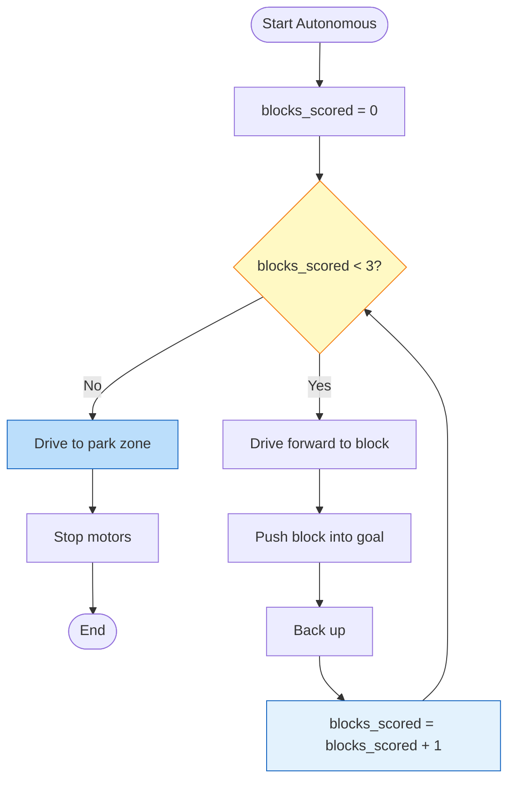
```mermaid
flowchart TD
    A([Start Autonomous]) --> B[blocks_scored = 0]
    B --> C{blocks_scored < 3?}
    C -->|No| D[Drive to park zone]
    D --> E[Stop motors]
    E --> F([End])
    C -->|Yes| G[Drive forward to block]
    G --> H[Push block into goal]
    H --> I[Back up]
    I --> J[blocks_scored = blocks_scored + 1]
    J --> C

    style C fill:#fff9c4,stroke:#f57f17
    style D fill:#bbdefb,stroke:#1565c0
    style J fill:#e3f2fd,stroke:#1565c0
```

**The Python code:**
```python
def autonomous_routine():
    blocks_scored = 0

    while blocks_scored < 3:
        drivetrain.drive_for(FORWARD, 500, MM)   # Drive to block
        drivetrain.drive_for(FORWARD, 300, MM)   # Push into goal
        drivetrain.drive_for(REVERSE, 400, MM)   # Back up
        blocks_scored = blocks_scored + 1

    # After 3 blocks, park
    drivetrain.turn_for(LEFT, 90, DEGREES)
    drivetrain.drive_for(FORWARD, 400, MM)
    drivetrain.stop()
```

</details>

---

## Part 6: Coding Challenges

Practice makes perfect! Try these challenges (answers at the end).

### Challenge 1 (Easy): Morning Routine

Draw a flowchart for:
"Wake up. Check time. If late, skip breakfast and go straight to getting dressed. Otherwise, eat breakfast first, then get dressed. Finally, go to school."

### Challenge 2 (Easy): Even or Odd

Draw a flowchart and write Python code for:
"Input a number. If number % 2 equals 0, print 'Even'. Otherwise, print 'Odd'."

### Challenge 3 (Medium): Grade Calculator

Draw a flowchart for:
"Input a score. Print 'A' if 90+, 'B' if 80+, 'C' if 70+, 'D' if 60+, 'F' if below 60."

### Challenge 4 (Medium): Password with 3 Attempts

Draw a flowchart for:
"Allow 3 password attempts. If correct, print 'Access granted'. If 3 fails, print 'Locked out'."

### Challenge 5 (Hard): VEX Autonomous Timer

Draw a flowchart for:
"Start a 15-second timer. Score blocks while time > 3 seconds. When time <= 3 seconds, drive to park zone."

### Challenge 6 (Hard): Zone Control Calculator

Draw a flowchart for:
"Count blocks in a goal (our_blocks and their_blocks). If our_blocks > their_blocks, print 'We control!' and add 10 points. Otherwise, print 'No control'."

---

## Flowchart to Code Translation

Use this table when converting flowcharts to Python:

| Flowchart Element | Python Code |
|-------------------|-------------|
| `([Start])` | First line of your function |
| `([End])` | Last line, or `return` |
| `[Action]` | Regular code line |
| `{Question?}` with 2 paths | `if condition:` and `else:` |
| `{Question?}` with 3+ paths | `if/elif/else` |
| Arrow looping back | `while condition:` |
| Arrow looping forever | `while True:` |

---

## Challenge Answers

### Challenge 1: Morning Routine

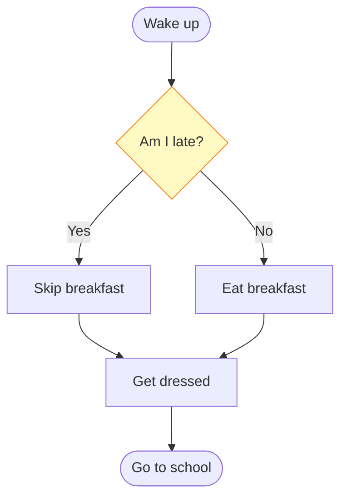
```mermaid
flowchart TD
    A([Wake up]) --> B{Am I late?}
    B -->|Yes| C[Skip breakfast]
    B -->|No| D[Eat breakfast]
    C --> E[Get dressed]
    D --> E
    E --> F([Go to school])

    style B fill:#fff9c4,stroke:#f57f17
```

### Challenge 2: Even or Odd

```mermaid
flowchart TD
    A([Start]) --> B[/Input number/]
    B --> C{number % 2 == 0?}
    C -->|Yes| D["Print 'Even'"]
    C -->|No| E["Print 'Odd'"]
    D --> F([End])
    E --> F

    style C fill:#fff9c4,stroke:#f57f17
```

```python
number = int(input("Enter a number: "))
if number % 2 == 0:
    print("Even")
else:
    print("Odd")
```

### Challenge 3: Grade Calculator

```mermaid
flowchart TD
    A([Start]) --> B[/Input score/]
    B --> C{score >= 90?}
    C -->|Yes| D["Print 'A'"]
    C -->|No| E{score >= 80?}
    E -->|Yes| F["Print 'B'"]
    E -->|No| G{score >= 70?}
    G -->|Yes| H["Print 'C'"]
    G -->|No| I{score >= 60?}
    I -->|Yes| J["Print 'D'"]
    I -->|No| K["Print 'F'"]
    D --> L([End])
    F --> L
    H --> L
    J --> L
    K --> L

    style C fill:#fff9c4,stroke:#f57f17
    style E fill:#fff9c4,stroke:#f57f17
    style G fill:#fff9c4,stroke:#f57f17
    style I fill:#fff9c4,stroke:#f57f17
```

```python
score = int(input("Enter score: "))
if score >= 90:
    print("A")
elif score >= 80:
    print("B")
elif score >= 70:
    print("C")
elif score >= 60:
    print("D")
else:
    print("F")
```

### Challenge 4: Password with 3 Attempts

```mermaid
flowchart TD
    A([Start]) --> B[attempts = 0]
    B --> C{attempts < 3?}
    C -->|No| D["Print 'Locked out'"]
    D --> E([End])
    C -->|Yes| F[/Ask for password/]
    F --> G{password == 'secret'?}
    G -->|Yes| H["Print 'Access granted'"]
    H --> E
    G -->|No| I[attempts = attempts + 1]
    I --> C

    style C fill:#fff9c4,stroke:#f57f17
    style G fill:#fff9c4,stroke:#f57f17
    style D fill:#ffcdd2,stroke:#c62828
    style H fill:#c8e6c9,stroke:#2e7d32
```

```python
attempts = 0
while attempts < 3:
    password = input("Enter password: ")
    if password == "secret":
        print("Access granted")
        break
    attempts = attempts + 1
else:
    print("Locked out")
```

### Challenge 5: VEX Autonomous Timer

```mermaid
flowchart TD
    A([Start Autonomous]) --> B[time_remaining = 15]
    B --> C{time_remaining > 3?}
    C -->|Yes| D[Score a block]
    D --> E[time_remaining = time_remaining - 2.5]
    E --> C
    C -->|No| F[Drive to park zone]
    F --> G[Stop]
    G --> H([End])

    style C fill:#fff9c4,stroke:#f57f17
    style F fill:#bbdefb,stroke:#1565c0
```

### Challenge 6: Zone Control Calculator

```mermaid
flowchart TD
    A([Start]) --> B[/Input our_blocks/]
    B --> C[/Input their_blocks/]
    C --> D{our_blocks > their_blocks?}
    D -->|Yes| E["Print 'We control!'"]
    E --> F[points = points + 10]
    F --> G([End])
    D -->|No| H["Print 'No control'"]
    H --> G

    style D fill:#fff9c4,stroke:#f57f17
    style E fill:#c8e6c9,stroke:#2e7d32
```

```python
our_blocks = int(input("Our blocks: "))
their_blocks = int(input("Their blocks: "))
points = 0

if our_blocks > their_blocks:
    print("We control!")
    points = points + 10
else:
    print("No control")

print("Points:", points)
```

---

## Summary

| Concept | Flowchart Symbol | Python |
|---------|------------------|--------|
| **Start/End** | Oval `([...])` | First/last line |
| **Action** | Rectangle `[...]` | Regular code |
| **Decision** | Diamond `{...}` | `if/elif/else` |
| **Input/Output** | Parallelogram `[/.../]` | `input()` / `print()` |
| **Loop** | Arrow back | `while` |

### Key Takeaways

1. **Plan before coding** - Draw a flowchart first!
2. **Break problems into steps** - One rectangle per action
3. **Identify decisions** - These become `if` statements
4. **Find repetition** - These become `while` loops
5. **Practice both ways** - Flowchart → Code AND Code → Flowchart

---

## What's Next?

Now that you can think with flowcharts, you're ready to learn **real Python code**!

In the next tutorial, you'll learn about **variables** - the building blocks that store information in your programs.

---

**[← Previous: Sensors Overview](../02-robot-anatomy/03-sensors-overview.md)** | **[Next: Variables and Types →](01-variables-and-types.md)**
