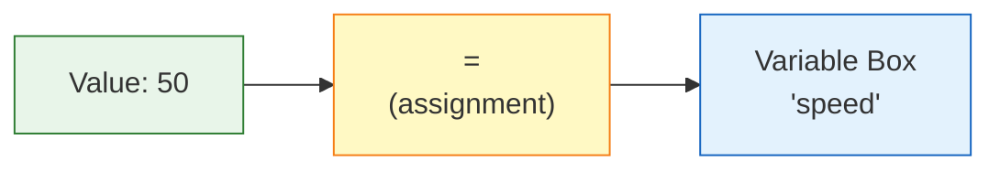
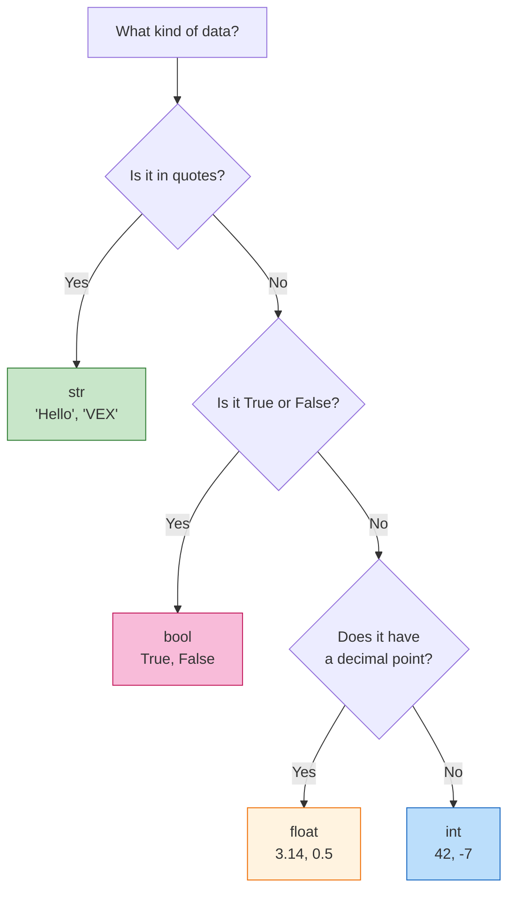
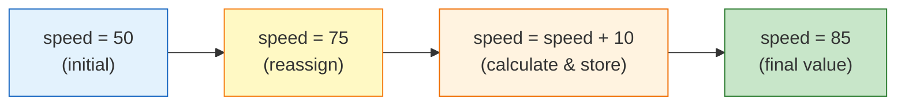
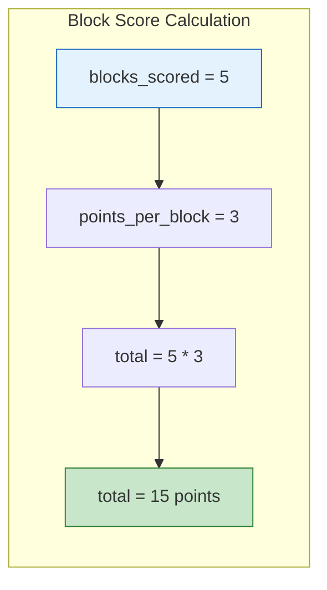

# Tutorial 3.1: Variables and Types

**Time:** ~15 minutes
**Prerequisites:** Tutorial 3.0: Thinking with Flowcharts

---

## What is a Variable?

A **variable** is like a labeled box that holds information. You give it a name and put something inside.

```
    Real World:                  In Code:

    ┌─────────────┐             speed = 50
    │   SPEED     │
    │     50      │             "speed" is the label
    └─────────────┘             50 is what's inside
```

Think of it like labeling containers in your kitchen:

```
    ┌───────┐  ┌───────┐  ┌───────┐
    │ SUGAR │  │ FLOUR │  │ SALT  │
    │  2kg  │  │  1kg  │  │ 0.5kg │
    └───────┘  └───────┘  └───────┘

    In Python:
    sugar = 2
    flour = 1
    salt = 0.5
```

## Creating Variables

In Python, you create a variable by writing `name = value`:

```python
# Create a variable called 'speed' with value 50
speed = 50

# Create a variable called 'robot_name' with value "VEX Bot"
robot_name = "VEX Bot"

# Create a variable called 'is_running' with value True
is_running = True
```

The `=` sign doesn't mean "equals" here - it means "store this value in this box."

### Variable Assignment Flowchart



This shows the flow: the **value** (50) is **assigned** (`=`) to the **variable** (speed).

## Types of Data

Python has different types of data that variables can hold:

### Numbers: Integers (int)

Whole numbers without decimal points:

```python
motor_port = 1          # Port number
team_number = 12345     # Your team
score = 42              # Points scored
negative = -100         # Negative numbers work too
```

### Numbers: Decimals (float)

Numbers with decimal points:

```python
wheel_circumference = 319.19   # Wheel size in mm
pi = 3.14159                   # Mathematical pi
half = 0.5                     # Half of something
```

### Text: Strings (str)

Words and sentences - always in quotes:

```python
robot_name = "VEX Bot"         # Double quotes work
team_name = 'Lightning'        # Single quotes work too
message = "Hello, World!"      # Your first program tradition!
```

### True/False: Booleans (bool)

Only two possible values: `True` or `False`

```python
is_running = True      # Motor is running
button_pressed = False # Button not pressed
sensor_active = True   # Sensor is working
```

## Type Comparison Table

| Type | Example | What It's For |
|------|---------|---------------|
| `int` | `42`, `-7`, `0` | Counting, port numbers |
| `float` | `3.14`, `0.5`, `-2.7` | Measurements, percentages |
| `str` | `"Hello"`, `'VEX'` | Text, messages |
| `bool` | `True`, `False` | Yes/no decisions |

### Data Type Decision Flowchart

How do you know what type a value is? Follow this decision tree:



**Quick Tips:**
- See quotes? It's a **string**
- See `True` or `False`? It's a **bool**
- See a decimal point? It's a **float**
- Just a number? It's an **int**

## Code Connection: Variables in robot_config.py

Look at `src/robot_config.py`:

```python
# These are all variables!

# Integer variables (port numbers)
# (hidden inside Motor constructor, but conceptually)

# Float variables (measurements)
WHEEL_TRAVEL_MM = 319.19      # float
TRACK_WIDTH_MM = 295          # int (but could be float)
WHEEL_BASE_MM = 200           # int
EXTERNAL_GEAR_RATIO = 1       # int

# The drivetrain uses these variables:
drivetrain = DriveTrain(
    left_motors,
    right_motors,
    WHEEL_TRAVEL_MM,           # Using the variable here!
    TRACK_WIDTH_MM,
    WHEEL_BASE_MM,
    MM,
    EXTERNAL_GEAR_RATIO
)
```

### ALL_CAPS Variable Names

Notice `WHEEL_TRAVEL_MM` is in ALL CAPS? This is a Python convention:
- **ALL_CAPS** = constant (value shouldn't change)
- **lowercase** = regular variable

## Changing Variable Values

Variables can change! That's why they're called "variables":

```python
speed = 50          # Start at 50
print(speed)        # Output: 50

speed = 75          # Change to 75
print(speed)        # Output: 75

speed = speed + 10  # Add 10 to current value
print(speed)        # Output: 85
```

### Variable Update Flowchart



Each arrow shows the variable being **updated** - the old value is replaced by the new one.

## Basic Math Operations

Python can do math with numbers:

```python
a = 10
b = 3

print(a + b)    # Addition: 13
print(a - b)    # Subtraction: 7
print(a * b)    # Multiplication: 30
print(a / b)    # Division: 3.333...
print(a // b)   # Integer division: 3 (no decimal)
print(a % b)    # Remainder: 1 (10 ÷ 3 = 3 remainder 1)
print(a ** b)   # Power: 1000 (10^3)
```

### Math in Robot Code

```python
# Calculate wheel circumference
diameter = 4  # inches
pi = 3.14159
circumference = diameter * pi  # 12.566...

# Convert joystick percentage to motor velocity
joystick_value = 75  # 75% forward
max_velocity = 200   # RPM
motor_velocity = (joystick_value / 100) * max_velocity  # 150 RPM
```

### Push Back Scoring Math

In the Push Back competition, you use math to calculate your score:



```python
# Push Back scoring example
blocks_scored = 5
points_per_block = 3
block_points = blocks_scored * points_per_block  # 15 points

# Zone control bonus (if you have more blocks in a goal)
long_goal_bonus = 10
center_goal_bonus = 6

# Total score calculation
total_score = block_points + long_goal_bonus
print("Total: " + str(total_score) + " points")  # Total: 25 points
```

## String Operations

You can combine strings:

```python
first_name = "VEX"
last_name = "Bot"

# Concatenation (joining strings)
full_name = first_name + " " + last_name
print(full_name)  # Output: "VEX Bot"

# Repetition
cheer = "Go! " * 3
print(cheer)  # Output: "Go! Go! Go! "
```

### Converting Types

Sometimes you need to convert between types:

```python
speed = 50                    # This is an int
message = "Speed: " + str(speed)  # Convert to string
print(message)                # Output: "Speed: 50"

text_number = "42"            # This is a string
actual_number = int(text_number)  # Convert to int
print(actual_number + 8)      # Output: 50
```

**Common Conversions:**
| Function | Does What | Example |
|----------|-----------|---------|
| `str()` | → string | `str(42)` → `"42"` |
| `int()` | → integer | `int("42")` → `42` |
| `float()` | → decimal | `float("3.14")` → `3.14` |

## Code Connection: Variables in utils.py

Look at `src/utils.py`:

```python
def clamp(value, min_val, max_val):
    """
    Clamp a value between minimum and maximum bounds.
    """
    return max(min_val, min(value, max_val))
```

Here, `value`, `min_val`, and `max_val` are variables that get their values when the function is called:

```python
result = clamp(150, 0, 100)  # value=150, min_val=0, max_val=100
# result is 100 (clamped to maximum)
```

---

## Push Back Variables in Action

Here's how variables are used throughout a Push Back match:

```python
# ═══════════════════════════════════════════════════════════════
# PUSH BACK GAME VARIABLES
# ═══════════════════════════════════════════════════════════════

# Match timing
AUTONOMOUS_TIME = 15      # int - seconds for autonomous
DRIVER_TIME = 105         # int - 1 minute 45 seconds
TOTAL_MATCH_TIME = 120    # int - 2 minutes total

# Scoring values
POINTS_PER_BLOCK = 3      # int - each block scored
LONG_GOAL_BONUS = 10      # int - controlling long goal zone
CENTER_UPPER_BONUS = 8    # int - center upper zone
CENTER_LOWER_BONUS = 6    # int - center lower zone
ONE_ROBOT_PARK = 8        # int - one robot parked
TWO_ROBOT_PARK = 30       # int - both robots parked

# Game tracking (these change during the match)
blocks_scored = 0         # int - starts at zero
is_parked = False         # bool - not parked yet
has_zone_control = False  # bool - no control yet
match_phase = "auto"      # str - current phase

# Robot configuration (from robot_config.py)
wheel_diameter_mm = 101.6   # float - 4 inches = 101.6mm
wheel_circumference = 319.19  # float - distance per rotation
track_width_mm = 295.0      # float - distance between wheels

# Alliance information
alliance_color = "red"      # str - "red" or "blue"
starting_position = "left"  # str - "left" or "right"

# ═══════════════════════════════════════════════════════════════
# CALCULATING FINAL SCORE
# ═══════════════════════════════════════════════════════════════

# During autonomous, you score blocks
blocks_scored = 4
block_points = blocks_scored * POINTS_PER_BLOCK  # 12 points

# Check zone control
red_blocks_in_long_goal = 5
blue_blocks_in_long_goal = 3
has_zone_control = red_blocks_in_long_goal > blue_blocks_in_long_goal  # True

# Add bonus if we control the zone
if has_zone_control:
    zone_bonus = LONG_GOAL_BONUS  # 10 points
else:
    zone_bonus = 0

# Parking bonus
robots_parked = 2
if robots_parked == 2:
    park_bonus = TWO_ROBOT_PARK  # 30 points
elif robots_parked == 1:
    park_bonus = ONE_ROBOT_PARK  # 8 points
else:
    park_bonus = 0

# Total score
total_score = block_points + zone_bonus + park_bonus
print("Match Score: " + str(total_score))  # Match Score: 52
```

---

## Common Mistakes with Variables

### Mistake 1: Using the Wrong Data Type

```python
# WRONG: Trying to add a string and an integer
motor_port = "1"         # This is a string!
next_port = motor_port + 1   # ERROR: can't add str + int

# RIGHT: Keep consistent types
motor_port = 1           # This is an integer
next_port = motor_port + 1   # Works: 2
```

### Mistake 2: Forgetting to Convert for Print

```python
# WRONG: Can't concatenate string and int
score = 42
print("Score: " + score)     # ERROR!

# RIGHT: Convert to string first
print("Score: " + str(score))  # Works: "Score: 42"

# ALSO RIGHT: Use comma (prints with space)
print("Score:", score)         # Works: "Score: 42"
```

### Mistake 3: Using = Instead of == in Comparisons

```python
# WRONG: This is assignment, not comparison!
if speed = 50:    # SyntaxError!
    print("Half speed")

# RIGHT: Use == to compare
if speed == 50:   # This checks if speed equals 50
    print("Half speed")
```

### Mistake 4: Invalid Variable Names

```python
# WRONG: These names are not allowed
my-speed = 50     # Hyphens look like subtraction
2fast = 100       # Can't start with a number
class = "A"       # "class" is a reserved word

# RIGHT: Valid variable names
my_speed = 50     # Underscores are OK
fast_2 = 100      # Numbers OK after first character
class_name = "A"  # Add suffix to avoid reserved words
```

---

## How Variables Connect to Push Back

In the Push Back competition, variables track everything about your match:

| What You Track | Variable Type | Example |
|----------------|---------------|---------|
| Blocks scored | `int` | `blocks = 8` |
| Zone control status | `bool` | `has_control = True` |
| Wheel circumference | `float` | `circumference = 319.19` |
| Alliance color | `str` | `alliance = "red"` |
| Match phase | `str` | `phase = "driver"` |
| Parking status | `bool` | `is_parked = False` |
| Score calculation | `int` | `score = blocks * 3` |

### Why Variables Matter in Robot Code

1. **Configuration:** `WHEEL_TRAVEL_MM` stores your wheel size once, use it everywhere
2. **Calculations:** Math with motor speeds, distances, and angles
3. **Decisions:** Boolean variables track what's happening
4. **Display:** String messages on the Brain screen
5. **Scoring:** Track points throughout the match

Every line of robot code uses variables - they're the foundation of programming!

---

## Summary

| Concept | What It Means | Example |
|---------|---------------|---------|
| **Variable** | Named storage | `speed = 50` |
| **int** | Whole number | `42`, `-7` |
| **float** | Decimal number | `3.14`, `0.5` |
| **str** | Text in quotes | `"Hello"` |
| **bool** | True or False | `True`, `False` |
| **Assignment** | Store value | `x = 10` |
| **Operations** | Math and combining | `+`, `-`, `*`, `/` |

---

## Exercise: Create Robot Variables

**Goal:** Create variables that describe your robot.

```python
# Fill in these variables with appropriate values:

# What's your team number? (int)
team_number = _____

# What's your robot's name? (str)
robot_name = "_____"

# How many motors does your robot have? (int)
motor_count = _____

# What's your wheel diameter in inches? (float)
wheel_diameter = _____

# Is your robot competition ready? (bool)
is_ready = _____

# BONUS: Calculate your wheel circumference
pi = 3.14159
wheel_circumference = wheel_diameter * _____

print("Team " + str(team_number) + ": " + robot_name)
print("Wheel circumference: " + str(wheel_circumference) + " inches")
```

---

## Sample Answers

```python
team_number = 12345
robot_name = "Push Bot"
motor_count = 4
wheel_diameter = 4.0
is_ready = False

pi = 3.14159
wheel_circumference = wheel_diameter * pi

print("Team " + str(team_number) + ": " + robot_name)
print("Wheel circumference: " + str(wheel_circumference) + " inches")
```

Output:
```
Team 12345: Push Bot
Wheel circumference: 12.56636 inches
```

---

**[← Previous: Thinking with Flowcharts](00-flowchart.md)** | **[Next: Functions →](02-functions.md)**
