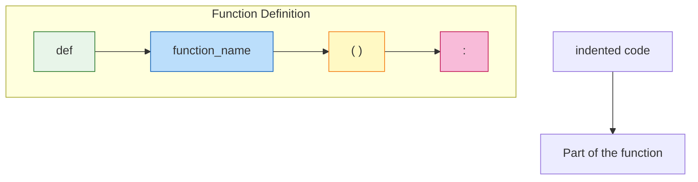
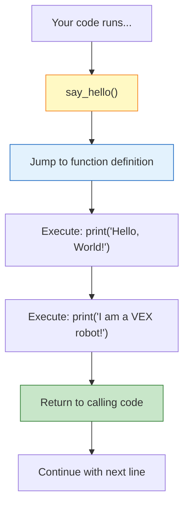
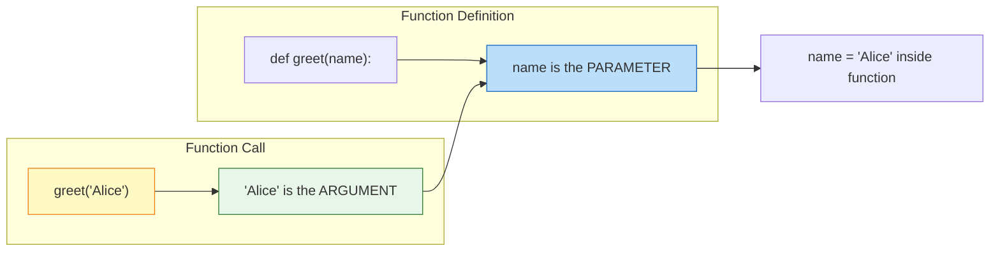
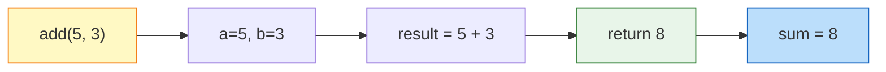
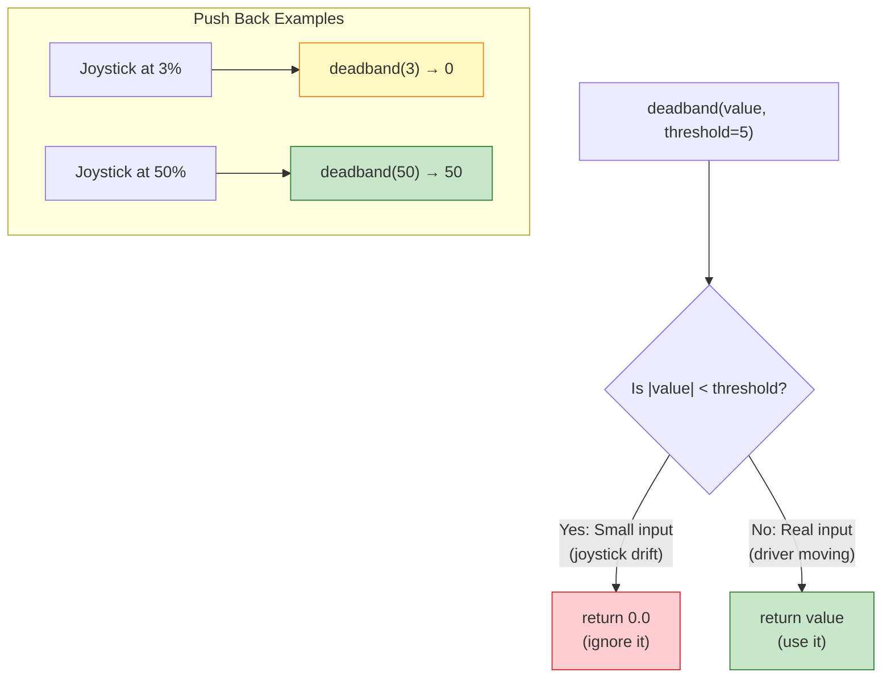
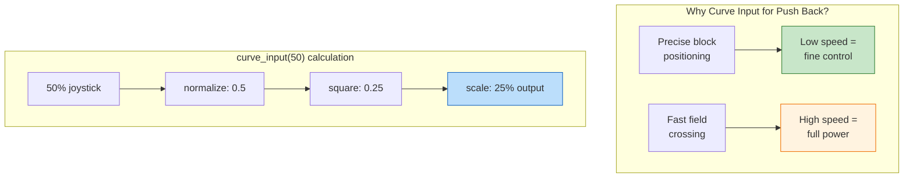

# Tutorial 3.2: Functions

**Time:** ~15 minutes
**Prerequisites:** Tutorial 3.1: Variables and Types

---

## What is a Function?

A **function** is like a recipe: a set of instructions with a name. You can use the recipe over and over without writing the instructions each time.

```
    Real World:                      In Python:

    ┌─────────────────────────┐     def make_sandwich():
    │   MAKE A SANDWICH       │         get_bread()
    │                         │         add_peanut_butter()
    │   1. Get bread          │         add_jelly()
    │   2. Add peanut butter  │         put_together()
    │   3. Add jelly          │
    │   4. Put together       │
    └─────────────────────────┘
```

Instead of writing all 4 steps every time, you just say `make_sandwich()`.

## Creating a Function

The basic pattern is:

```python
def function_name():
    # Code inside the function
    # (indented with 4 spaces)
    do_something()
    do_something_else()
```

**Example:**
```python
def say_hello():
    print("Hello, World!")
    print("I am a VEX robot!")
```

### Function Anatomy Flowchart



| Part | Meaning |
|------|---------|
| `def` | Keyword that starts a function definition |
| `function_name` | The name you give your function |
| `( )` | Parentheses hold parameters (inputs) |
| `:` | Colon marks the start of the function body |
| indented code | The instructions inside the function (4 spaces) |

**Using (calling) the function:**
```python
say_hello()  # This runs both print statements
```

Output:
```
Hello, World!
I am a VEX robot!
```

### Function Call Flowchart

When you call a function, the computer "jumps" to run that function's code, then returns:



## Parameters: Giving Functions Information

**Parameters** are like ingredients - information you give to the function:

```
    Real World:                      In Python:

    MAKE SANDWICH with:              def make_sandwich(bread_type, filling):
    - Bread type: white                  get_bread(bread_type)
    - Filling: turkey                    add_filling(filling)
```

```python
def greet(name):
    print("Hello, " + name + "!")

greet("Alice")   # Output: Hello, Alice!
greet("Bob")     # Output: Hello, Bob!
```

### Parameters and Arguments Flowchart



**Remember:**
- **Parameter** = the variable in the function definition (placeholder)
- **Argument** = the actual value you pass when calling (the real data)

### Multiple Parameters

```python
def introduce(name, age, team):
    print("I am " + name)
    print("I am " + str(age) + " years old")
    print("I am on team " + str(team))

introduce("VEX Bot", 1, 12345)
```

Output:
```
I am VEX Bot
I am 1 years old
I am on team 12345
```

## Return Values: Getting Information Back

Functions can give you results back using `return`:

```
    Real World:                  In Python:

    CALCULATOR:                  def add(a, b):
    "What's 5 + 3?"                  result = a + b
    "The answer is 8"                return result
```

### Return Value Flowchart



```python
def add(a, b):
    result = a + b
    return result

# Use the returned value
sum = add(5, 3)
print(sum)  # Output: 8
```

### Why Return Matters

```python
# WITHOUT return - you can't use the result
def add_no_return(a, b):
    result = a + b
    print(result)  # Just prints, doesn't give back

x = add_no_return(5, 3)  # x is None!

# WITH return - you can use the result
def add_with_return(a, b):
    result = a + b
    return result

y = add_with_return(5, 3)  # y is 8!
print(y * 2)  # You can use it! Output: 16
```

## Code Connection: Functions in utils.py

Let's examine a real function from `src/utils.py`:

```python
def deadband(value, threshold=5.0):
    """
    Apply deadband to joystick input to prevent drift.

    Args:
        value: The input value (typically -100 to 100)
        threshold: Values below this are treated as zero

    Returns:
        0 if within deadband, otherwise the original value
    """
    if abs(value) < threshold:
        return 0.0
    return value
```

Let's break this down:

```
    def deadband(value, threshold=5.0):
    ↑      ↑            ↑
    |      |            |
    |      |            Default value (optional parameter)
    |      Function name
    Keyword to define a function

    if abs(value) < threshold:
       ↑
       Built-in function: absolute value (makes negative positive)

    return 0.0
           ↑
           Give back zero if input is small

    return value
           ↑
           Otherwise, give back original
```

### deadband() Function Flowchart



### Using deadband()

```python
# Normal use
result1 = deadband(50)     # Returns 50 (above threshold)
result2 = deadband(3)      # Returns 0 (below 5 threshold)
result3 = deadband(-4)     # Returns 0 (abs(-4) = 4 < 5)

# With custom threshold
result4 = deadband(8, threshold=10)   # Returns 0 (below 10)
result5 = deadband(15, threshold=10)  # Returns 15 (above 10)
```

### Default Parameters

Notice `threshold=5.0`? That's a **default parameter**:

```python
# If you don't specify threshold, it uses 5.0
deadband(50)              # Same as deadband(50, 5.0)

# But you CAN specify a different value
deadband(50, 10)          # Uses 10 as threshold
deadband(50, threshold=10) # Same thing, more readable
```

## More Functions from utils.py

### clamp()

```python
def clamp(value, min_val, max_val):
    """Clamp a value between minimum and maximum bounds."""
    return max(min_val, min(value, max_val))

# Examples:
clamp(150, 0, 100)   # Returns 100 (capped at max)
clamp(-50, 0, 100)   # Returns 0 (raised to min)
clamp(50, 0, 100)    # Returns 50 (already in range)
```

### curve_input()

```python
def curve_input(value, exponent=2.0):
    """Apply exponential curve for finer control at low speeds."""
    sign = 1 if value >= 0 else -1
    normalized = abs(value) / 100.0
    curved = (normalized ** exponent) * 100.0
    return sign * curved

# Examples:
curve_input(50)      # Returns 25 (50% input → 25% output)
curve_input(100)     # Returns 100 (max stays max)
curve_input(-50)     # Returns -25 (preserves direction)
```

Why is this useful? It gives more precise control at low speeds!

### curve_input() Flowchart



```
    LINEAR (no curve):          CURVED (exponent=2):

    Joystick  →  Motor          Joystick  →  Motor
       0%     →    0%              0%     →    0%
      25%     →   25%             25%     →    6.25%  ← More precision!
      50%     →   50%             50%     →   25%
      75%     →   75%             75%     →   56.25%
     100%     →  100%            100%     →  100%
```

**Why this matters for Push Back:** When you're carefully pushing blocks into a goal, you need precise, slow movements. curve_input() lets you make small adjustments without overshooting!

## Functions Calling Functions

Functions can use other functions:

```python
def process_joystick(raw_value):
    """Process raw joystick input with deadband and curve."""
    # First, apply deadband
    after_deadband = deadband(raw_value)

    # Then, apply curve
    final_value = curve_input(after_deadband)

    return final_value

# Use it:
speed = process_joystick(25)  # Goes through both processing steps
```

## The Docstring

The text in triple quotes `"""..."""` is called a **docstring**:

```python
def deadband(value, threshold=5.0):
    """
    Apply deadband to joystick input to prevent drift.

    Args:
        value: The input value (typically -100 to 100)
        threshold: Values below this are treated as zero

    Returns:
        0 if within deadband, otherwise the original value
    """
```

It explains what the function does. Good practice!

---

## Summary

| Concept | What It Means | Example |
|---------|---------------|---------|
| **Function** | Reusable set of instructions | `def say_hello():` |
| **Parameter** | Input to a function | `def greet(name):` |
| **Return** | Output from a function | `return result` |
| **Default** | Optional parameter with preset value | `threshold=5.0` |
| **Calling** | Using a function | `say_hello()` |
| **Docstring** | Documentation in `"""..."""` | Explains the function |

---

## Exercise: Write Your Own Functions

**Challenge 1:** Write a function that calculates the area of a rectangle:

```python
def rectangle_area(width, height):
    # Your code here
    pass

# Test it:
print(rectangle_area(5, 3))  # Should print 15
```

**Challenge 2:** Write a function that converts motor percent to RPM:

```python
def percent_to_rpm(percent, max_rpm=200):
    # Your code here
    # Hint: 100% = max_rpm, 50% = half of max_rpm
    pass

# Test it:
print(percent_to_rpm(100))      # Should print 200
print(percent_to_rpm(50))       # Should print 100
print(percent_to_rpm(75, 600))  # Should print 450 (using blue cartridge max)
```

**Challenge 3:** Look at `utils.py` and try to understand `scale_input()`. What does it do?

**Challenge 4 (Push Back):** Write a function called `parking_bonus` that takes `num_robots` (0, 1, or 2) and returns the correct bonus points (0, 8, or 30).

**Challenge 5 (Push Back):** Write a function called `check_awp_requirements` that checks if an alliance meets the Autonomous Win Point requirements:
- 7+ blocks scored
- Blocks in 3+ different goals
- 3+ blocks removed from loaders

---

## Push Back Helper Functions

Here are specialized functions for the Push Back competition:

```python
# ═══════════════════════════════════════════════════════════════
# PUSH BACK SCORING FUNCTIONS
# ═══════════════════════════════════════════════════════════════

def calculate_block_score(blocks):
    """
    Calculate points from blocks scored in Push Back.

    Args:
        blocks: Number of blocks pushed into goals

    Returns:
        Total block points (3 points per block)
    """
    POINTS_PER_BLOCK = 3
    return blocks * POINTS_PER_BLOCK


def check_zone_control(our_blocks, opponent_blocks):
    """
    Determine if we control a goal zone in Push Back.

    Args:
        our_blocks: Number of our alliance's blocks in the zone
        opponent_blocks: Number of opponent's blocks in the zone

    Returns:
        True if we have majority, False otherwise
    """
    return our_blocks > opponent_blocks


def get_zone_bonus(zone_type, have_control):
    """
    Get bonus points for controlling a goal zone.

    Args:
        zone_type: "long", "center_upper", or "center_lower"
        have_control: True if we have majority in the zone

    Returns:
        Bonus points for that zone (0 if no control)
    """
    if not have_control:
        return 0

    if zone_type == "long":
        return 10
    elif zone_type == "center_upper":
        return 8
    elif zone_type == "center_lower":
        return 6
    else:
        return 0


def parking_bonus(num_robots):
    """
    Calculate parking bonus based on robots parked.

    Args:
        num_robots: Number of alliance robots parked (0, 1, or 2)

    Returns:
        Parking bonus points
    """
    if num_robots == 2:
        return 30
    elif num_robots == 1:
        return 8
    else:
        return 0


def calculate_total_score(blocks, zone_controls, robots_parked):
    """
    Calculate complete alliance score for a Push Back match.

    Args:
        blocks: Total blocks scored
        zone_controls: List of (zone_type, have_control) tuples
        robots_parked: Number of robots in park zone (0, 1, or 2)

    Returns:
        Total match score
    """
    # Block points
    score = calculate_block_score(blocks)

    # Zone control bonuses
    for zone_type, have_control in zone_controls:
        score = score + get_zone_bonus(zone_type, have_control)

    # Parking bonus
    score = score + parking_bonus(robots_parked)

    return score


# ═══════════════════════════════════════════════════════════════
# USING THE FUNCTIONS
# ═══════════════════════════════════════════════════════════════

# Example match scenario
blocks_scored = 8
zone_controls = [
    ("long", True),           # We control a long goal: +10
    ("center_upper", False),  # Opponent controls center: +0
]
robots_parked = 2             # Both robots parked: +30

# Calculate final score
final_score = calculate_total_score(blocks_scored, zone_controls, robots_parked)
print("Match Score: " + str(final_score))  # 24 + 10 + 30 = 64 points
```

---

## Common Mistakes with Functions

### Mistake 1: Forgetting Parentheses When Calling

```python
# WRONG: This doesn't call the function!
result = add    # Just refers to the function object, doesn't run it

# RIGHT: Parentheses call the function
result = add(5, 3)  # Actually runs add() and returns 8
```

### Mistake 2: Forgetting to Return

```python
# WRONG: Function doesn't return anything useful
def add(a, b):
    result = a + b
    # Forgot return! result is calculated but lost

x = add(5, 3)    # x is None, not 8!

# RIGHT: Return the result
def add(a, b):
    result = a + b
    return result  # Now the value comes back

y = add(5, 3)    # y is 8
```

### Mistake 3: Wrong Indentation

```python
# WRONG: Code not indented inside function
def greet():
print("Hello")    # ERROR: IndentationError!

# RIGHT: Indent with 4 spaces
def greet():
    print("Hello")  # This is inside the function
```

### Mistake 4: Missing Colon

```python
# WRONG: Missing colon after function definition
def say_hello()   # SyntaxError!
    print("Hello")

# RIGHT: Colon marks start of function body
def say_hello():
    print("Hello")
```

### Mistake 5: Modifying Parameters Doesn't Change Original

```python
# This might surprise you:
def double(x):
    x = x * 2    # This only changes x inside the function
    return x

my_speed = 50
double(my_speed)          # Returns 100, but...
print(my_speed)           # Still 50! Original wasn't changed

# If you want to change the original:
my_speed = double(my_speed)  # Now my_speed is 100
```

---

## How Functions Connect to Push Back

Functions organize your Push Back robot code into reusable pieces:

| Function | Purpose in Push Back |
|----------|---------------------|
| `deadband()` | Stops joystick drift when positioning blocks precisely |
| `clamp()` | Keeps motor speeds valid when using turbo mode |
| `curve_input()` | Gives precise control for careful block placement |
| `autonomous_routine()` | Runs your 15-second scoring sequence |
| `driver_control_loop()` | Controls robot during 1:45 driver period |
| `calculate_block_score()` | Tracks your alliance's points |

### Why Functions Matter

Without functions, you'd have to:
1. Copy the same code everywhere you need it
2. Fix bugs in multiple places
3. Make your code impossible to read

With functions, you:
1. Write code once, use it everywhere
2. Fix bugs in one place
3. Give meaningful names to complex operations

```python
# Without functions: Confusing!
left_speed = controller.axis3.position()
if abs(left_speed) < 5:
    left_speed = 0
# ... repeated everywhere you need deadband

# With functions: Clear!
left_speed = deadband(controller.axis3.position())
# One line, easy to understand
```

---

## Answers

**Challenge 1:**
```python
def rectangle_area(width, height):
    area = width * height
    return area
```

**Challenge 2:**
```python
def percent_to_rpm(percent, max_rpm=200):
    rpm = (percent / 100) * max_rpm
    return rpm
```

**Challenge 3:** `scale_input()` converts a value from one range to another. Example: convert a 0-1023 sensor reading to 0-100% output.

---

**[← Previous: Variables and Types](01-variables-and-types.md)** | **[Next: Loops and Conditionals →](03-loops-and-conditionals.md)**
