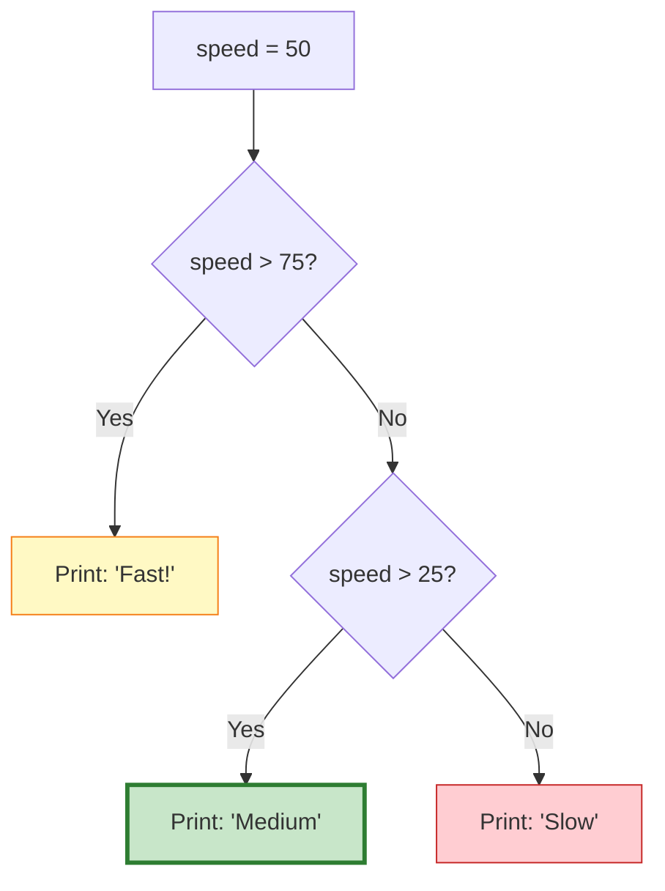
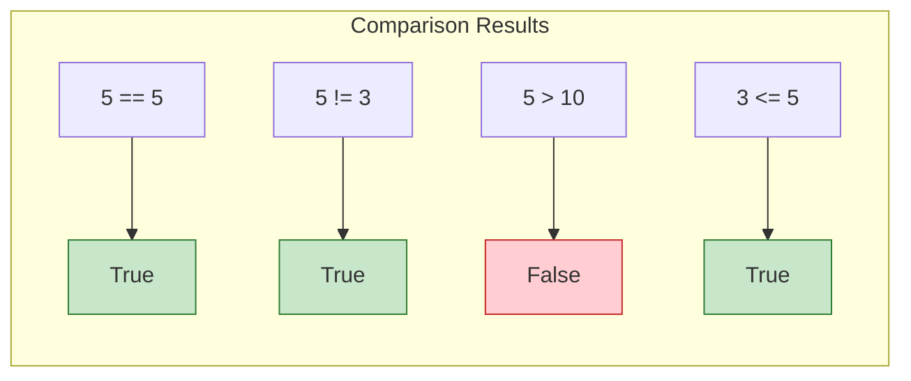
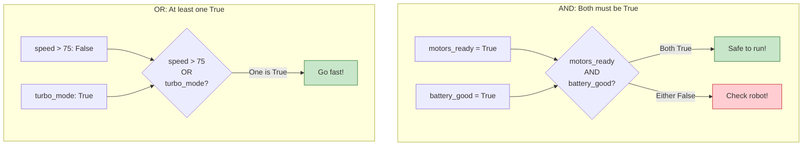
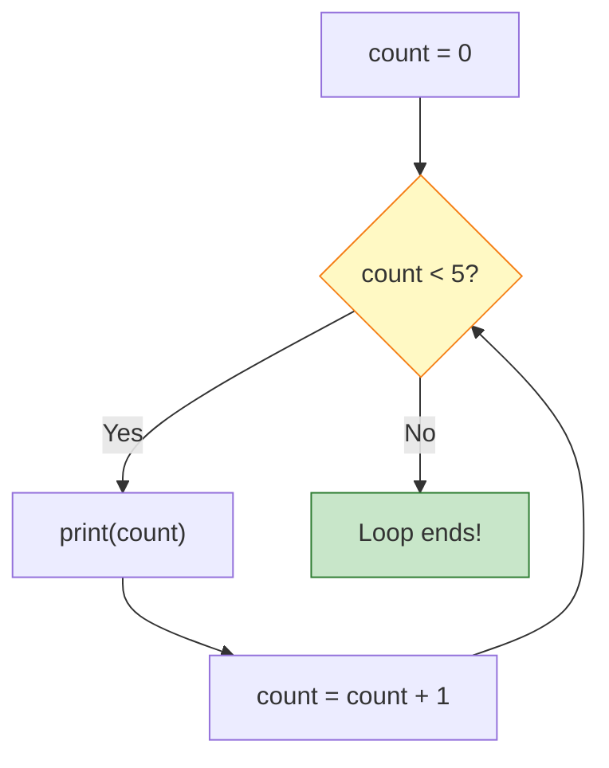
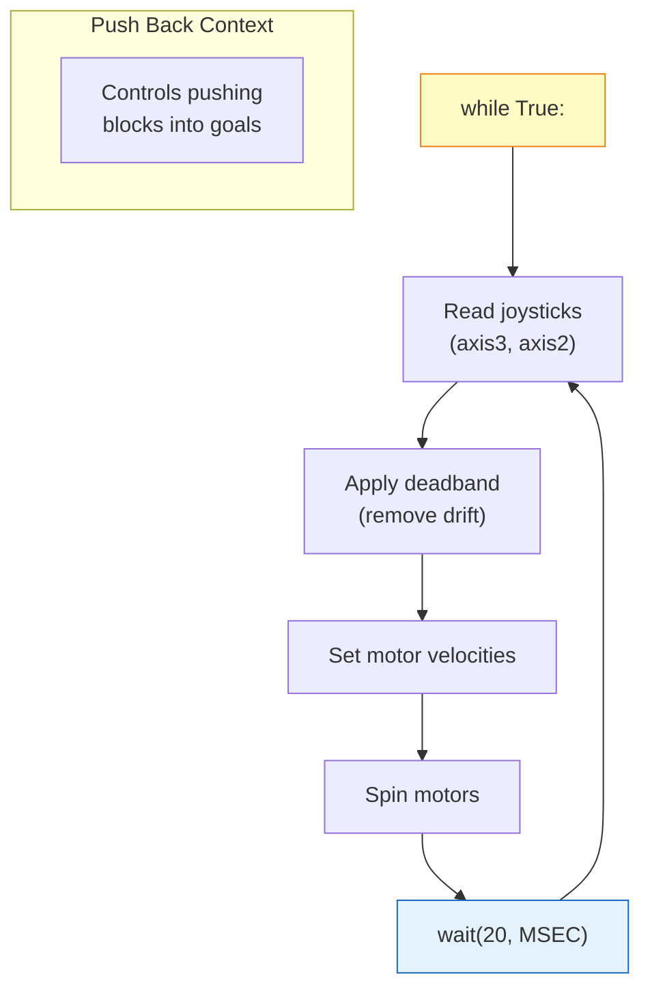
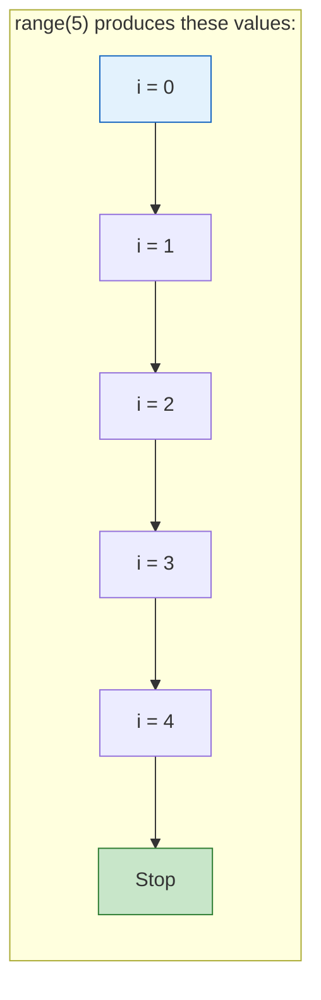
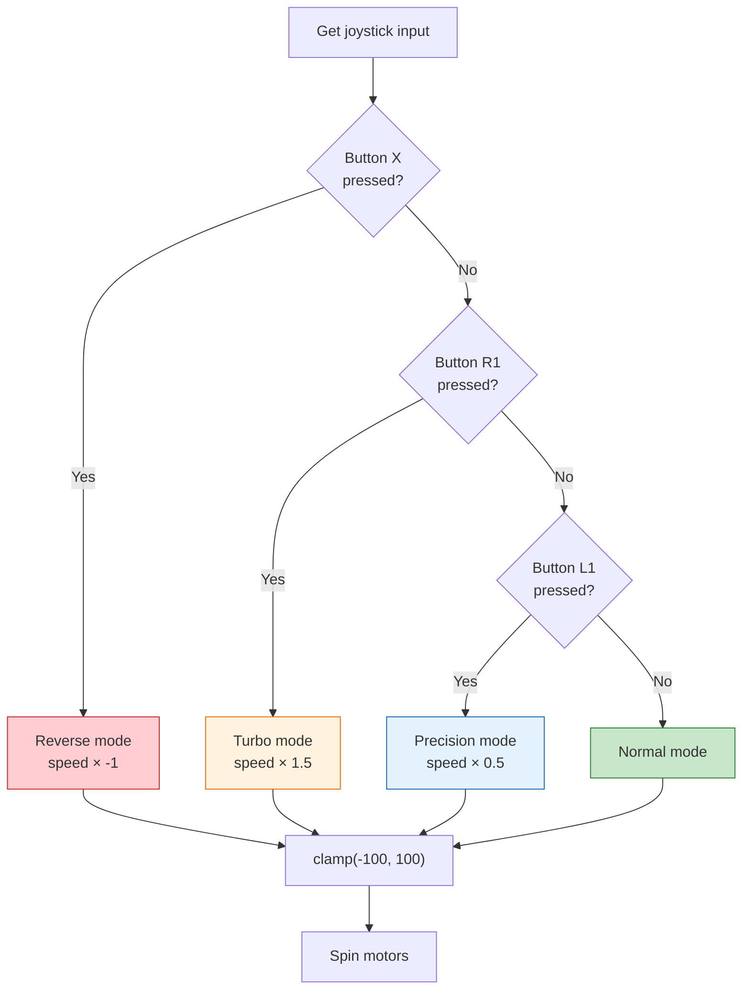
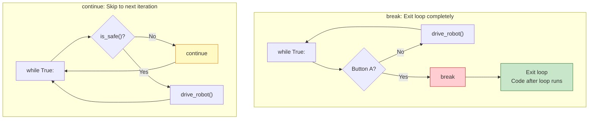
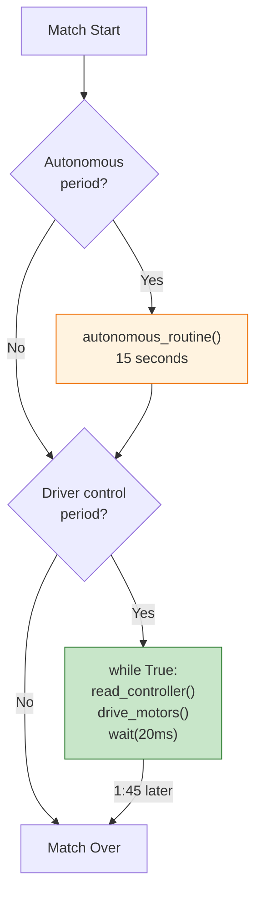

# Tutorial 3.3: Loops and Conditionals

**Time:** ~15 minutes
**Prerequisites:** Tutorial 3.2: Functions

---

## What are Conditionals?

**Conditionals** let your code make decisions: "If this is true, do this. Otherwise, do that."

```
    Real World:                      In Python:

    "If it's raining,                if is_raining:
     take an umbrella.                   take_umbrella()
     Otherwise, wear sunglasses."    else:
                                         wear_sunglasses()
```

This is how your robot decides what to do based on conditions!

## The if Statement

```python
button_pressed = True

if button_pressed:
    print("Button is pressed!")
```

The code inside the `if` block (indented) only runs if the condition is `True`.

### if-else

```python
speed = 50

if speed > 75:
    print("Going fast!")
else:
    print("Going slow or medium")
```

### if-elif-else

When you have multiple conditions:

```python
speed = 50

if speed > 75:
    print("Fast!")
elif speed > 25:
    print("Medium")
else:
    print("Slow")
```

### if-elif-else Flowchart



With `speed = 50`:
1. Is 50 > 75? **No** → skip "Fast!"
2. Is 50 > 25? **Yes** → print "Medium" ← This runs!

## Comparison Operators

These are used to compare values:

| Operator | Meaning | Example | Result |
|----------|---------|---------|--------|
| `==` | Equal to | `5 == 5` | `True` |
| `!=` | Not equal | `5 != 3` | `True` |
| `>` | Greater than | `5 > 3` | `True` |
| `<` | Less than | `5 < 3` | `False` |
| `>=` | Greater or equal | `5 >= 5` | `True` |
| `<=` | Less or equal | `3 <= 5` | `True` |

### Comparison Results Flowchart



> :warning: **Common mistake:** Using `=` instead of `==`
> - `=` assigns a value: `x = 5`
> - `==` compares values: `if x == 5:`

## Logical Operators

Combine multiple conditions:

| Operator | Meaning | Example |
|----------|---------|---------|
| `and` | Both must be true | `if speed > 0 and button_pressed:` |
| `or` | At least one true | `if speed > 75 or turbo_mode:` |
| `not` | Opposite | `if not button_pressed:` |

```python
# Example: Robot safety check
motors_ready = True
battery_good = True

if motors_ready and battery_good:
    print("Robot is safe to run!")
else:
    print("Check motors or battery!")
```

### Logical Operators Flowchart



## What are Loops?

**Loops** repeat code over and over. Essential for robot control!

### while Loop

Repeats while a condition is true:

```python
count = 0

while count < 5:
    print(count)
    count = count + 1

# Output: 0, 1, 2, 3, 4
```

### while Loop Flowchart



The loop keeps going back to check the condition until it's False.

### while True (Forever Loop)

The most common loop in robot code:

```python
while True:
    # This runs forever!
    read_sensors()
    control_motors()
    wait(20, MSEC)
```

This is how `driver_control_loop()` works - it runs continuously!

## Code Connection: driver_control.py

Let's examine the real driver control loop:

```python
def driver_control_loop():
    brain.screen.print("Driver Control Active")

    while True:
        # Get joystick positions (-100 to 100)
        left_speed = controller.axis3.position()
        right_speed = controller.axis2.position()

        # Apply deadband to prevent motor drift
        left_speed = deadband(left_speed, threshold=5)
        right_speed = deadband(right_speed, threshold=5)

        # Set motor velocities and spin
        left_motors.set_velocity(left_speed, PERCENT)
        right_motors.set_velocity(right_speed, PERCENT)

        left_motors.spin(FORWARD)
        right_motors.spin(FORWARD)

        # Small delay to prevent CPU overload
        wait(20, MSEC)
```

### Driver Control Loop Flowchart



**Why this loop runs forever:** During driver control, you need to constantly read the joysticks and update motors. This runs 50 times per second (every 20 milliseconds) for smooth control!

**Why wait(20, MSEC)?**
- Without it, the loop runs millions of times per second
- Uses too much CPU power
- 20ms = 50 updates per second (smooth control)

## for Loops

When you know exactly how many times to repeat:

```python
# Print numbers 0 to 4
for i in range(5):
    print(i)
# Output: 0, 1, 2, 3, 4

# Print "Go!" three times
for i in range(3):
    print("Go!")
# Output: Go! Go! Go!
```

### range() Function

| Code | Produces |
|------|----------|
| `range(5)` | 0, 1, 2, 3, 4 |
| `range(1, 6)` | 1, 2, 3, 4, 5 |
| `range(0, 10, 2)` | 0, 2, 4, 6, 8 |

### for Loop Flowchart



**Note:** `range(5)` gives you 5 values: 0, 1, 2, 3, 4. It stops **before** 5!

## Combining Loops and Conditionals

Real robot code uses both together:

```python
def driver_control_with_button():
    while True:
        # Normal driving
        left_speed = controller.axis3.position()
        right_speed = controller.axis2.position()

        # Check for turbo button
        if controller.buttonR1.pressing():
            # Double the speed!
            left_speed = left_speed * 2
            right_speed = right_speed * 2

        # Limit to valid range
        left_speed = clamp(left_speed, -100, 100)
        right_speed = clamp(right_speed, -100, 100)

        left_motors.spin(FORWARD, left_speed, PERCENT)
        right_motors.spin(FORWARD, right_speed, PERCENT)

        wait(20, MSEC)
```

### Push Back Button Mode Flowchart

This flowchart shows how conditionals inside a loop control robot behavior:



This gives the driver multiple control modes during Push Back matches!

## Breaking Out of Loops

Use `break` to exit a loop early:

```python
while True:
    if controller.buttonA.pressing():
        print("Button A pressed - stopping!")
        break  # Exit the loop!

    # Normal operation
    drive_robot()
```

Use `continue` to skip to the next iteration:

```python
while True:
    if not is_safe():
        continue  # Skip this iteration, don't drive

    drive_robot()  # Only runs if is_safe() is True
```

### break vs continue Flowchart



**Key difference:**
- `break` = **STOP** the entire loop
- `continue` = **SKIP** this round, go to next

---

## Push Back Control Logic

Here's a complete driver control with Push Back-specific features:

```python
# ═══════════════════════════════════════════════════════════════
# PUSH BACK DRIVER CONTROL WITH MODES
# ═══════════════════════════════════════════════════════════════

def push_back_driver_control():
    """Enhanced driver control for Push Back competition."""
    brain.screen.print("Push Back Mode Active")

    scoring_mode = False  # Toggle for precision block placement

    while True:
        # Get base joystick input
        left_speed = controller.axis3.position()
        right_speed = controller.axis2.position()

        # Apply deadband to remove joystick drift
        left_speed = deadband(left_speed, threshold=5)
        right_speed = deadband(right_speed, threshold=5)

        # Toggle scoring mode with Button A
        if controller.buttonA.pressing():
            scoring_mode = not scoring_mode
            brain.screen.print("Scoring: " + str(scoring_mode))
            wait(200, MSEC)  # Debounce button

        # Apply speed modifiers based on mode
        if scoring_mode:
            # Slow, precise control for pushing blocks into goals
            left_speed = left_speed * 0.3
            right_speed = right_speed * 0.3
        elif controller.buttonR1.pressing():
            # Turbo for crossing field quickly
            left_speed = left_speed * 1.5
            right_speed = right_speed * 1.5
        elif controller.buttonL1.pressing():
            # Half speed for careful maneuvering
            left_speed = left_speed * 0.5
            right_speed = right_speed * 0.5

        # Reverse controls with Button X
        if controller.buttonX.pressing():
            left_speed = left_speed * -1
            right_speed = right_speed * -1

        # Always clamp to valid motor range
        left_speed = clamp(left_speed, -100, 100)
        right_speed = clamp(right_speed, -100, 100)

        # Drive the motors
        left_motors.spin(FORWARD, left_speed, PERCENT)
        right_motors.spin(FORWARD, right_speed, PERCENT)

        wait(20, MSEC)


# ═══════════════════════════════════════════════════════════════
# PUSH BACK AUTONOMOUS WITH DECISIONS
# ═══════════════════════════════════════════════════════════════

def push_back_autonomous():
    """15-second autonomous routine with strategic decisions."""
    setup_autonomous()

    # Track our progress
    blocks_pushed = 0
    time_remaining = 15

    # Push blocks while we have time
    while time_remaining > 3:  # Keep 3 seconds for parking
        # Push toward goal
        drivetrain.drive_for(FORWARD, 500, MM)
        blocks_pushed = blocks_pushed + 1

        # Back up for next push
        drivetrain.drive_for(REVERSE, 200, MM)

        # Update time estimate (simplified)
        time_remaining = time_remaining - 2.5

        brain.screen.print("Blocks: " + str(blocks_pushed))

    # Use remaining time to park
    drivetrain.turn_for(LEFT, 90, DEGREES)
    drivetrain.drive_for(FORWARD, 400, MM)
    brain.screen.print("PARKED!")


# ═══════════════════════════════════════════════════════════════
# AWP CHECKER - Check Autonomous Win Point requirements
# ═══════════════════════════════════════════════════════════════

def check_awp_progress(blocks, goals_used, loader_blocks):
    """
    Check progress toward Autonomous Win Point.

    Requirements:
    - 7+ blocks scored
    - Blocks in 3+ different goals
    - 3+ blocks removed from loaders
    """
    requirements_met = 0

    # Check block count
    if blocks >= 7:
        print("Blocks: MET (7+)")
        requirements_met = requirements_met + 1
    else:
        print("Blocks: NEED " + str(7 - blocks) + " more")

    # Check goal diversity
    if goals_used >= 3:
        print("Goals: MET (3+)")
        requirements_met = requirements_met + 1
    else:
        print("Goals: NEED " + str(3 - goals_used) + " more")

    # Check loader blocks
    if loader_blocks >= 3:
        print("Loader: MET (3+)")
        requirements_met = requirements_met + 1
    else:
        print("Loader: NEED " + str(3 - loader_blocks) + " more")

    # Final verdict
    if requirements_met == 3:
        print("AWP REQUIREMENTS MET!")
        return True
    else:
        print("AWP: " + str(requirements_met) + "/3 requirements")
        return False
```

---

## Common Mistakes with Loops and Conditionals

### Mistake 1: Infinite Loop (Forgetting to Update)

```python
# WRONG: count never changes, runs forever!
count = 0
while count < 5:
    print(count)
    # Forgot: count = count + 1

# RIGHT: Update the variable
count = 0
while count < 5:
    print(count)
    count = count + 1  # This makes the loop eventually stop
```

### Mistake 2: Using = Instead of ==

```python
# WRONG: = is assignment, not comparison
if speed = 50:     # SyntaxError!
    print("Half speed")

# RIGHT: == compares values
if speed == 50:    # This checks if speed equals 50
    print("Half speed")
```

### Mistake 3: Forgetting the Colon

```python
# WRONG: Missing colon after condition
if x > 5          # SyntaxError!
    print("Big")

while count < 10  # SyntaxError!
    print(count)

# RIGHT: Colon marks start of the block
if x > 5:
    print("Big")

while count < 10:
    print(count)
```

### Mistake 4: Wrong Indentation

```python
# WRONG: Code outside the if block
if button_pressed:
print("Pressed")   # ERROR: not indented

# RIGHT: Indented code is inside the block
if button_pressed:
    print("Pressed")  # This is part of the if
```

### Mistake 5: Off-by-One with range()

```python
# If you want to print 1 through 5:

# WRONG: This prints 0, 1, 2, 3, 4
for i in range(5):
    print(i)

# RIGHT: Start at 1, stop at 6
for i in range(1, 6):
    print(i)  # Prints 1, 2, 3, 4, 5
```

---

## How Loops and Conditionals Connect to Push Back

### Conditionals in Push Back

| Condition | Action |
|-----------|--------|
| `if turbo_button:` | Increase speed to cross field fast |
| `if scoring_mode:` | Reduce speed for precise block placement |
| `if blocks >= 7:` | AWP block requirement met |
| `if time_remaining < 5:` | Switch to parking strategy |
| `if is_autonomous:` | Run pre-programmed routine |

### Loops in Push Back

| Loop | Purpose |
|------|---------|
| `while True:` | Driver control - constantly reads joysticks |
| `for i in range(5):` | Score 5 blocks in sequence |
| `while time > 0:` | Autonomous - keep working until time's up |

### The Big Picture

Your entire robot program during a match looks like this:



**Every robot program is loops and conditionals!**

---

## Summary

| Concept | What It Does | Example |
|---------|--------------|---------|
| `if` | Run code if condition true | `if x > 5:` |
| `else` | Run if condition false | `else:` |
| `elif` | Additional conditions | `elif x > 3:` |
| `while` | Repeat while true | `while running:` |
| `while True` | Repeat forever | `while True:` |
| `for` | Repeat specific times | `for i in range(5):` |
| `break` | Exit loop early | `break` |
| `continue` | Skip to next iteration | `continue` |

---

## Exercise: Add Button Detection

**Goal:** Modify driver control to reverse when button X is pressed.

```python
def driver_control_with_reverse():
    while True:
        left_speed = controller.axis3.position()
        right_speed = controller.axis2.position()

        # YOUR CODE HERE:
        # If buttonX is pressing, multiply speeds by -1
        # Hint: if controller.buttonX.pressing():

        left_motors.spin(FORWARD, left_speed, PERCENT)
        right_motors.spin(FORWARD, right_speed, PERCENT)

        wait(20, MSEC)
```

**Bonus:** Add multiple buttons:
- Button X = reverse (multiply by -1)
- Button R1 = turbo (multiply by 1.5, then clamp)
- Button L1 = slow mode (multiply by 0.5)

---

## Answer

```python
def driver_control_with_reverse():
    while True:
        left_speed = controller.axis3.position()
        right_speed = controller.axis2.position()

        # Reverse when X is pressed
        if controller.buttonX.pressing():
            left_speed = left_speed * -1
            right_speed = right_speed * -1

        left_motors.spin(FORWARD, left_speed, PERCENT)
        right_motors.spin(FORWARD, right_speed, PERCENT)

        wait(20, MSEC)
```

**Bonus Answer:**
```python
def driver_control_with_modes():
    while True:
        left_speed = controller.axis3.position()
        right_speed = controller.axis2.position()

        # Reverse mode
        if controller.buttonX.pressing():
            left_speed = left_speed * -1
            right_speed = right_speed * -1

        # Turbo mode
        if controller.buttonR1.pressing():
            left_speed = left_speed * 1.5
            right_speed = right_speed * 1.5

        # Slow mode
        if controller.buttonL1.pressing():
            left_speed = left_speed * 0.5
            right_speed = right_speed * 0.5

        # Always clamp to valid range
        left_speed = clamp(left_speed, -100, 100)
        right_speed = clamp(right_speed, -100, 100)

        left_motors.spin(FORWARD, left_speed, PERCENT)
        right_motors.spin(FORWARD, right_speed, PERCENT)

        wait(20, MSEC)
```
---

**Ready to test your knowledge? Check out the [Python Q&A Review](04-review-qa.md)!**

---

**[← Previous: Functions](02-functions.md)** | **[Next: Tutorial 4 - Drive Control →](../04-drive-control/01-tank-drive.md)**
