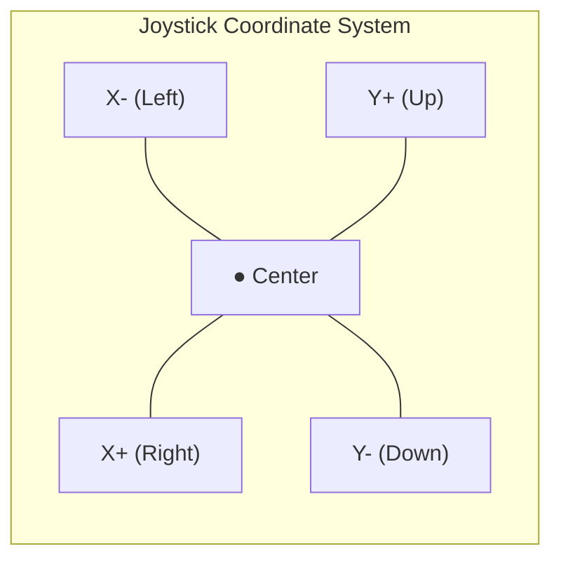

# Tutorial 4.0: VEX Controller Basics

**Time:** ~15 minutes
**Prerequisites:** Tutorial 2.1: Brain and Controller (review recommended)
**Math Review:** Negative numbers, percentages, basic number lines

---

## Before We Drive: Understanding the Controller

Before we learn tank drive or arcade drive, let's make sure we understand how the VEX controller talks to our robot. This tutorial covers the fundamentals that every driver needs to know!

---

## Part 1: The Controller Layout

The VEX V5 Controller has two joysticks and twelve buttons:

```
    VEX V5 CONTROLLER (front view)

    [L1]                               [R1]    <- Bumper buttons
    [L2]                               [R2]    <- Trigger buttons

    +-------+                       +-------+
    |       |                       |       |
    |   O   |  <- Left Joystick     |   O   |  <- Right Joystick
    |       |                       |       |
    +-------+                       +-------+

                [UP]
           [LEFT]  [RIGHT]     [X]   [A]
                [DOWN]              [B]   [Y]
```

### Joystick Movement Directions

Each joystick can move in TWO directions:
- **Y-axis** = Up and Down (vertical)
- **X-axis** = Left and Right (horizontal)



---

## Part 2: Axis Numbers (Why axis3 and axis2?)

VEX gave each joystick direction a NUMBER. Here's the full map:

```
    LEFT JOYSTICK                    RIGHT JOYSTICK

         axis3                           axis2
           ↑                               ↑
           |                               |
    axis4 ←●→ axis4                 axis1 ←●→ axis1
           |                               |
           ↓                               ↓
         axis3                           axis2


    QUICK REFERENCE:
    ┌────────────────────────────────────────┐
    │  axis1 = Right stick, Left/Right (X)  │
    │  axis2 = Right stick, Up/Down    (Y)  │
    │  axis3 = Left stick,  Up/Down    (Y)  │
    │  axis4 = Left stick,  Left/Right (X)  │
    └────────────────────────────────────────┘
```

### Memory Trick

Think of it as reading right-to-left: **3-2** goes **Left-to-Right** for Y-axes!

```
    Y-axes:  3 ──────────────────→ 2
             Left stick          Right stick

    X-axes:  4 ──────────────────→ 1
             Left stick          Right stick
```

### What Does axis3.position() Mean?

When you write `controller.axis3.position()`:
- `controller` = The VEX controller
- `axis3` = Left joystick, up/down movement
- `position()` = "Tell me where the joystick is right now"

---

## Part 3: Joystick Values (-100 to +100)

When you move a joystick, it returns a number between **-100** and **+100**:

```
    JOYSTICK Y-AXIS (up/down):

            Full UP = +100
                ↑
               +75
                ↑
               +50
                ↑
               +25
                ↑
    Center →    0   ← Joystick at rest
                ↓
               -25
                ↓
               -50
                ↓
               -75
                ↓
            Full DOWN = -100


    IT'S LIKE A THERMOMETER:
    ┌────────────────────────────┐
    │ Positive = "hot" = forward │
    │ Negative = "cold" = back   │
    │ Zero = "room temp" = stop  │
    └────────────────────────────┘
```

### Real Examples

| Joystick Position | axis3 Returns | Motor Response |
|-------------------|---------------|----------------|
| All the way up | +100 | Full speed forward |
| Halfway up | +50 | Half speed forward |
| At rest (center) | 0 | Motor stops |
| Halfway down | -50 | Half speed backward |
| All the way down | -100 | Full speed backward |

---

## Part 4: VEX API Constants Explained

When you see code like this:

```python
left_motors.spin(FORWARD, left_speed, PERCENT)
wait(20, MSEC)
```

What do `FORWARD`, `PERCENT`, and `MSEC` mean? Let's break them down:

### FORWARD and REVERSE

These are **direction references**, NOT commands to move forward!

```
    FORWARD  = "When speed is positive, spin this way"
               (clockwise when looking at the motor shaft)

    REVERSE  = "When speed is positive, spin the OTHER way"


    HOW IT WORKS:
    ┌─────────────────────────────────────────────────┐
    │  spin(FORWARD, +50, PERCENT)  →  Forward at 50% │
    │  spin(FORWARD, -50, PERCENT)  →  Backward at 50%│
    │                                                 │
    │  The SIGN of the speed controls direction!      │
    └─────────────────────────────────────────────────┘
```

Think of `FORWARD` like a light switch that says "follow the number's sign":
- Positive number = spin forward
- Negative number = spin backward

### PERCENT

This tells the motor what **unit** the speed is in:

```
    PERCENT means "out of 100"

    Examples:
    - 100 PERCENT = Maximum speed (100%)
    - 50 PERCENT  = Half speed (50%)
    - 0 PERCENT   = Stopped (0%)

    Just like your test grades:
    - 100% = perfect
    - 50%  = half right
    - 0%   = nothing
```

### MSEC (Milliseconds)

This is a unit of time. There are **1000 milliseconds in 1 second**:

```
    TIME CONVERSION:
    ┌───────────────────────────────┐
    │  1000 MSEC  =  1 second       │
    │   500 MSEC  =  0.5 seconds    │
    │   100 MSEC  =  0.1 seconds    │
    │    20 MSEC  =  0.02 seconds   │
    └───────────────────────────────┘

    Why wait(20, MSEC)?
    - 20 milliseconds = 0.02 seconds
    - 1000 ÷ 20 = 50 times per second
    - The loop runs 50 times per second (smooth control!)
```

Think of it like video game frame rates:
- 60 FPS game = 60 frames per second
- Our robot = 50 updates per second

---

## Part 5: Why Joysticks Drift

Have you ever noticed that when you let go of the joystick, the value isn't exactly 0? Maybe it shows 2 or -3 instead?

### This is Called "Drift"

```
    IDEAL WORLD:                  REAL WORLD:

    +-----+                       +-----+
    |  ●  | = 0                   |  ●  | = 2 or -1 or 3
    +-----+                       +-----+

    Joystick at rest should       But actually returns
    return exactly 0              a small number
```

### Why Does Drift Happen?

**Analogy: The Shopping Cart**

Imagine a shopping cart with slightly bent wheels:

```
    PERFECT CART:                 REAL CART:

    ┌─────┐                       ┌─────┐
    │     │ Goes perfectly        │     │ Drifts a little
    │  ●  │ straight              │  ●  │ even when you
    └──┬──┘                       └──┬──┘ push straight
       │                             ↗
       ↓                           (slight drift)
```

Joysticks are the same! They use:
- **Springs** that wear out over time
- **Sensors** with tiny manufacturing differences
- **Materials** affected by temperature

**Result:** The "center" position is never perfectly zero.

### The Solution: Deadband

We'll learn about this in the next tutorial, but the idea is simple:

```
    WITHOUT DEADBAND:           WITH DEADBAND:

    Joystick = 2                Joystick = 2
    Motor speed = 2             Motor speed = 0  ← Treated as zero!
    Robot slowly creeps...      Robot stays still!

    We ignore small values (like -5 to +5) so drift doesn't
    cause the robot to creep around.
```

---

## Part 6: Math Review for Drive Control

Before we dive into drive code, let's review three math concepts you'll see:

### 1. Absolute Value: |x|

Absolute value means "distance from zero" - ignore the negative sign!

```
    |5|   = 5     (5 is 5 units from zero)
    |-5|  = 5     (-5 is also 5 units from zero)
    |-100| = 100  (100 units from zero)
    |0|   = 0     (0 is 0 units from zero)

    REAL WORLD EXAMPLE:
    Walking 5 blocks LEFT = walking 5 blocks RIGHT
    Same DISTANCE, different direction!
```

### 2. Exponents: x^n

An exponent means "multiply by itself n times":

```
    2^2 = 2 × 2 = 4
    3^2 = 3 × 3 = 9
    10^2 = 10 × 10 = 100

    With decimals:
    0.5^2 = 0.5 × 0.5 = 0.25
    0.25^2 = 0.25 × 0.25 = 0.0625

    REAL WORLD EXAMPLE:
    Area of a square = side × side = side²
    A 5-foot square has area 5² = 25 square feet
```

### 3. Normalized Values (0 to 1 range)

"Normalizing" means converting a value to a 0-to-1 scale:

```
    To normalize: divide by the maximum

    50 out of 100 = 50/100 = 0.5 (normalized)
    75 out of 100 = 75/100 = 0.75 (normalized)
    25 out of 100 = 25/100 = 0.25 (normalized)

    REAL WORLD EXAMPLE:
    Test score: 85 out of 100
    Normalized: 85/100 = 0.85 = 85%
```

---

## Quick Reference

```
    AXIS NUMBERS:
    ┌──────────────────────────────────────┐
    │  axis1 = Right X (right joystick ←→) │
    │  axis2 = Right Y (right joystick ↑↓) │
    │  axis3 = Left Y  (left joystick ↑↓)  │
    │  axis4 = Left X  (left joystick ←→)  │
    └──────────────────────────────────────┘

    VALUES:
    ┌──────────────────────────────────────┐
    │  Joystick range: -100 to +100        │
    │  Center = 0                          │
    │  Up/Right = positive                 │
    │  Down/Left = negative                │
    └──────────────────────────────────────┘

    CONSTANTS:
    ┌──────────────────────────────────────┐
    │  FORWARD = direction reference       │
    │  PERCENT = speed unit (0-100%)       │
    │  MSEC = milliseconds (1000 = 1 sec)  │
    └──────────────────────────────────────┘
```

---

## Exercise: Controller Exploration

**Goal:** Explore your controller values in real-time

**Step 1:** Add this code to display joystick values:

```python
while True:
    # Read all four axes
    left_y = controller.axis3.position()
    left_x = controller.axis4.position()
    right_y = controller.axis2.position()
    right_x = controller.axis1.position()

    # Display on brain screen
    brain.screen.clear_screen()
    brain.screen.set_cursor(1, 1)
    brain.screen.print("Left Y (axis3): ", left_y)
    brain.screen.set_cursor(2, 1)
    brain.screen.print("Left X (axis4): ", left_x)
    brain.screen.set_cursor(3, 1)
    brain.screen.print("Right Y (axis2): ", right_y)
    brain.screen.set_cursor(4, 1)
    brain.screen.print("Right X (axis1): ", right_x)

    wait(50, MSEC)
```

**Step 2:** Download and run. Watch the screen as you move the joysticks!

**Questions to Answer:**
1. What value do you see when the left stick is all the way up?
2. What value do you see when the right stick is at rest?
3. Is the "at rest" value exactly 0, or does it drift?
4. Move the left stick in a circle - what happens to axis3 and axis4?

---

**[← Previous: Loops and Conditionals](../03-python-basics/03-loops-and-conditionals.md)** | **[Next: Tank Drive →](01-tank-drive.md)**
