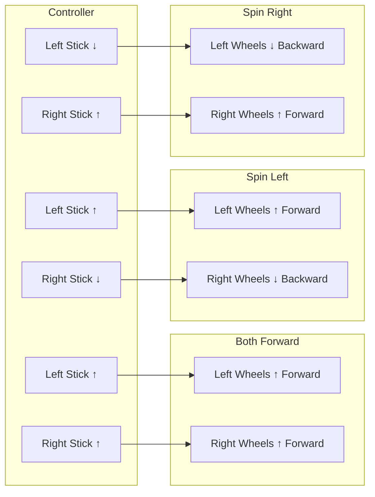
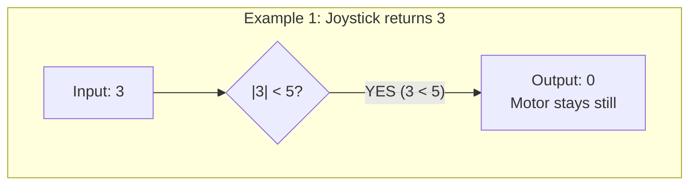
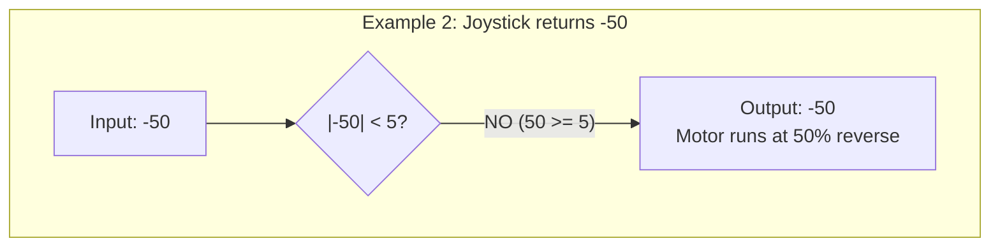
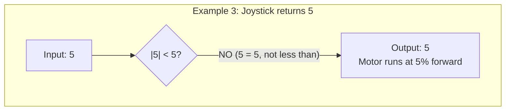
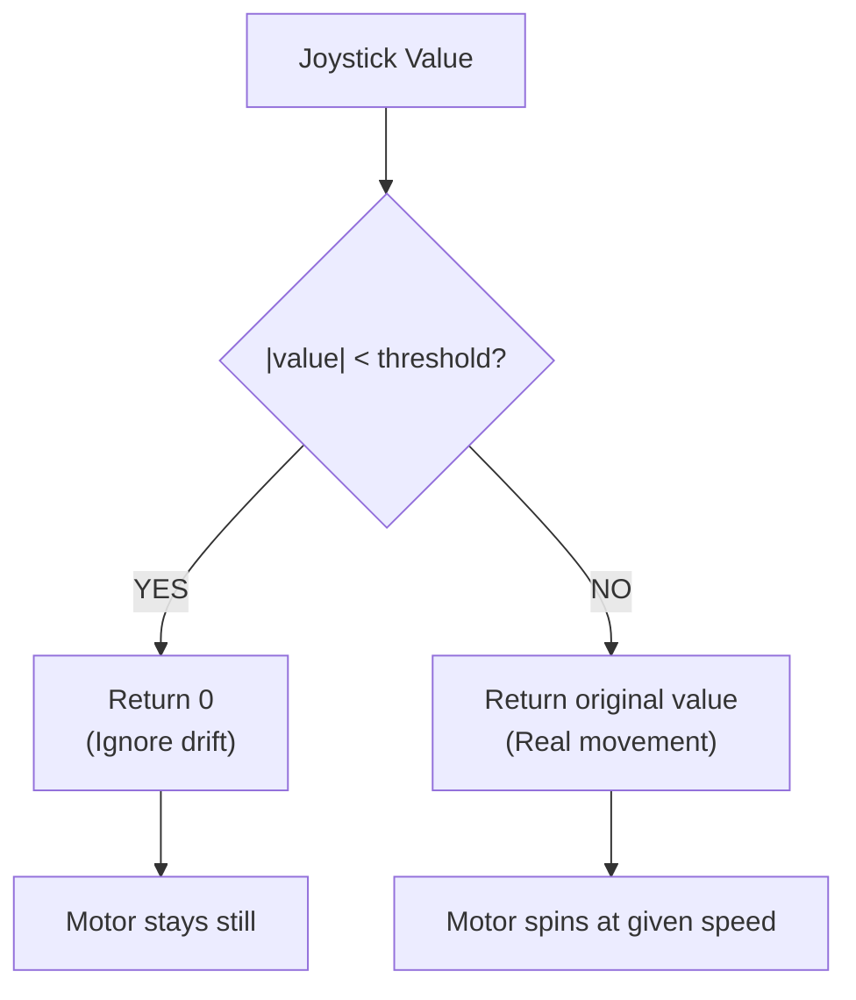

# Tutorial 4.1: Tank Drive

**Time:** ~10 minutes
**Prerequisites:** Tutorial 3: Python Basics

---

## What is Tank Drive?

Tank drive is the simplest way to control a robot: each joystick controls one side of the drivetrain, just like driving a tank!



## Understanding axis3 and axis2

These are the NAMES that VEX gave to joystick directions:

```
    LEFT JOYSTICK                RIGHT JOYSTICK

         axis3                        axis2
           ↑                            ↑
           |                            |
    axis4 ←●→ axis4             axis1 ←●→ axis1
           |                            |
           ↓                            ↓
         axis3                        axis2


    QUICK REFERENCE:
    ┌──────────────────────────────────────────────────┐
    │  axis3 = Left stick, up-down movement (Y-axis)  │
    │  axis2 = Right stick, up-down movement (Y-axis) │
    └──────────────────────────────────────────────────┘
```

Think of the axis numbers as addresses:
- **axis3** = "Left stick, up-down movement"
- **axis2** = "Right stick, up-down movement"

**Memory Trick:** "3-2" reads left-to-right, just like the sticks on the controller!

## The Tank Drive Logic

The code is surprisingly simple:

```python
while True:
    # Read left joystick Y-axis (axis3)
    left_speed = controller.axis3.position()

    # Read right joystick Y-axis (axis2)
    right_speed = controller.axis2.position()

    # Send to motors
    left_motors.spin(FORWARD, left_speed, PERCENT)
    right_motors.spin(FORWARD, right_speed, PERCENT)

    wait(20, MSEC)
```

That's it! The joystick value (-100 to +100) directly becomes the motor speed.

### Wait, What Does FORWARD Mean Here?

Here's what might confuse you:

```
    left_motors.spin(FORWARD, left_speed, PERCENT)
                       ↑          ↑          ↑
                       |          |          |
                       |          |          Unit of speed (out of 100)
                       |          The actual speed number
                       Direction reference point
```

**FORWARD doesn't mean "go forward"!** It means:
- "Spin in the positive direction when speed is positive"
- "Spin in the negative direction when speed is negative"

```
    HOW IT WORKS:
    ┌──────────────────────────────────────────────────┐
    │  If left_speed = +50:                           │
    │      Motors spin FORWARD at 50% speed           │
    │                                                 │
    │  If left_speed = -50:                           │
    │      Motors spin BACKWARD at 50% speed          │
    │                                                 │
    │  FORWARD just means "follow the number's sign"  │
    └──────────────────────────────────────────────────┘
```

**PERCENT** tells the motor what unit the speed is in:
- 100 PERCENT = maximum speed
- 50 PERCENT = half speed
- 0 PERCENT = stopped

## Code Walkthrough: driver_control.py

Let's look at the full implementation in `src/driver_control.py`:

```python
def driver_control_loop():
    """
    Main driver control loop using tank drive.
    """
    brain.screen.clear_screen()
    brain.screen.set_cursor(1, 1)
    brain.screen.print("Driver Control Active")

    while True:
        # Get joystick positions (-100 to 100)
        left_speed = controller.axis3.position()   # Left joystick Y
        right_speed = controller.axis2.position()  # Right joystick Y

        # Apply deadband to prevent motor drift
        left_speed = deadband(left_speed, threshold=5)
        right_speed = deadband(right_speed, threshold=5)

        # Set motor velocities and spin
        left_motors.set_velocity(left_speed, PERCENT)
        right_motors.set_velocity(right_speed, PERCENT)

        left_motors.spin(FORWARD)
        right_motors.spin(FORWARD)

        wait(20, MSEC)
```

### Why Deadband?

Joysticks are never perfectly centered. There's always a tiny bit of drift:

Joystick at rest ideally returns 0, but in reality returns small values like 2, 3, or -1. Without deadband, motors creep slowly! With deadband, values under the threshold become 0.

### Deadband Step-by-Step

Let's trace what happens with `threshold=5`:







**General Deadband Decision Flow:**



## Movement Patterns

### Forward
```
    Left Stick: ↑ (+100)     Left Motors:  ↑ Forward
    Right Stick: ↑ (+100)    Right Motors: ↑ Forward
```

### Backward
```
    Left Stick: ↓ (-100)     Left Motors:  ↓ Backward
    Right Stick: ↓ (-100)    Right Motors: ↓ Backward
```

### Turn Left (Pivot)
```
    Left Stick: ↓ (-100)     Left Motors:  ↓ Backward
    Right Stick: ↑ (+100)    Right Motors: ↑ Forward

    Robot pivots counter-clockwise!
```

### Turn Right (Pivot)
```
    Left Stick: ↑ (+100)     Left Motors:  ↑ Forward
    Right Stick: ↓ (-100)    Right Motors: ↓ Backward

    Robot pivots clockwise!
```

### Arc Turn (Gradual)
```
    Left Stick: ↑ (+100)     Left Motors:  ↑ Forward (100%)
    Right Stick: ↑ (+50)     Right Motors: ↑ Forward (50%)

    Robot arcs to the right!
```

### Practice Pattern Dimensions

When practicing movement patterns, use these recommended sizes:

```
    STRAIGHT LINE TEST:
    ●═══════════════════════════●
    START                      END

    Distance: 6 feet (~1.8 meters)
    Goal: Drive without veering left or right

    ────────────────────────────────────────

    PIVOT TEST:

         ↺
        ╱ ╲
       │ ● │    Spin 360° in place
        ╲ ╱
         ↻

    Goal: End facing the same direction you started

    ────────────────────────────────────────

    ARC TURN TEST:

    ●═══════════════╗
    START           ║  Width: 3 feet (~90 cm)
                    ╚═══════════════★ END

    Goal: Smooth curve, no jerky corrections
```

## Tank Drive Diagram

```
    CONTROLLER                          ROBOT (top view)

    +-----+                              +--------+
    | ↑   |  axis3.position()       →    [LF][LB]  (left side)
    +-----+                              |        |
                                         |        |
    +-----+                              |        |
    | ↑   |  axis2.position()       →    [RF][RB]  (right side)
    +-----+                              +--------+

    Each stick controls one side independently!
```

## Pros and Cons of Tank Drive

### Advantages
- **Simple to understand** - one stick = one side
- **Easy to code** - just read two axes
- **Precise turning** - independent control of each side
- **Good for beginners** - intuitive mapping

### Disadvantages
- **Requires both hands** - can't drive one-handed
- **Harder for curves** - need to coordinate both sticks
- **Can be jerky** - small stick differences cause wobble

---

## Exercise: Experiment with Deadband

**Goal:** Change the deadband threshold and observe the effect.

**Step 1:** Open `src/driver_control.py`

**Step 2:** Find these lines:
```python
left_speed = deadband(left_speed, threshold=5)
right_speed = deadband(right_speed, threshold=5)
```

**Step 3:** Try different values:
- `threshold=0` - No deadband (any small movement = motor movement)
- `threshold=10` - Larger deadband (need to push stick further)
- `threshold=20` - Very large deadband (significant push required)

**Questions:**
1. What happens with `threshold=0`? Does the robot drift?
2. What happens with `threshold=20`? Is it hard to make small movements?
3. What's the best balance for your driving style?

---

**[← Previous: Controller Basics](00-controller-basics.md)** | **[Next: Arcade Drive →](02-arcade-drive.md)**
