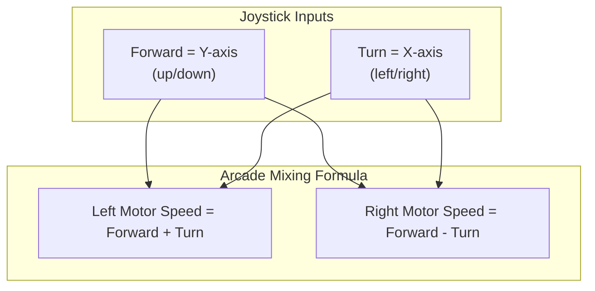
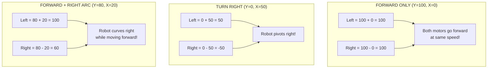
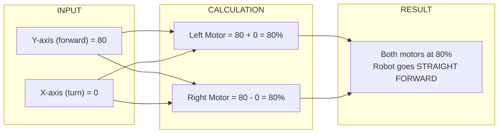
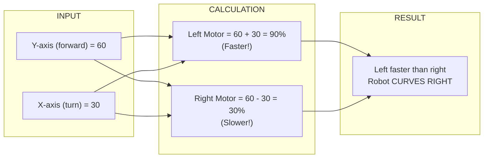
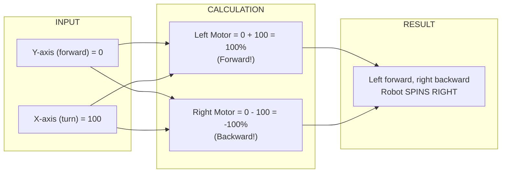
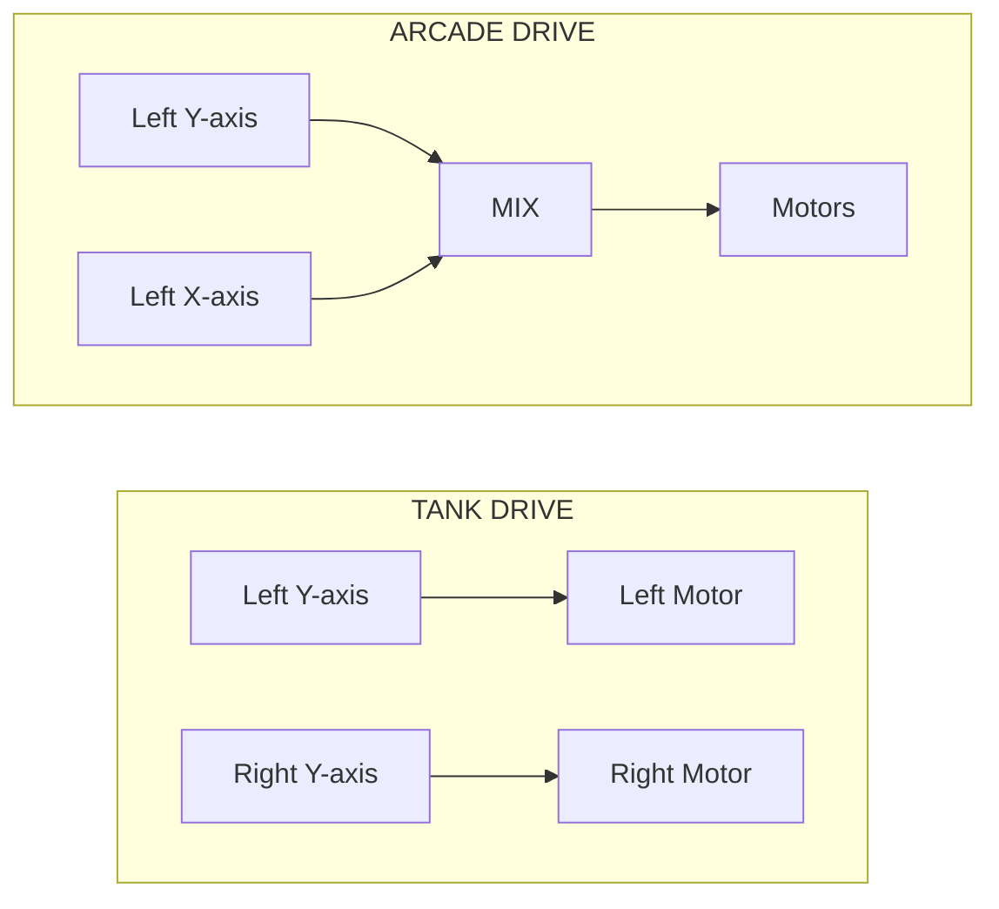

# Tutorial 4.2: Arcade Drive

**Time:** ~10 minutes
**Prerequisites:** Tutorial 4.1: Tank Drive

---

## What is Arcade Drive?

Arcade drive uses **one joystick** for everything: forward/backward AND turning. It's called "arcade" because it's like driving in a video game!

```
    Controller:              Robot Response:

    LEFT STICK only:

         ↑               = Forward
         ↓               = Backward
         ←               = Turn left
         →               = Turn right
         ↗               = Forward + Turn right (arc)
```

## The Arcade Drive Math

The magic is in how we **mix** the joystick values:



### Why Does This Work?



### Let's Do The Math Together (Step-by-Step)

**EXAMPLE 1: Driving Forward Only**

You push the joystick straight up to 80%.



**EXAMPLE 2: Turning While Driving**

You push the joystick up AND right.



**EXAMPLE 3: Spin in Place**

You push the joystick RIGHT only (no forward/backward).



## Code Walkthrough: arcade_drive_loop()

From `src/driver_control.py`:

```python
def arcade_drive_loop():
    """
    Alternative driver control using arcade drive.
    """
    brain.screen.clear_screen()
    brain.screen.set_cursor(1, 1)
    brain.screen.print("Arcade Drive Active")

    while True:
        # Get joystick positions
        forward = controller.axis3.position()  # Left Y = forward/back
        turn = controller.axis4.position()     # Left X = turn

        # Apply deadband
        forward = deadband(forward, threshold=5)
        turn = deadband(turn, threshold=5)

        # Calculate motor speeds (arcade mixing)
        left_speed = forward + turn
        right_speed = forward - turn

        # Clamp to valid range (-100 to 100)
        left_speed = max(-100, min(100, left_speed))
        right_speed = max(-100, min(100, right_speed))

        # Set motor velocities and spin
        left_motors.set_velocity(left_speed, PERCENT)
        right_motors.set_velocity(right_speed, PERCENT)

        left_motors.spin(FORWARD)
        right_motors.spin(FORWARD)

        wait(20, MSEC)
```

### Why Clamp?

When you push both forward AND turn at the same time, the values can add up beyond 100:

```
Forward = 80, Turn = 50

Left  = 80 + 50 = 130   ← Over 100!
Right = 80 - 50 = 30

After clamping:
Left  = 100  ← Clamped to max
Right = 30
```

Without clamping, motors would receive invalid values!

### Clamping Visualized: Number Line Method

Motors can only accept values from -100 to +100. Here's what clamping does:

```
    THE VALID RANGE:

    -100 ─────────────── 0 ─────────────── +100
      ↑                                      ↑
      │         VALID MOTOR VALUES           │
      └──────────────────────────────────────┘


    WHAT HAPPENS TO 130?

         100  130
          ↓   ↓
    ──────●═══×── → gets pulled back → ──────●──
          │   │                              │
          └───┘                              └── Clamped to 100!
          Too far!


    WHAT HAPPENS TO -150?

    -150   -100
      ↓     ↓
    ──×═════●────── → gets pulled back → ──────●──
      │     │                                  │
      └─────┘                                  └── Clamped to -100!
      Too far!
```

### Tracing the Clamp Code

The code `max(-100, min(100, left_speed))` works in two steps:

```mermaid
flowchart TD
    subgraph Example1["EXAMPLE: left_speed = 130"]
        A1["Input: 130"] --> B1{Is value > 100?}
        B1 -->|Yes| C1["min(100, 130) = 100"]
        C1 --> D1{Is value < -100?}
        D1 -->|No| E1["Result: 100"]
    end

    subgraph Example2["EXAMPLE: left_speed = -150"]
        A2["Input: -150"] --> B2{Is value > 100?}
        B2 -->|No| C2["min(100, -150) = -150"]
        C2 --> D2{Is value < -100?}
        D2 -->|Yes| E2["max(-100, -150) = -100"]
        E2 --> F2["Result: -100"]
    end

    subgraph Example3["EXAMPLE: left_speed = 75"]
        A3["Input: 75"] --> B3{Is value > 100?}
        B3 -->|No| C3["min(100, 75) = 75"]
        C3 --> D3{Is value < -100?}
        D3 -->|No| E3["Result: 75 (unchanged)"]
    end
```



## Tank vs. Arcade Comparison



**Key Differences:**
- **Tank:** Direct mapping, 2 sticks needed, independent control
- **Arcade:** Mixed calculation, 1 stick needed, coordinated control

| Feature | Tank | Arcade |
|---------|------|--------|
| **Sticks used** | Both | One |
| **One-handed?** | No | Yes |
| **Forward/back** | Intuitive | Intuitive |
| **Precise turns** | Excellent | Good |
| **Smooth curves** | Harder | Easier |
| **Best for** | Precise maneuvering | Smooth driving |

### Quick Decision Guide

Ask yourself these questions to choose the right drive mode:

```
    QUESTION                              ANSWER

    "Do I need to push against
     defenders?"                      →   TANK
                                          (more precise pivot control)

    "Am I scoring blocks in goals?"   →   EITHER
                                          (depends on driver preference)

    "Am I new to driving robots?"     →   ARCADE
                                          (easier to learn)

    "Do I want one hand free
     for buttons?"                    →   ARCADE
                                          (only uses left stick)

    "Am I doing driver skills
     (solo run)?"                     →   TANK
                                          (maximum control authority)

    "Do I need to spin quickly
     to block opponents?"             →   TANK
                                          (faster pivot response)
```

## Movement Patterns

### Forward/Backward (Same as Tank)
```
    Arcade (Y=100, X=0):         Tank (L=100, R=100):

    Left  = 100 + 0 = 100        Left  = 100
    Right = 100 - 0 = 100        Right = 100

    Same result!
```

### Turn in Place
```
    Arcade (Y=0, X=100):         Tank (L=100, R=-100):

    Left  = 0 + 100 = 100        Left  = 100
    Right = 0 - 100 = -100       Right = -100

    Same result!
```

### Arc Turn (Where Arcade Shines)
```
    Arcade (Y=60, X=30):         Tank equivalent is harder!

    Left  = 60 + 30 = 90
    Right = 60 - 30 = 30

    Smooth arc - easy with one stick!
    In tank drive, you'd need to precisely
    hold left at 90% and right at 30%.
```

## Switching Between Drive Modes

To switch to arcade drive, modify `src/main.py`:

```python
def main():
    brain.screen.clear_screen()
    brain.screen.set_cursor(1, 1)
    brain.screen.print("Robot Ready!")

    wait(500, MSEC)

    # Option 1: Tank drive (default)
    # driver_control_loop()

    # Option 2: Arcade drive
    arcade_drive_loop()
```

Just uncomment the mode you want!

## Which Should You Use?

### Choose Tank If:
- You need precise maneuvering
- You're pushing/defending (need to spin in place quickly)
- Your driver practiced with tank controls
- You want maximum control authority

### Choose Arcade If:
- You want smooth, curved movements
- Your driver is new to robotics
- You need one-handed operation (other hand for buttons)
- You prioritize ease of use

### Pro Tip: Many Teams Use Both!
```python
if controller.buttonA.pressing():
    arcade_drive()
else:
    tank_drive()
```

---

## Exercise: Try Arcade Drive

**Step 1:** Modify `main.py` to use `arcade_drive_loop()` instead of `driver_control_loop()`

**Step 2:** Download and test the robot

**Step 3:** Practice these maneuvers:
- Drive in a straight line
- Make a U-turn
- Drive in a figure-8 pattern
- Drive in a circle

**Step 4:** Switch back to tank drive and try the same maneuvers

**Question:** Which felt more natural for you?

---

**[← Previous: Tank Drive](01-tank-drive.md)** | **[Next: Driver Practice →](03-driver-practice.md)**
