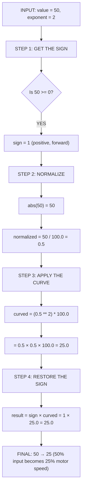

# Tutorial 4.3: Driver Practice

**Time:** ~10 minutes
**Prerequisites:** Tutorial 4.2: Arcade Drive

---

## Why Practice Matters

The best robot in the world is useless with an unpracticed driver. Driver skill can be the difference between winning and losing!

```
    Beginner Driver              Practiced Driver

    ~~~~zigzag~~~~>              ━━━━━━━━━━━━━━━>

    Overshoots turns             Hits targets precisely
    Bumps into walls             Smooth movements
    Slow reactions               Quick reflexes
```

## Practice Patterns

### Pattern 1: The Straight Line

**Goal:** Drive in a perfectly straight line

```
    START                                    END
      ●━━━━━━━━━━━━━━━━━━━━━━━━━━━━━━━━━━━━━━●

    Set up two markers and drive between them
    without veering left or right.
```

**Tips:**
- Look ahead, not at your robot
- Small corrections, not jerky movements
- Use tank drive for best straight-line control

### Pattern 2: The Square

**Goal:** Drive in a perfect square

```
    ●━━━━━━━━━━●
    │          │
    │          │
    │          │
    ●━━━━━━━━━━●

    Drive forward, turn 90°, repeat 4 times.
    End exactly where you started!
```

**Challenge:** Can you make the square with no gaps or overlaps?

### Practice Pattern Specifications

Here are the exact dimensions to set up each pattern:

```
    PATTERN 1 - THE STRAIGHT LINE:

    ●━━━━━━━━━━━━━━━━━━━━━━━━━━━━━━━━━━●
    START                              END

    Distance: 6 feet (1.8 meters)
    Goal: End within 3 inches of the centerline
    Setup: Use tape or cones to mark start and end

    ────────────────────────────────────────

    PATTERN 2 - THE SQUARE:

    ●━━━━━━━━━━●
    │          │   Side length: 3 feet (90 cm)
    │          │   Total distance: 12 feet
    │          │   Goal: End within 6 inches of start
    ●━━━━━━━━━━●

    Setup: Mark 4 corners with tape or small objects

    ────────────────────────────────────────

    PATTERN 3 - THE SLALOM:

         ●           ●           ●
       ╱   ╲       ╱   ╲       ╱   ╲
    ━━●━━━━━●━━━━━●━━━━━●━━━━━●━━━━━●━━>
               ╲       ╱   ╲       ╱
                ●           ●

    Cone spacing: 2 feet (60 cm) apart
    Lane width: 2 feet (60 cm) total
    Number of cones: 5-7
    Goal: Don't touch any cones!

    ────────────────────────────────────────

    PATTERN 4 - THE FIGURE-8:

         ╭───╮
        ╱     ╲      Circle radius: 18 inches (45 cm)
       │       │     Total distance: ~9 feet
        ╲     ╱      Goal: Smooth curves, no jerky turns
         ╳───╳       Setup: Mark center crossover point
        ╱     ╲
       │       │
        ╲     ╱
         ╰───╯
```

### Pattern 3: The Figure-8

**Goal:** Continuous smooth curves

```
         ╭───╮
        ╱     ╲
       │       │
        ╲     ╱
         ╳───╳    ← Cross in the middle
        ╱     ╲
       │       │
        ╲     ╱
         ╰───╯
```

**Tips:**
- Arcade drive works well here
- Keep constant speed
- Smooth joystick movements

### Pattern 4: The Slalom

**Goal:** Weave between obstacles

```
         ●           ●           ●
       ╱   ╲       ╱   ╲       ╱   ╲
    ━━●━━━━━●━━━━━●━━━━━●━━━━━●━━━━━●━━>
               ╲       ╱   ╲       ╱
                ●           ●
```

**Tips:**
- Plan your path ahead
- Look at the NEXT obstacle, not the current one
- Smooth steering inputs

## Fine Control with curve_input()

For precise driving, we can apply a curve to joystick input:

```python
def curve_input(value, exponent=2.0):
    """Apply exponential curve for finer control at low speeds."""
    sign = 1 if value >= 0 else -1
    normalized = abs(value) / 100.0
    curved = (normalized ** exponent) * 100.0
    return sign * curved
```

### How It Helps

```
    LINEAR INPUT               CURVED INPUT (exponent=2)

    Joystick  Motor            Joystick  Motor
    25%   →   25%              25%   →   6.25%  ← More precision!
    50%   →   50%              50%   →   25%
    75%   →   75%              75%   →   56.25%
    100%  →   100%             100%  →   100%

    The middle range is                   Small movements
    equally sensitive                     are much finer
```

### Understanding curve_input() Math (Complete Breakdown)

The formula might look intimidating, but let's break it down step by step:

```python
def curve_input(value, exponent=2.0):
    sign = 1 if value >= 0 else -1     # Step 1: Remember direction
    normalized = abs(value) / 100.0     # Step 2: Convert to 0-1 scale
    curved = (normalized ** exponent) * 100.0  # Step 3: Apply curve
    return sign * curved                # Step 4: Restore direction
```

**COMPLETE TRACE: curve_input(50, exponent=2)**



**Why each step matters:**
- **Step 1:** Remember if joystick was pushed forward (+) or backward (-) before using absolute value
- **Step 2:** Convert joystick range (-100 to +100) to 0-1 scale for easy math
- **Step 3:** Squaring a number less than 1 makes it SMALLER (0.5 × 0.5 = 0.25) - this gives more precision at low speeds
- **Step 4:** Restore the original direction (positive or negative)

**COMPLETE TRACE: curve_input(-40, exponent=2)**

```
    INPUT: value = -40, exponent = 2

    STEP 1: GET THE SIGN
    Is -40 >= 0?  NO!
    sign = -1  (negative, meaning "backward")

    STEP 2: NORMALIZE
    abs(-40) = 40
    normalized = 40 / 100.0 = 0.4

    STEP 3: APPLY THE CURVE
    curved = (0.4 ** 2) * 100.0
           = (0.4 × 0.4) * 100.0
           = 0.16 * 100.0
           = 16.0

    STEP 4: RESTORE THE SIGN
    result = -1 * 16.0
           = -16.0

    FINAL ANSWER: -40 → -16
    (40% backward becomes 16% backward)
```

**WHY PRESERVING SIGN MATTERS**

```
    WITHOUT preserving sign:
    (-40)^2 = 1600  ← WRONG! (positive and way too big)

    WITH preserving sign:
    abs(-40) = 40
    (0.4)^2 = 0.16
    0.16 × 100 = 16
    -1 × 16 = -16  ← CORRECT! (negative and right size)
```

### Visual Comparison: Linear vs Curved

```
    WITHOUT CURVE (exponent = 1):

    Output
    100% │                        ●
         │                   ●
         │              ●
         │         ●
         │    ●
       0 └────●────────────────────── Input
              0    25   50   75  100%

    Everything is proportional: 50% → 50%


    WITH CURVE (exponent = 2):

    Output
    100% │                        ●
         │                   ●
         │              ●
         │         ●
         │    ●
       0 └────●────────────────────── Input
              0    25   50   75  100%
                   ↓    ↓    ↓
                  6%   25%  56%

    Low inputs are "squished" down for finer control!
```

### Adding Curve to Drive Code

```python
def driver_control_with_curve():
    while True:
        left_speed = controller.axis3.position()
        right_speed = controller.axis2.position()

        # Apply deadband
        left_speed = deadband(left_speed)
        right_speed = deadband(right_speed)

        # Apply curve for finer control
        left_speed = curve_input(left_speed, exponent=2.0)
        right_speed = curve_input(right_speed, exponent=2.0)

        left_motors.spin(FORWARD, left_speed, PERCENT)
        right_motors.spin(FORWARD, right_speed, PERCENT)

        wait(20, MSEC)
```

## Competition Driving Tips

### Before the Match
1. **Check controller battery** - Dead controller = dead robot
2. **Test all buttons** - Make sure everything works
3. **Warm up your hands** - Cold fingers are slow fingers
4. **Watch your opponents** - Know their robot's capabilities

### During Driver Control
1. **Know your field** - Where are the goals? Where are the blocks?
2. **Communicate** - Your partner is your teammate!
3. **Don't panic** - Smooth is fast, jerky is slow
4. **Watch the clock** - Know when to rush, when to be careful

### Push Back Specific Tips
```
    SCORING PRIORITY:

    1. Blocks in goals (3 pts each)
    2. Zone control (6-10 pts)
    3. PARKING (8 or 30 pts!) ← Don't forget!

    In the last 10 seconds:
    - Stop scoring blocks
    - Get to the parking zone!
    - Two robots parked = 30 points!
```

### Push Back Driving Scenarios

Let's walk through specific situations you'll face in competition:

**SCENARIO 1: Approaching a Goal to Score**

```
    You're 3 feet from the goal with a block.

    WRONG APPROACH:
    ┌─────────────────────────────────────────────┐
    │  Full speed ahead → overshoot!              │
    │  Block falls out of robot or misses goal   │
    └─────────────────────────────────────────────┘

    RIGHT APPROACH (with curve_input):
    ┌─────────────────────────────────────────────┐
    │  1. Start at 50% stick → 25% motor speed    │
    │     (smooth acceleration)                   │
    │                                             │
    │  2. Slow to 25% stick → 6% motor speed      │
    │     (precision placement)                   │
    │                                             │
    │  3. Gently push block into goal             │
    │                                             │
    │  4. Back away slowly                        │
    └─────────────────────────────────────────────┘

    The curve gives you fine control when it matters most!
```

**SCENARIO 2: Defending Your Zone**

```
    Opponent is trying to descore your blocks.

    TANK DRIVE ADVANTAGE:
    ┌─────────────────────────────────────────────┐
    │  Pivot turns are FAST with tank drive!      │
    │                                             │
    │  Left stick UP + Right stick DOWN:          │
    │                                             │
    │         ↻                                   │
    │        ╱ ╲                                  │
    │       │ ● │  ← You spin to block opponent  │
    │        ╲ ╱                                  │
    │         ↺                                   │
    │                                             │
    │  You can react to their movement instantly! │
    └─────────────────────────────────────────────┘

    This is why many teams use tank for defense.
```

**SCENARIO 3: Parking with 10 Seconds Left**

```
    The clock shows 0:10 remaining!

    PRIORITY ORDER:
    ┌─────────────────────────────────────────────┐
    │  1. COMMUNICATE: Yell "PARKING NOW!" to     │
    │     your partner                            │
    │                                             │
    │  2. ABANDON current task - don't finish     │
    │     that block you were scoring             │
    │                                             │
    │  3. DRIVE DIRECTLY to park zone             │
    │     (shortest path, ignore everything)      │
    │                                             │
    │  4. FIT BOTH ROBOTS:                        │
    │                                             │
    │     ┌───────────────┐                       │
    │     │ ┌───┐  ┌───┐  │ ← Park zone           │
    │     │ │ R1│  │ R2│  │   (18" × 16")         │
    │     │ └───┘  └───┘  │                       │
    │     └───────────────┘                       │
    │                                             │
    │  5. STOP MOVING before buzzer!              │
    │     (movement at buzzer = NOT parked)       │
    └─────────────────────────────────────────────┘

    POINTS COMPARISON:
    - 0 robots parked: 0 points
    - 1 robot parked: 8 points
    - 2 robots parked: 30 points (!!)

    The 30-point bonus is HUGE - it can win matches!
```

**SCENARIO 4: Recovering from a Tip**

```
    Your robot has tipped onto its side!

    DON'T PANIC:
    ┌─────────────────────────────────────────────┐
    │  1. Check if your wheels can touch ground   │
    │                                             │
    │  2. If wheels touch: Try driving to         │
    │     flip yourself back over                 │
    │                                             │
    │  3. If wheels don't touch: Signal partner   │
    │     for help (they can push you back up)    │
    │                                             │
    │  4. If you're stuck: Focus on PARKING       │
    │     at match end - even a tipped robot      │
    │     in the zone counts!                     │
    └─────────────────────────────────────────────┘
```

## Controller Button Layout

Plan your button assignments:

```
    SUGGESTED LAYOUT:

    [L1] = Intake In         [R1] = Turbo Mode
    [L2] = Intake Out        [R2] = Slow Mode

    +------+                  +------+
    | LEFT |                  | RIGHT|
    | STICK|    [A] Unused    | STICK|
    | Drive|    [B] Unused    | (Tank)|
    +------+    [X] Reverse   +------+
                [Y] Toggle Mode
```

Document your layout in a comment:

```python
# BUTTON ASSIGNMENTS:
# L1 = Intake forward
# L2 = Intake reverse
# R1 = Turbo mode (1.5x speed)
# R2 = Slow mode (0.5x speed)
# X  = Reverse direction
```

---

## Exercise: Tune Your Drive Feel

**Goal:** Experiment with curve exponent to find your preference

**Step 1:** Add `curve_input()` to your driver control:

```python
left_speed = curve_input(left_speed, exponent=2.0)
right_speed = curve_input(right_speed, exponent=2.0)
```

**Step 2:** Try different exponent values:
- `1.0` = Linear (no curve)
- `2.0` = Squared (default, good for most)
- `3.0` = Cubed (very fine control at low speed)
- `1.5` = Mild curve

**Step 3:** Test with the slalom pattern

**Question:** What exponent gives you the best control?

---

## Timed Challenges

Set up these challenges and time yourself:

### Challenge 1: Speed Run
- Set up two cones 3 meters apart
- Drive from one to the other and back
- Best time wins!

### Challenge 2: Precision Park
- Set up a small box (slightly larger than your robot)
- Park inside the box as fast as possible
- Touching the walls = 5 second penalty

### Challenge 3: Block Push
- Place a block on the field
- Push it into a goal
- Don't let it fall out!

---

**Ready to test your knowledge? Check out the [Drive Control Q&A Review](04-review-qa.md)!**

---

**[← Previous: Arcade Drive](02-arcade-drive.md)** | **[Next: Tutorial 5 - Autonomous →](../05-autonomous/01-basic-movements.md)**
