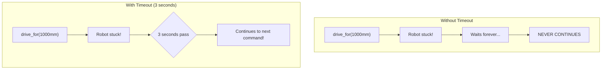

# Tutorial 5.1: Basic Autonomous Movements

**Time:** ~15 minutes
**Prerequisites:** Tutorial 4: Drive Control

---

## What is Autonomous?

During the first 15 seconds of a VEX match, **no human control is allowed**. Your robot must execute pre-programmed movements on its own!

```mermaid
timeline
    title VEX Match Timeline
    section Autonomous
        0:00 - 0:15 : Robot runs programmed code
                    : No human control allowed
    section Driver Control
        0:15 - 2:00 : Human driver takes over
                    : Full controller access
```

## The DriveTrain Commands

### drive_for() - Move Forward/Backward

```python
# Drive forward 500mm
drivetrain.drive_for(FORWARD, 500, MM)

# Drive backward 300mm
drivetrain.drive_for(REVERSE, 300, MM)

# Drive forward 12 inches
drivetrain.drive_for(FORWARD, 12, INCHES)
```

**Parameters:**
| Parameter | Options | What It Does |
|-----------|---------|--------------|
| Direction | `FORWARD`, `REVERSE` | Which way to move |
| Distance | Number | How far to travel |
| Units | `MM`, `INCHES` | What unit for distance |

### turn_for() - Rotate in Place

```python
# Turn right 90 degrees
drivetrain.turn_for(RIGHT, 90, DEGREES)

# Turn left 45 degrees
drivetrain.turn_for(LEFT, 45, DEGREES)

# Full 180° turn
drivetrain.turn_for(RIGHT, 180, DEGREES)
```

```
    TURNING VISUALIZED:

    Before:                After turn_for(RIGHT, 90):

       ↑                          →
    +-----+                    +-----+
    |     |                    |     |
    +-----+                    +-----+
```

## Code Walkthrough: autonomous.py

```python
def setup_autonomous():
    """Configure drivetrain settings for autonomous mode."""
    drivetrain.set_drive_velocity(50, PERCENT)  # Movement speed
    drivetrain.set_turn_velocity(30, PERCENT)   # Turn speed
    drivetrain.set_stopping(BRAKE)               # How to stop
    drivetrain.set_timeout(3, SECONDS)           # Max time per move

def autonomous_routine():
    """Main 15-second autonomous routine."""
    brain.screen.print("Autonomous Started")

    setup_autonomous()

    # Example moves (replace with your strategy):
    drivetrain.drive_for(FORWARD, 500, MM)
    wait(200, MSEC)

    drivetrain.turn_for(RIGHT, 90, DEGREES)
    wait(200, MSEC)

    drivetrain.drive_for(FORWARD, 300, MM)
    wait(200, MSEC)

    brain.screen.print("Autonomous Complete")
```

## Understanding set_timeout()

What if your robot gets stuck? `set_timeout()` prevents infinite waiting:

```python
drivetrain.set_timeout(3, SECONDS)  # Max 3 seconds per move

# If drive_for takes longer than 3 seconds,
# the robot gives up and moves to the next command
drivetrain.drive_for(FORWARD, 1000, MM)  # Will stop after 3 sec if stuck
```



## Stopping Modes

```python
drivetrain.set_stopping(COAST)  # Free-spin to stop
drivetrain.set_stopping(BRAKE)  # Active braking (recommended)
drivetrain.set_stopping(HOLD)   # Hold position firmly
```

```
    COAST                BRAKE                HOLD

    ⟳ → ⟳ → ⟳ → stop     ⟳ → ⟳ → X           ⟳ → X (locked!)
    Slowly coasts        Quick stop           Resists movement
    Good for: speed      Good for: accuracy   Good for: holding
```

## Driving a Square Pattern

Here's how to drive a square:

```python
def drive_square():
    setup_autonomous()

    for i in range(4):  # Repeat 4 times
        drivetrain.drive_for(FORWARD, 500, MM)
        wait(200, MSEC)
        drivetrain.turn_for(RIGHT, 90, DEGREES)
        wait(200, MSEC)
```

```
    Square Pattern:

    START/END
        ●━━━━━━━━━●
        │         │
        │         │   Each side: 500mm
        │         │   Each turn: 90°
        ●━━━━━━━━━●
```

## Why wait() Between Moves?

Without `wait()`, the robot might not fully stop before starting the next move:

```python
# WITHOUT wait - robot might drift
drivetrain.drive_for(FORWARD, 500, MM)
drivetrain.turn_for(RIGHT, 90, DEGREES)  # Might start before fully stopped!

# WITH wait - robot stabilizes
drivetrain.drive_for(FORWARD, 500, MM)
wait(200, MSEC)  # 0.2 seconds to settle
drivetrain.turn_for(RIGHT, 90, DEGREES)
```

## Velocity Settings

```python
# Slow but accurate
drivetrain.set_drive_velocity(30, PERCENT)
drivetrain.set_turn_velocity(20, PERCENT)

# Fast but might overshoot
drivetrain.set_drive_velocity(80, PERCENT)
drivetrain.set_turn_velocity(50, PERCENT)

# Balanced (recommended starting point)
drivetrain.set_drive_velocity(50, PERCENT)
drivetrain.set_turn_velocity(30, PERCENT)
```

**Trade-off:**
| Speed | Accuracy | Battery | Best For |
|-------|----------|---------|----------|
| Low | High | Lower use | Precise movements |
| High | Lower | Higher use | Distance coverage |

---

## Exercise: Drive a Triangle

**Goal:** Program the robot to drive a triangle pattern.

**Hint:** A triangle has:
- 3 sides (each needs `drive_for`)
- 3 corners (each needs `turn_for`)
- Each turn is 120° (360° ÷ 3 = 120°)

```python
def drive_triangle():
    setup_autonomous()

    for i in range(3):
        drivetrain.drive_for(FORWARD, _____, MM)
        wait(200, MSEC)
        drivetrain.turn_for(RIGHT, _____, DEGREES)
        wait(200, MSEC)
```

Fill in the blanks!

---

## Answer

```python
def drive_triangle():
    setup_autonomous()

    for i in range(3):
        drivetrain.drive_for(FORWARD, 400, MM)  # Any distance works
        wait(200, MSEC)
        drivetrain.turn_for(RIGHT, 120, DEGREES)  # 360/3 = 120
        wait(200, MSEC)
```

---

**[← Previous: Driver Practice](../04-drive-control/03-driver-practice.md)** | **[Next: Timing and Sequences →](02-timing-and-sequences.md)** | **[📝 Review Q&A](04-review-qa.md)**
