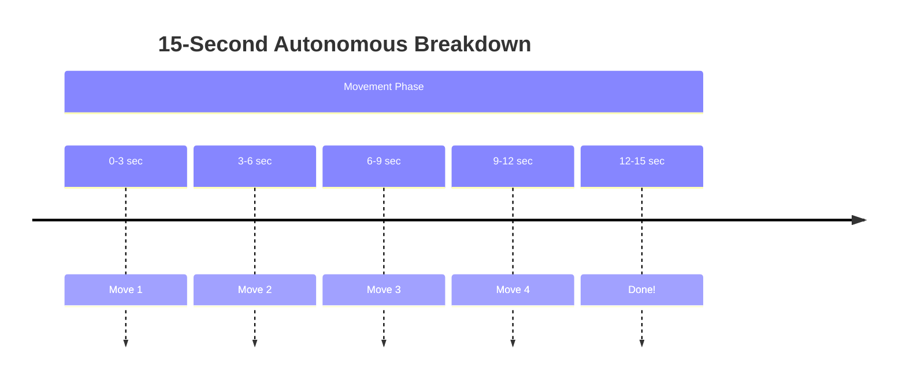
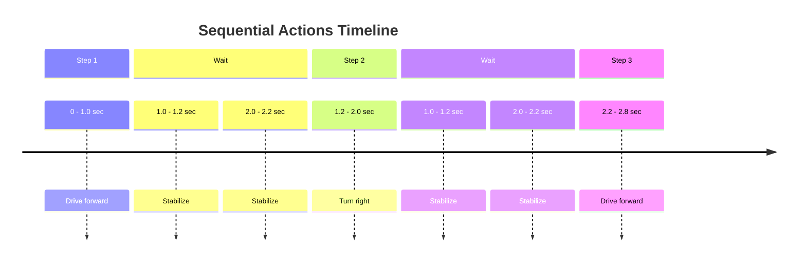
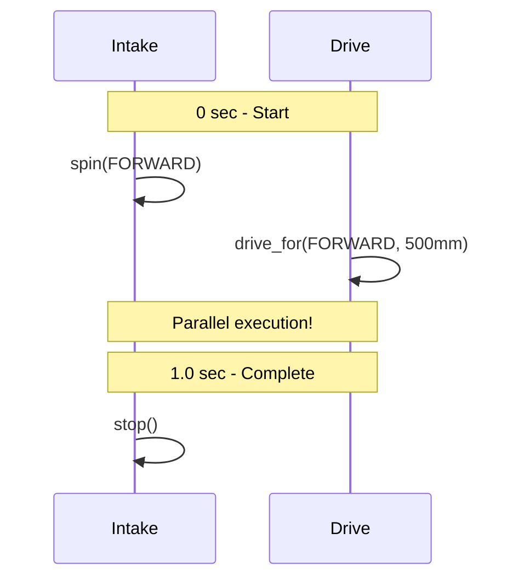
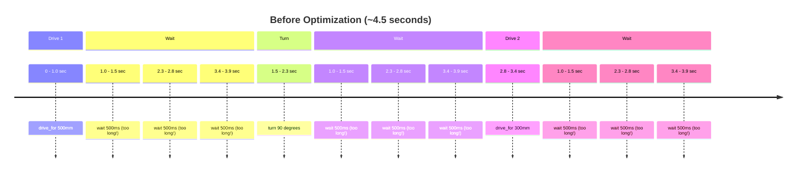
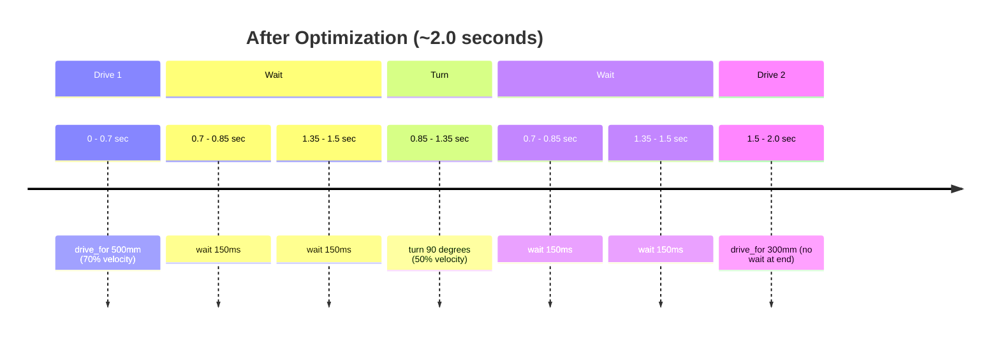

# Tutorial 5.2: Timing and Sequences

**Time:** ~15 minutes
**Prerequisites:** Tutorial 5.1: Basic Movements

---

## The 15-Second Challenge

You only have 15 seconds for autonomous. Every millisecond counts!



Each movement takes time - plan carefully!

## Calculating Movement Time

### Distance vs Time

Movement time depends on speed and distance:

```
Time = Distance ÷ Speed

Example at 50% velocity (about 500 mm/s):
- 500mm takes ~1 second
- 1000mm takes ~2 seconds
- 250mm takes ~0.5 seconds
```

### Turn Time

```
At 30% turn velocity:
- 90° turn takes ~0.8 seconds
- 180° turn takes ~1.6 seconds
- 45° turn takes ~0.4 seconds
```

## wait() Function

```python
wait(duration, unit)
```

| Unit | Example | Use For |
|------|---------|---------|
| `MSEC` | `wait(200, MSEC)` | Short pauses (0.2 seconds) |
| `SECONDS` | `wait(1, SECONDS)` | Longer waits |

### When to Use wait()

```python
# After movements - let robot stabilize
drivetrain.drive_for(FORWARD, 500, MM)
wait(200, MSEC)  # 0.2 seconds to stop momentum

# After turning - same reason
drivetrain.turn_for(RIGHT, 90, DEGREES)
wait(200, MSEC)

# Waiting for mechanisms
intake_motor.spin(FORWARD)
wait(500, MSEC)  # 0.5 seconds to grab block
intake_motor.stop()
```

## Sequencing Multiple Actions

### Sequential (One After Another)

```python
def simple_sequence():
    # Step 1: Drive forward
    drivetrain.drive_for(FORWARD, 500, MM)
    wait(200, MSEC)

    # Step 2: Turn
    drivetrain.turn_for(RIGHT, 90, DEGREES)
    wait(200, MSEC)

    # Step 3: Drive again
    drivetrain.drive_for(FORWARD, 300, MM)
```



### Overlapping Actions

Some actions CAN happen at the same time:

```python
def grab_while_moving():
    # Start intake (doesn't block)
    intake_motor.spin(FORWARD, 100, PERCENT)

    # Drive forward (blocks until complete)
    drivetrain.drive_for(FORWARD, 500, MM)

    # Stop intake after arriving
    intake_motor.stop()
```



Both actions happen at the same time!

### Key Insight: Blocking vs Non-Blocking

| Method | Behavior |
|--------|----------|
| `drive_for()` | **Blocks** - waits until done |
| `turn_for()` | **Blocks** - waits until done |
| `motor.spin()` | **Non-blocking** - returns immediately |
| `motor.spin_for()` | **Blocks** - waits until rotation complete |

## Optimizing for Speed

### Before Optimization
```python
def slow_routine():
    drivetrain.drive_for(FORWARD, 500, MM)
    wait(500, MSEC)  # Too long!

    drivetrain.turn_for(RIGHT, 90, DEGREES)
    wait(500, MSEC)  # Too long!

    drivetrain.drive_for(FORWARD, 300, MM)
    wait(500, MSEC)  # Too long!

    # Total: ~4.5 seconds (lots of wasted time)
```

### After Optimization
```python
def fast_routine():
    drivetrain.set_drive_velocity(70, PERCENT)  # Faster!
    drivetrain.set_turn_velocity(50, PERCENT)   # Faster!

    drivetrain.drive_for(FORWARD, 500, MM)
    wait(150, MSEC)  # Shorter wait

    drivetrain.turn_for(RIGHT, 90, DEGREES)
    wait(150, MSEC)  # Shorter wait

    drivetrain.drive_for(FORWARD, 300, MM)
    # No wait needed at end

    # Total: ~2.0 seconds
```

### Timing Comparison





## Building Complex Sequences

### Sequence Builder Pattern

```python
def score_first_block():
    """Sequence to score first block"""
    # Drive to block
    drivetrain.drive_for(FORWARD, 400, MM)

    # Activate intake
    intake_motor.spin(FORWARD, 100, PERCENT)
    wait(500, MSEC)
    intake_motor.stop()

    # Turn toward goal
    drivetrain.turn_for(RIGHT, 45, DEGREES)
    wait(100, MSEC)

    # Drive to goal
    drivetrain.drive_for(FORWARD, 300, MM)

    # Release block
    intake_motor.spin(REVERSE, 100, PERCENT)
    wait(300, MSEC)
    intake_motor.stop()


def autonomous_routine():
    setup_autonomous()

    score_first_block()    # Use the sequence!
    # ... more sequences ...
```

### Reusable Movement Functions

```python
def drive_and_wait(direction, distance):
    """Drive with automatic wait"""
    drivetrain.drive_for(direction, distance, MM)
    wait(150, MSEC)

def turn_and_wait(direction, angle):
    """Turn with automatic wait"""
    drivetrain.turn_for(direction, angle, DEGREES)
    wait(150, MSEC)

# Much cleaner code!
def clean_routine():
    drive_and_wait(FORWARD, 500)
    turn_and_wait(RIGHT, 90)
    drive_and_wait(FORWARD, 300)
```

## Timing Table Template

Use this to plan your autonomous:

| Step | Action | Distance/Angle | Velocity | Est. Time | Total |
|------|--------|----------------|----------|-----------|-------|
| 1 | Drive forward | 500mm | 50% | 1.0s | 1.0s |
| 2 | Wait | - | - | 0.2s | 1.2s |
| 3 | Turn right | 90° | 30% | 0.8s | 2.0s |
| 4 | Wait | - | - | 0.2s | 2.2s |
| 5 | Drive forward | 300mm | 50% | 0.6s | 2.8s |
| ... | ... | ... | ... | ... | ... |
| **Total** | | | | | **< 15s** |

---

## Exercise: Optimize This Routine

**Given this slow routine:**

```python
def slow_auto():
    setup_autonomous()
    drivetrain.set_drive_velocity(30, PERCENT)
    drivetrain.set_turn_velocity(20, PERCENT)

    drivetrain.drive_for(FORWARD, 600, MM)
    wait(1, SECONDS)

    drivetrain.turn_for(RIGHT, 90, DEGREES)
    wait(1, SECONDS)

    drivetrain.drive_for(FORWARD, 400, MM)
    wait(1, SECONDS)

    drivetrain.turn_for(LEFT, 90, DEGREES)
    wait(1, SECONDS)

    drivetrain.drive_for(FORWARD, 600, MM)
```

**Challenge:** Modify it to complete in under 6 seconds instead of ~15!

**Hint:** Increase velocities and reduce wait times.

---

**[← Previous: Basic Movements](01-basic-movements.md)** | **[Next: Push Back Autonomous →](03-push-back-autonomous.md)** | **[📝 Review Q&A](04-review-qa.md)**
