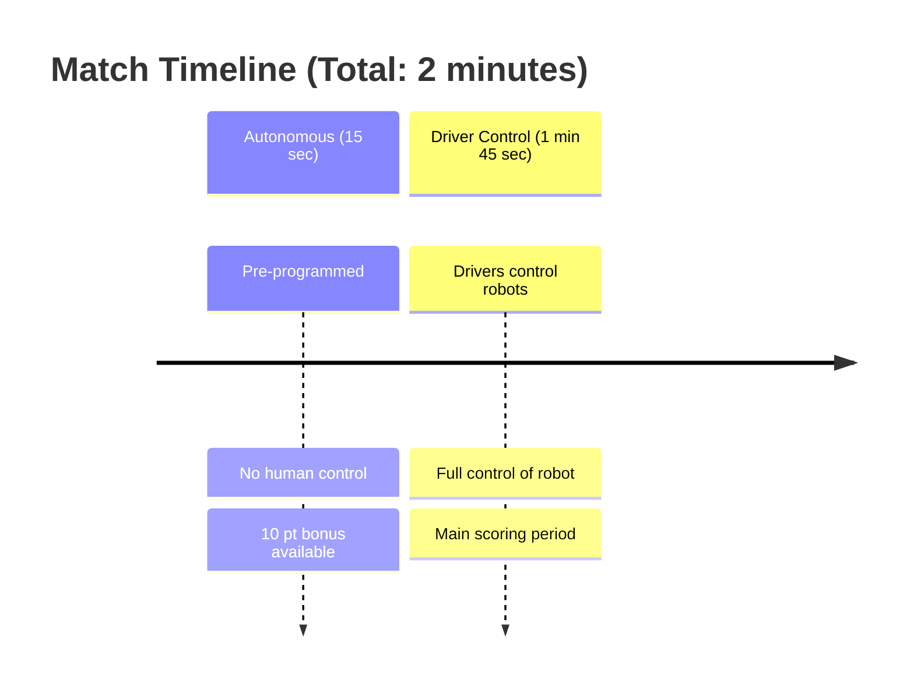
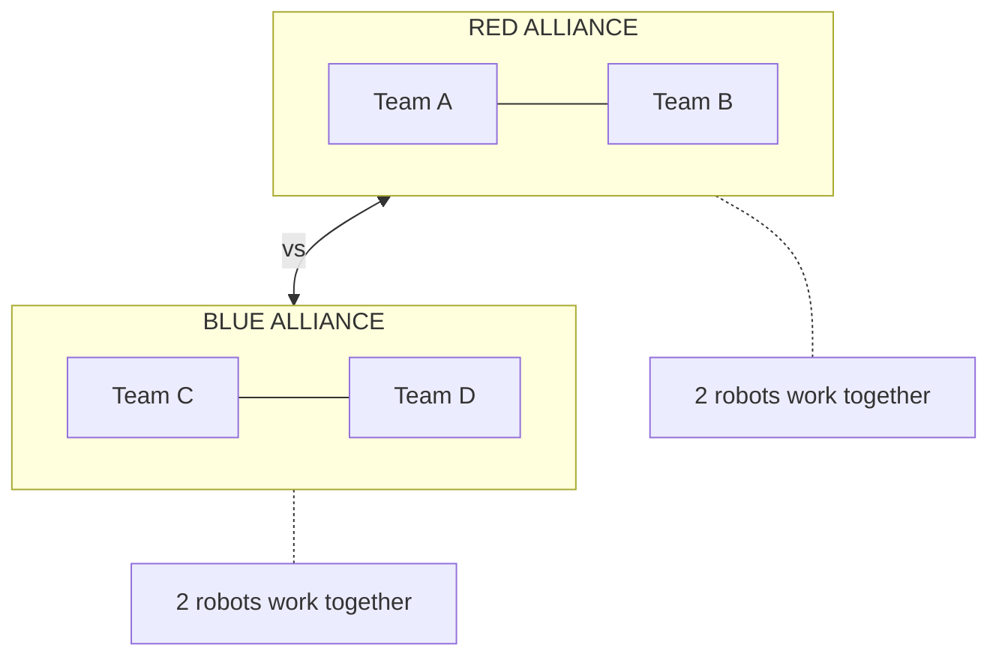
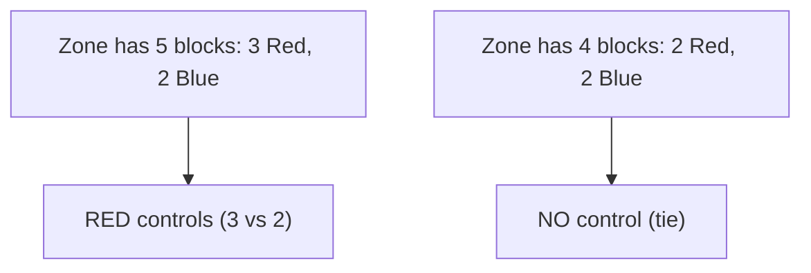

# Tutorial 6.1: Push Back Game Overview

**Time:** ~10 minutes
**Prerequisites:** Tutorial 5: Autonomous Programming

---

## Welcome to Push Back!

Push Back is the VEX V5 Robotics Competition game for the 2025-2026 season. Here's everything you need to know!

## The Field

```
    ════════════════════════════════════════════════════════════════
    ║                       PUSH BACK FIELD                        ║
    ║                         12' x 12'                            ║
    ║                        (3.6m x 3.6m)                         ║
    ║                                                              ║
    ║  ┌──────────────┐    ┌──────────────┐    ┌──────────────┐   ║
    ║  │              │    │    CENTER    │    │              │   ║
    ║  │  LONG GOAL   │    │     GOAL     │    │  LONG GOAL   │   ║
    ║  │   (14 max)   │    │   (7 upper)  │    │   (14 max)   │   ║
    ║  │              │    │   (7 lower)  │    │              │   ║
    ║  └──────────────┘    └──────────────┘    └──────────────┘   ║
    ║                                                              ║
    ║         ▓▓ ▓▓ ▓▓ ▓▓ ▓▓ ▓▓ ▓▓ ▓▓ ▓▓ ▓▓ ▓▓ ▓▓                ║
    ║              88 BLOCKS (44 red, 44 blue)                     ║
    ║         ▓▓ ▓▓ ▓▓ ▓▓ ▓▓ ▓▓ ▓▓ ▓▓ ▓▓ ▓▓ ▓▓ ▓▓                ║
    ║                                                              ║
    ║  ┌────────┐                                  ┌────────┐     ║
    ║  │ LOADER │                                  │ LOADER │     ║
    ║  │  RED   │                                  │  BLUE  │     ║
    ║  └────────┘                                  └────────┘     ║
    ║                                                              ║
    ║  ╔════════════╗                          ╔════════════╗     ║
    ║  ║  PARK ZONE ║                          ║  PARK ZONE ║     ║
    ║  ║    RED     ║                          ║    BLUE    ║     ║
    ║  ║  18" x 16" ║                          ║  18" x 16" ║     ║
    ║  ╚════════════╝                          ╚════════════╝     ║
    ║                                                              ║
    ║  [RED ALLIANCE STATION]      [BLUE ALLIANCE STATION]        ║
    ════════════════════════════════════════════════════════════════
```

## Match Structure



## Scoring Summary

| Action | Points | Notes |
|--------|--------|-------|
| **Block Scored** | 3 | Each block in any goal |
| **Long Goal Zone** | 10 | Majority control of zone |
| **Center Goal (Upper)** | 8 | Majority control |
| **Center Goal (Lower)** | 6 | Majority control |
| **1 Robot Parked** | 8 | In your alliance's zone |
| **2 Robots Parked** | 30 | BOTH robots in zone! |
| **Autonomous Bonus** | 10 | Win autonomous period |

## Autonomous Win Point

To earn the **Autonomous Win Point**, your alliance must:

```
    ☑ Score 7+ blocks of your color
    ☑ Score in at least 3 different goals
    ☑ Remove 3+ blocks from loaders
    ☑ Neither robot touching park barrier at end

    ALL four conditions must be met!
```

## Game Objects

### Blocks
```
    ┌───────┐
    │       │  Size: 5" x 5" x 5"
    │  RED  │  Weight: ~100g
    │       │  88 total (44 per alliance)
    └───────┘
```

### Goals
```
    LONG GOAL (x2)        CENTER GOAL (x1)
    ┌────────────────┐    ┌────────────────┐
    │                │    │     UPPER      │
    │  Holds up to   │    │   (7 blocks)   │
    │   14 blocks    │    ├────────────────┤
    │                │    │     LOWER      │
    │                │    │   (7 blocks)   │
    └────────────────┘    └────────────────┘
```

## Alliances



## Key Game Mechanics

### 1. Descoring is ALLOWED!
You can remove opponent blocks from goals:

```
    ┌────────────────┐        ┌────────────────┐
    │ 🔵 🔵 🔵       │   →    │ 🔵 🔵          │
    │      🔴 🔴 🔴  │        │                │
    └────────────────┘        └────────────────┘

    Push opponent blocks OUT of the goal!
```

### 2. Zone Control
Majority of blocks = control the zone:



### 3. Parking Bonus

```
    1 ROBOT PARKED:        2 ROBOTS PARKED:
    ╔════════════╗         ╔════════════╗
    ║   [ROBOT]  ║         ║ [R1] [R2]  ║
    ║     8 pts  ║         ║   30 pts!  ║
    ╚════════════╝         ╚════════════╝

    30 points is HUGE - don't forget!
```

---

## Quick Reference Card

```
    ╔══════════════════════════════════════════════════════╗
    ║              PUSH BACK QUICK REFERENCE               ║
    ╠══════════════════════════════════════════════════════╣
    ║  SCORING:                                            ║
    ║    Block scored        = 3 pts                       ║
    ║    Long goal zone      = 10 pts                      ║
    ║    Center upper zone   = 8 pts                       ║
    ║    Center lower zone   = 6 pts                       ║
    ║    1 robot parked      = 8 pts                       ║
    ║    2 robots parked     = 30 pts                      ║
    ║    Autonomous bonus    = 10 pts                      ║
    ╠══════════════════════════════════════════════════════╣
    ║  KEY RULES:                                          ║
    ║    - Descoring allowed                               ║
    ║    - Zone = majority of blocks                       ║
    ║    - Park in last 10 seconds!                        ║
    ╚══════════════════════════════════════════════════════╝
```

---

**[← Previous: Push Back Autonomous](../05-autonomous/03-push-back-autonomous.md)** | **[Next: Scoring Strategies →](02-scoring-strategies.md)**
