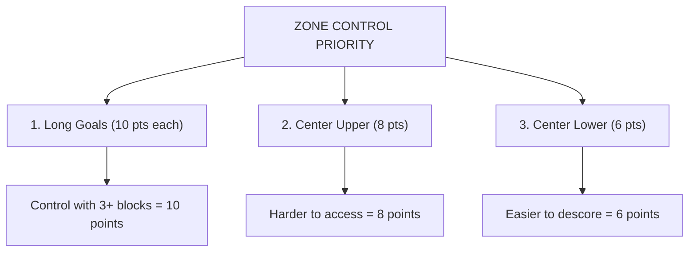

# Tutorial 6.2: Scoring Strategies

**Time:** ~10 minutes
**Prerequisites:** Tutorial 6.1: Game Overview

---

## Points Per Action Analysis

Let's calculate which actions give the most points per second:

| Action | Points | Time (est.) | Points/Second |
|--------|--------|-------------|---------------|
| Score 1 block | 3 | ~3 sec | 1.0 |
| Score 5 blocks (push) | 15 | ~5 sec | 3.0 |
| Win zone (5 blocks) | 10 | ~5 sec | 2.0 |
| Descore 3 blocks | +9* | ~4 sec | 2.25 |
| Park 2 robots | 30 | ~10 sec | 3.0 |

*Descoring swings points: you remove 3 pts AND deny zone control

**Key Insight:** Parking 2 robots is extremely valuable!

## Strategy 1: Volume Scoring

Focus on scoring as many blocks as possible:

```
    VOLUME STRATEGY:

    ┌─────────────────────────────────────────┐
    │  Push groups of blocks, not individuals │
    │                                         │
    │    ▓▓ ▓▓ ▓▓ ▓▓       ┌──────────────┐   │
    │         ↓            │              │   │
    │    [ROBOT] →→→→→→→→  │    GOAL      │   │
    │         Push 4-5     │              │   │
    │         at once!     └──────────────┘   │
    └─────────────────────────────────────────┘
```

**Pros:**
- High point potential
- Simple robot design (just push)
- Works in autonomous and driver

**Cons:**
- Blocks scatter easily
- Opponent can descore

## Strategy 2: Zone Control

Focus on controlling high-value zones:



**Strategy:** Put 3 blocks in a zone, then defend it!

## Strategy 3: Descoring

Remove opponent blocks to swing points:

```mermaid
stateDiagram-v2
    [*] --> Before
    Before : Zone has 3 Blue, 2 Red
    Before : Blue controls (+10 Blue)

    Before --> After : Descore 2 blue blocks

    After : Zone has 1 Blue, 2 Red
    After : RED controls (+10 Red)
    After --> [*]

    note right of After : Point swing: 20 points!
```

**Best Descoring Targets:**
- Goals with slim opponent majority
- Opponent blocks near the edge
- Undefended zones

## Strategy 4: Parking Priority

Never forget parking! It's the most efficient scoring late-game.

```mermaid
timeline
    title End-Game Timeline
    section 1:50
        Start heading to park
    section 1:55
        Both robots in zone
    section 2:00
        Match ends
```

**Note:** 10-15 seconds before end: HEAD TO PARK ZONE!

**Parking Math:**
| Situation | Points | Worth It? |
|-----------|--------|-----------|
| 1 robot parks | 8 | Yes if scoring <3 blocks |
| 2 robots park | 30 | Almost always worth it! |

## Combined Strategy Example

### Match Plan

```mermaid
timeline
    title Combined Strategy Match Plan
    section AUTONOMOUS (0-15 sec)
        Score 3+ blocks in different goals
        : Clear loader (3+ blocks)
        : Don't touch park barrier!
    section DRIVER PHASE 1 (15 sec - 1:00)
        Push blocks into goals
        : Focus on zone control
        : Communicate with partner
    section DRIVER PHASE 2 (1:00 - 1:50)
        Defend your zones
        : Descore opponent if winning zones
        : Keep scoring if behind
    section END GAME (1:50 - 2:00)
        STOP SCORING
        : Both robots head to park
        : 30 points for double park!
```

## Role Specialization

### Robot A: Scorer
```
    Focus:
    - Fast block collection
    - High-volume scoring
    - Works the center field

    Design:
    - Fast drivetrain
    - Intake mechanism
    - Good maneuverability
```

### Robot B: Defender/Support
```
    Focus:
    - Zone defense
    - Descoring
    - Parking management

    Design:
    - Strong pushing power
    - Low center of gravity
    - Durable construction
```

## Point Calculator

**Use this to estimate match scores:**

```
    YOUR ALLIANCE:
    ┌────────────────────────────────────────┐
    │ Blocks scored:      ___ × 3 = ___     │
    │ Long goal zones:    ___ × 10 = ___    │
    │ Center upper zone:  ___ × 8 = ___     │
    │ Center lower zone:  ___ × 6 = ___     │
    │ Robots parked:      1=8, 2=30 = ___   │
    │ Autonomous bonus:   10 = ___          │
    ├────────────────────────────────────────┤
    │ TOTAL:                        ___     │
    └────────────────────────────────────────┘
```

---

## Exercise: Strategy Analysis

**Scenario:** Your alliance has:
- 15 blocks scored (45 pts)
- 1 long goal zone (10 pts)
- 0 robots parked

Time remaining: 20 seconds

**Question 1:** Should you score more blocks or park?

**Question 2:** If your partner is closer to the park zone, what should they do?

---

## Answers

**Question 1:** PARK! Two robots parking = 30 points. You'd need to score 10 more blocks in 20 seconds to equal that. Parking is almost always better in end-game.

**Question 2:** Your partner should head to park zone immediately. You should follow as soon as possible. 30 points for double park!

---

**[← Previous: Game Overview](01-game-overview.md)** | **[Next: Alliance Coordination →](03-alliance-coordination.md)**
