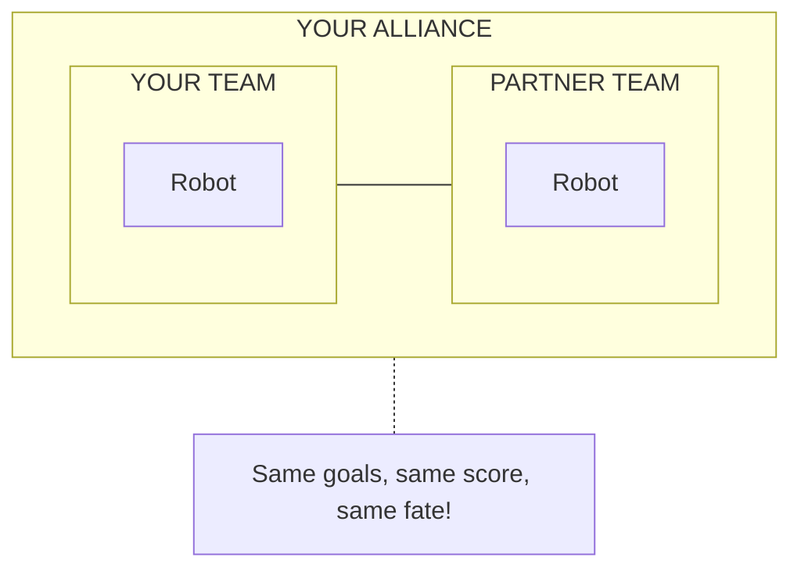
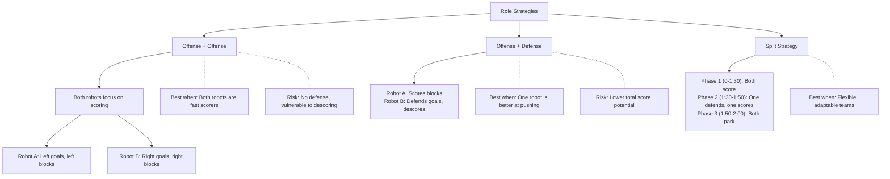
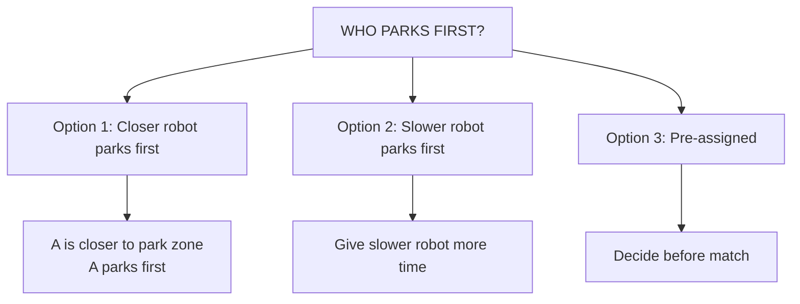

# Tutorial 6.3: Alliance Coordination

**Time:** ~10 minutes
**Prerequisites:** Tutorial 6.2: Scoring Strategies

---

## Working as an Alliance

In VEX competitions, you're paired with another team. Success depends on coordination!



## Pre-Match Communication

### What to Discuss

```
    ALLIANCE MEETING CHECKLIST:

    □ Autonomous routines
      - What does each robot do?
      - Do they conflict?

    □ Role assignments
      - Who scores? Who defends?
      - Who parks first?

    □ Field zones
      - Who takes left side?
      - Who takes right side?

    □ End-game plan
      - When do we park?
      - Signal for parking?
```

### Autonomous Coordination

```
    GOOD PLAN:                 BAD PLAN:

    Robot A: Left side         Robot A: Center
    Robot B: Right side        Robot B: Also center

    ┌─────────────────┐        ┌─────────────────┐
    │  A →     ← B   │        │     A ↔ B       │
    │ (no conflict)   │        │   (COLLISION!)  │
    └─────────────────┘        └─────────────────┘
```

## During the Match

### Communication Methods

| Method | Pros | Cons |
|--------|------|------|
| Verbal | Quick, natural | Noisy venue |
| Hand signals | Visible across field | Need practice |
| Pre-planned | No thinking needed | Less flexible |

### Simple Signal System

```
    SUGGESTED SIGNALS:

    ✋ Open hand = "I'm going to park"
    ☝️ Point at goal = "Score there"
    ✊ Fist = "I'll defend"
    🤚 Wave = "Help me!"
```

### Zone Division

```
    FIELD ZONES:

    ┌─────────────┬─────────────┐
    │             │             │
    │  ROBOT A    │  ROBOT B    │
    │  ZONE       │  ZONE       │
    │             │             │
    │   (Left)    │   (Right)   │
    └─────────────┴─────────────┘

    Each robot owns their zone:
    - Score blocks in your zone
    - Defend goals in your zone
    - Don't cross unless needed
```

## Role Strategies



## End-Game Coordination

### The 10-Second Rule

**CRITICAL: With 10 seconds left... STOP SCORING, START PARKING!**

```mermaid
timeline
    title 10-Second Rule Timing
    section 1:50
        Head to park zone
    section 1:55
        Both robots in position
    section 2:00
        Match ends, 30 pts!
```

### Parking Order



## Scouting Other Teams

### What to Look For

```
    SCOUTING CHECKLIST:

    □ Robot capabilities
      - Fast or strong?
      - Good at scoring or descoring?
      - Reliable autonomous?

    □ Driver skill
      - Precise or sloppy?
      - Fast reactions?

    □ Common strategies
      - Do they descore a lot?
      - Do they forget to park?

    □ Weaknesses
      - Tipping issues?
      - Slow?
      - Unreliable mechanisms?
```

### Scouting Sheet Template

```
    ╔═══════════════════════════════════════════╗
    ║           SCOUTING SHEET                  ║
    ╠═══════════════════════════════════════════╣
    ║ Team Number: ___________                  ║
    ║ Robot Name: ____________                  ║
    ╠═══════════════════════════════════════════╣
    ║ AUTONOMOUS:                               ║
    ║   Score (1-5): ___                        ║
    ║   Notes: _________________________        ║
    ╠═══════════════════════════════════════════╣
    ║ DRIVER:                                   ║
    ║   Speed (1-5): ___                        ║
    ║   Control (1-5): ___                      ║
    ╠═══════════════════════════════════════════╣
    ║ STRENGTHS: ________________________       ║
    ║ WEAKNESSES: _______________________       ║
    ╠═══════════════════════════════════════════╣
    ║ GOOD PARTNER?  YES / MAYBE / NO           ║
    ╚═══════════════════════════════════════════╝
```

## Communication During Autonomous

You CAN'T talk during autonomous (no human control), but you CAN plan ahead:

```
    PRE-MATCH PLAN:

    "During autonomous, I'll go left
     and score in the left long goal.

     You go right and clear the loader.

     We'll meet in the middle after
     autonomous ends."
```

---

## Exercise: Alliance Strategy Card

**Create a strategy card for your alliance:**

```
    ╔═══════════════════════════════════════════╗
    ║         ALLIANCE STRATEGY CARD            ║
    ╠═══════════════════════════════════════════╣
    ║ OUR TEAM: _________  PARTNER: _________   ║
    ╠═══════════════════════════════════════════╣
    ║ AUTONOMOUS:                               ║
    ║   Our robot: ________________________     ║
    ║   Partner:   ________________________     ║
    ╠═══════════════════════════════════════════╣
    ║ DRIVER CONTROL:                           ║
    ║   Our role:  ☐ Scorer  ☐ Defender         ║
    ║   Our zone:  ☐ Left    ☐ Right            ║
    ╠═══════════════════════════════════════════╣
    ║ END GAME:                                 ║
    ║   Who parks first? __________             ║
    ║   Park signal: ________________           ║
    ╠═══════════════════════════════════════════╣
    ║ SPECIAL NOTES:                            ║
    ║   _____________________________________   ║
    ╚═══════════════════════════════════════════╝
```

---

**[← Previous: Scoring Strategies](02-scoring-strategies.md)** | **[Next: Review Q&A →](04-review-qa.md)**
