# Tutorial 7.1: PID Control (Advanced)

**Time:** ~25 minutes
**Prerequisites:** All previous tutorials
**Level:** Bonus/Advanced

---

## What is PID?

**PID** stands for **Proportional-Integral-Derivative**. It's a control algorithm that helps robots move more accurately by adjusting power based on how far you are from your target.

### Real-World Analogies

#### The Thermostat Analogy

Your home thermostat is a simple controller:

```
    SET TEMPERATURE: 70°F

    Room is 60°F     → Heater ON (big correction)
    Room is 68°F     → Heater ON (small correction)
    Room is 70°F     → Heater OFF (at target!)
    Room is 72°F     → AC ON (overshoot correction)
```

PID does the same thing, but smarter!

#### The Video Game Analogy

In racing games, when you approach a checkpoint:
- **Far away:** Full speed ahead!
- **Getting closer:** Start slowing down
- **Almost there:** Gentle tap on brakes
- **At checkpoint:** Perfect stop

That's exactly what PID does for your robot!

#### The Basketball Shot Analogy

When shooting free throws:
- **Miss by 2 feet short:** Add LOTS more power next shot
- **Miss by 6 inches short:** Add a little more power
- **Perfect shot:** Same power!
- **Overshoot by 6 inches:** Reduce power slightly

PID adjusts motor power the same way you adjust your shot!

#### The Driving Analogy

When approaching a stop sign:
- **100 feet away:** Full speed
- **50 feet away:** Start braking
- **10 feet away:** Light brake
- **At line:** Stopped perfectly

If you only knew "GO" and "STOP" (bang-bang), you'd either stop too early or slam into the intersection!

### PID Overview Flowchart

```mermaid
flowchart LR
    subgraph "PID Controller"
        A["Target\n(90°)"] --> B["Calculate\nError"]
        C["Current\n(85°)"] --> B
        B --> D["Error\n= 5°"]
        D --> E["P Term\nKp × Error"]
        D --> F["I Term\nKi × Sum"]
        D --> G["D Term\nKd × Change"]
        E --> H["Add\nTerms"]
        F --> H
        G --> H
        H --> I["Motor\nPower"]
    end

    style A fill:#c8e6c9,stroke:#2e7d32
    style C fill:#bbdefb,stroke:#1565c0
    style D fill:#fff3e0,stroke:#ef6c00
    style I fill:#f8bbd9,stroke:#c2185b
```



## Why Do We Need PID?

### Bang-Bang vs PID Control Comparison

```mermaid
flowchart TB
    subgraph "Bang-Bang Control (Bad)"
        A1["Heading: 0°"] --> A2["Motors ON\n100%"]
        A2 --> A3["Heading: 85°"]
        A3 --> A4["Motors ON\n100%"]
        A4 --> A5["Heading: 90°"]
        A5 --> A6["Motors OFF"]
        A6 --> A7["OVERSHOOT!\n95°"]
        A7 --> A8["Turn back..."]
        A8 --> A9["UNDERSHOOT!\n88°"]
        A9 --> A10["Oscillates\nforever"]
    end

    style A7 fill:#ffcdd2,stroke:#c62828
    style A9 fill:#ffcdd2,stroke:#c62828
    style A10 fill:#ffcdd2,stroke:#c62828
```

```mermaid
flowchart TB
    subgraph "PID Control (Good)"
        B1["Heading: 0°"] --> B2["Motors at\n80%"]
        B2 --> B3["Heading: 50°"]
        B3 --> B4["Motors at\n40%"]
        B4 --> B5["Heading: 85°"]
        B5 --> B6["Motors at\n5%"]
        B6 --> B7["Heading: 90°"]
        B7 --> B8["Motors at\n0%"]
        B8 --> B9["Smooth stop!"]
    end

    style B9 fill:#c8e6c9,stroke:#2e7d32
```





### The Key Difference

| Control Type | Behavior | Result |
|--------------|----------|--------|
| **Bang-Bang** | Full power until target | Overshoot, oscillate |
| **PID** | Power proportional to distance | Smooth, accurate stop |

## The P in PID: Proportional

**Proportional** means the correction is proportional to the error. The farther you are from the target, the bigger the correction!

### Error Calculation Flowchart

```mermaid
flowchart LR
    A["Target\n90°"] --> C{"-"}
    B["Current\n30°"] --> C
    C --> D["Error\n= 60°"]
    D --> E["× Kp\n(0.5)"]
    E --> F["Correction\n= 30%"]

    style A fill:#c8e6c9,stroke:#2e7d32
    style B fill:#bbdefb,stroke:#1565c0
    style D fill:#fff3e0,stroke:#ef6c00
    style F fill:#f8bbd9,stroke:#c2185b
```



### The P Formula

```
Error = Target - Current

Correction = Kp × Error

Where Kp is a tuning constant (like 0.5)
```

**Think of Kp as a "sensitivity dial":**
- **Kp = 0.1** → Very gentle, slow response
- **Kp = 0.5** → Balanced response
- **Kp = 2.0** → Very aggressive, may overshoot

### Example: P Controller for Turning

```python
def turn_to_heading(target_heading):
    """Turn to a specific heading using P control."""
    Kp = 0.5  # Tuning constant

    while True:
        current = inertial_sensor.heading()
        error = target_heading - current

        # Handle wraparound (0-360)
        if error > 180:
            error -= 360
        if error < -180:
            error += 360

        # If close enough, stop
        if abs(error) < 2:
            left_motors.stop()
            right_motors.stop()
            break

        # Calculate correction
        correction = Kp * error

        # Apply to motors (turn in place)
        left_motors.spin(FORWARD, correction, PERCENT)
        right_motors.spin(FORWARD, -correction, PERCENT)

        wait(20, MSEC)
```

### Tuning Kp

```mermaid
flowchart TB
    subgraph "Kp Effects Comparison"
        direction TB

        A["Kp = 0.1\n(Too Low)"]
        A1["❌ Slow response"]
        A2["❌ May not reach target"]
        A3["❌ Friction wins"]

        B["Kp = 0.5-1.0\n(Just Right)"]
        B1["✅ Quick response"]
        B2["✅ Minimal overshoot"]
        B3["✅ Accurate stop"]

        C["Kp = 2.0\n(Too High)"]
        C1["❌ Fast but overshoots"]
        C2["❌ Oscillates"]
        C3["❌ Jerky movement"]

        A --> A1 --> A2 --> A3
        B --> B1 --> B2 --> B3
        C --> C1 --> C2 --> C3
    end

    style A fill:#ffcdd2,stroke:#c62828
    style A1 fill:#ffcdd2,stroke:#c62828
    style A2 fill:#ffcdd2,stroke:#c62828
    style A3 fill:#ffcdd2,stroke:#c62828
    style B fill:#c8e6c9,stroke:#2e7d32
    style B1 fill:#c8e6c9,stroke:#2e7d32
    style B2 fill:#c8e6c9,stroke:#2e7d32
    style B3 fill:#c8e6c9,stroke:#2e7d32
    style C fill:#ffcdd2,stroke:#c62828
    style C1 fill:#ffcdd2,stroke:#c62828
    style C2 fill:#ffcdd2,stroke:#c62828
    style C3 fill:#ffcdd2,stroke:#c62828
```



### What Each Symptom Means

| Symptom | Cause | Fix |
|---------|-------|-----|
| Robot never reaches target | Kp too low | Increase Kp |
| Robot oscillates around target | Kp too high | Decrease Kp |
| Robot stops perfectly | Kp just right | Keep it! |

## The I in PID: Integral

**Integral** accumulates error over time. It fixes **steady-state error** - when the robot gets close but can't quite reach the target.

### The Friction Problem

```mermaid
flowchart LR
    subgraph "P-Only Problem"
        A["Target: 90°\nCurrent: 88°"] --> B["Error = 2°"]
        B --> C["Correction =\n0.5 × 2 = 1%"]
        C --> D["1% power\ncan't overcome\nfriction!"]
    end

    style D fill:#ffcdd2,stroke:#c62828
```



### The I Term Solution

```mermaid
flowchart TB
    subgraph "Integral Accumulation"
        A["Error = 2°\nCycle 1"] --> B["integral = 2"]
        B --> C["Error = 2°\nCycle 2"]
        C --> D["integral = 4"]
        D --> E["Error = 2°\nCycle 3"]
        E --> F["integral = 6"]
        F --> G["..."]
        G --> H["Error = 2°\nCycle 10"]
        H --> I["integral = 20"]
        I --> J["Now Ki × 20\nOVERCOMES\nfriction!"]
    end

    style J fill:#c8e6c9,stroke:#2e7d32
```



**Think of it like pushing a heavy box:**
- One small push (P) isn't enough
- But 10 small pushes adding up (I) finally moves it!

### PI Controller

```python
def turn_to_heading_pi(target_heading):
    """Turn using PI control."""
    Kp = 0.5
    Ki = 0.01  # Small integral gain

    integral = 0

    while True:
        current = inertial_sensor.heading()
        error = target_heading - current

        # Handle wraparound
        if error > 180:
            error -= 360
        if error < -180:
            error += 360

        # Accumulate error
        integral += error

        # Stop condition
        if abs(error) < 2:
            left_motors.stop()
            right_motors.stop()
            break

        # PI calculation
        correction = (Kp * error) + (Ki * integral)

        left_motors.spin(FORWARD, correction, PERCENT)
        right_motors.spin(FORWARD, -correction, PERCENT)

        wait(20, MSEC)
```

> **For beginners:** Skip the I term at first! P-only often works well enough.

## The D in PID: Derivative

**Derivative** predicts future error based on rate of change.

```
    Error is decreasing rapidly?
    → Don't overcorrect, you're about to reach target!

    Error is increasing?
    → Something's wrong, add more correction!
```

### Full PID (Optional)

```python
def turn_to_heading_pid(target_heading):
    """Full PID control (advanced)."""
    Kp = 0.5
    Ki = 0.01
    Kd = 0.1

    integral = 0
    previous_error = 0

    while True:
        current = inertial_sensor.heading()
        error = target_heading - current

        # Handle wraparound
        if error > 180:
            error -= 360
        if error < -180:
            error += 360

        # Calculate I and D terms
        integral += error
        derivative = error - previous_error
        previous_error = error

        # Stop condition
        if abs(error) < 2:
            left_motors.stop()
            right_motors.stop()
            break

        # Full PID
        correction = (Kp * error) + (Ki * integral) + (Kd * derivative)

        left_motors.spin(FORWARD, correction, PERCENT)
        right_motors.spin(FORWARD, -correction, PERCENT)

        wait(20, MSEC)
```

## PID Tuning Guide

### Step-by-Step Tuning Flowchart


### Quick Reference Starting Values

| Robot Type | Kp Start | Ki Start | Notes |
|------------|----------|----------|-------|
| Turning in place | 0.5-1.0 | 0.01 | Most common |
| Driving straight | 0.3-0.5 | 0.005 | Less aggressive |
| Arm movement | 0.2-0.4 | 0.01 | Avoid jerky motion |

---

## Summary

| Term | What It Does | When to Use |
|------|--------------|-------------|
| **P** | Correction proportional to error | Always (start here) |
| **I** | Fixes steady-state error | If robot can't reach target |
| **D** | Dampens oscillation | If robot overshoots |

---

## PID in Push Back Competition

PID control is essential for competitive Push Back robots. Here's how each use case helps you score more points:

### Accurate Autonomous Turns

```python
def push_back_autonomous():
    """
    Use PID for precise turns to line up with goals.
    Accurate turns = More blocks in the goal!
    """
    # Turn exactly 45° to face the long goal
    turn_to_heading_p(45)  # P controller

    # Drive forward and push blocks
    drivetrain.drive_for(FORWARD, 600, MM)

    # Turn exactly 90° to face center goal
    turn_to_heading_p(135)

    # More accurate turns = More points!
```

### Straight-Line Block Pushing

```python
def push_blocks_straight():
    """
    Use PID to drive STRAIGHT while pushing blocks.
    Without PID, blocks push you off course!
    """
    start_heading = inertial_sensor.heading()
    Kp = 0.5

    while distance_to_goal > 100:
        # Calculate heading error
        current = inertial_sensor.heading()
        error = start_heading - current

        # Handle wraparound
        if error > 180: error -= 360
        if error < -180: error += 360

        correction = Kp * error

        # Apply correction to stay straight
        left_motors.spin(FORWARD, 50 + correction, PERCENT)
        right_motors.spin(FORWARD, 50 - correction, PERCENT)

        wait(20, MSEC)
```

### Precise Parking

```mermaid
flowchart LR
    A["Far from\npark zone"] --> B["Fast\napproach"]
    B --> C["Getting\nclose"]
    C --> D["Slow\ndown"]
    D --> E["Almost\nthere"]
    E --> F["Gentle\nstop"]
    F --> G["PARKED!\n8-30 pts 🎯"]

    style G fill:#c8e6c9,stroke:#2e7d32
```



```python
def pid_park():
    """
    Use PID to park smoothly in the zone.
    Smooth parking = No rolling out of zone!
    """
    target_distance = 50  # Stop 50mm from back wall
    Kp = 0.3  # Gentle for parking

    while True:
        dist = distance_sensor.object_distance(MM)
        error = dist - target_distance

        if abs(error) < 10:  # Within 10mm
            drivetrain.stop()
            return True  # Parked!

        speed = Kp * error
        speed = max(-30, min(30, speed))  # Slow for parking

        drivetrain.drive(FORWARD, speed, PERCENT)
        wait(20, MSEC)
```

---

## Progressive Exercises

### Beginner: P-Only Turn

**Goal:** Make the robot turn to exactly 90° using P control.

```python
def turn_to_90():
    Kp = 0.5
    target = 90

    inertial_sensor.calibrate()
    wait(3, SECONDS)

    while True:
        error = target - inertial_sensor.heading()

        if abs(error) < 2:
            break

        correction = Kp * error

        # YOUR CODE: Apply correction to motors
        # Hint: left_motors.spin(FORWARD, correction, PERCENT)
        # Hint: right_motors.spin(FORWARD, -correction, PERCENT)

        wait(20, MSEC)

    # YOUR CODE: Stop the motors
```

**Success criteria:** Robot turns smoothly and stops at 90° ±2°

---

### Intermediate: Add Wraparound Handling

**Goal:** Handle the 0-360° boundary problem.

**Problem:** What if current = 350° and target = 10°?
- Simple math: error = 10 - 350 = -340° (wrong!)
- Correct: The shortest turn is +20° (right!)

```python
def turn_to_heading(target):
    Kp = 0.5

    while True:
        current = inertial_sensor.heading()
        error = target - current

        # YOUR CODE: Add wraparound handling
        # If error > 180, subtract 360
        # If error < -180, add 360

        if abs(error) < 2:
            left_motors.stop()
            right_motors.stop()
            break

        correction = Kp * error
        left_motors.spin(FORWARD, correction, PERCENT)
        right_motors.spin(FORWARD, -correction, PERCENT)

        wait(20, MSEC)
```

**Test cases:**
- Turn from 10° to 350° (should turn left 20°, not right 340°)
- Turn from 350° to 10° (should turn right 20°, not left 340°)

---

### Challenge: PI Control for Accurate Parking

**Goal:** Use PI control to overcome friction and park accurately.

**Scenario:** Your robot needs to park exactly 100mm from the back wall. P-only control stops 5mm short because of friction.

```python
def pi_park(target_distance=100):
    Kp = 0.3
    Ki = 0.01
    integral = 0
    tolerance = 5  # mm

    while True:
        current = distance_sensor.object_distance(MM)
        error = current - target_distance

        # YOUR CODE: Accumulate integral
        # integral += error

        if abs(error) < tolerance:
            drivetrain.stop()
            return True

        # YOUR CODE: Calculate PI correction
        # correction = (Kp * error) + (Ki * integral)

        # Limit speed for parking
        correction = max(-30, min(30, correction))

        drivetrain.drive(FORWARD, correction, PERCENT)
        wait(20, MSEC)
```

**Bonus challenge:** Add "integral windup protection" - reset integral when error changes sign!

---

## Common Mistakes with PID

### Mistake 1: Wrong Kp Sign

```python
# WRONG: Negative Kp causes wrong direction!
correction = -0.5 * error  # Robot turns away from target!

# RIGHT: Positive Kp
correction = 0.5 * error   # Robot turns toward target
```

### Mistake 2: Missing Wraparound Handling

```python
# WRONG: No wraparound - robot spins 340° instead of 20°
error = target - current

# RIGHT: Handle 0-360 boundary
error = target - current
if error > 180:
    error -= 360
elif error < -180:
    error += 360
```

### Mistake 3: No Stop Condition

```python
# WRONG: Loop never ends!
while True:
    error = target - inertial_sensor.heading()
    correction = Kp * error
    left_motors.spin(FORWARD, correction, PERCENT)
    # No break condition! Robot vibrates forever!

# RIGHT: Stop when close enough
while True:
    error = target - inertial_sensor.heading()
    if abs(error) < 2:  # Tolerance of 2°
        left_motors.stop()
        right_motors.stop()
        break
    # ... rest of code
```

### Mistake 4: Correction Too Powerful

```python
# WRONG: No speed limiting - motors max out
correction = Kp * error  # Could be 100%+ !

# RIGHT: Clamp correction to safe range
correction = Kp * error
correction = max(-50, min(50, correction))  # Limit to ±50%
```

### Mistake 5: Starting with Full PID

```python
# WRONG: Start with all three terms
Kp = 0.5
Ki = 0.1
Kd = 0.5  # Too complex to tune!

# RIGHT: Start P-only, add terms as needed
Kp = 0.5
Ki = 0    # Add later if needed
Kd = 0    # Rarely needed for VEX
```

---

## How PID Connects to Push Back

| Push Back Task | PID Use | Why It Helps |
|----------------|---------|--------------|
| **Autonomous turns** | P control for heading | Accurate alignment with goals |
| **Straight driving** | P control for heading correction | Blocks don't push you off course |
| **Goal approach** | P control for distance | Stop at right distance to push |
| **Parking** | PI control for precision | Guarantee those 8-30 points! |
| **Block pushing** | P control while driving | Maintain heading under load |

### Push Back Points Gained with PID


**Bottom line:** PID can easily add 15-20 points to your match score through:
- More accurate autonomous routines
- Reliable parking
- Better zone control

---

**[← Previous: Alliance Coordination](../06-competition-strategy/03-alliance-coordination.md)** | **[Next: Sensor Integration →](02-sensor-integration.md)** | **[Review Q&A](04-review-qa.md)**
