# Tutorial 7.2: Sensor Integration (Advanced)

**Time:** ~20 minutes
**Prerequisites:** Tutorial 7.1: PID Control
**Level:** Bonus/Advanced

---

## Why Use Sensors?

Sensors are your robot's **eyes, ears, and sense of direction**. Without them, your robot is guessing. With them, it *knows*.

### Real-World Analogies

#### 👀 Eyes and Ears for Your Robot

Just like you use your senses to navigate:
- **Eyes** → Distance sensor, Optical sensor (see obstacles and colors)
- **Ears** → Not applicable, but sensors "listen" to the world
- **Balance** → Inertial sensor (like your inner ear for orientation)
- **GPS in phone** → GPS sensor (knows exact position)

#### 🚗 Car Sensors You Already Know

| Car Feature | Robot Equivalent | What It Does |
|-------------|-----------------|--------------|
| Backup camera beeps | Distance sensor | Detects how far from objects |
| Dashboard compass | Inertial sensor | Tracks which direction you're facing |
| Phone GPS | GPS sensor | Knows exact position on field |
| Color-sorting machine | Optical sensor | Identifies block colors |

#### 🎮 Video Game Comparison

```
WITHOUT SENSORS (like playing blindfolded):
    "I pressed forward for 2 seconds... I think I'm near the goal?"

WITH SENSORS (like playing with eyes open):
    "I can SEE the goal is 100mm away. I'll stop when I reach it!"
```

### Open-Loop vs Closed-Loop Control

```mermaid
flowchart LR
    subgraph "❌ Open-Loop (Guessing)"
        A1["Command:\ndrive 500mm"] --> B1["Robot moves"]
        B1 --> C1["Hope it\nworked? 🤞"]
    end

    subgraph "✅ Closed-Loop (Sensors)"
        A2["Command:\ndrive until\n500mm"] --> B2["Robot moves"]
        B2 --> C2["Sensor:\n487mm..."]
        C2 --> D2["Keep going"]
        D2 --> E2["Sensor:\n500mm"]
        E2 --> F2["STOP! ✅"]
        C2 -.-> B2
    end

    style C1 fill:#ffcdd2,stroke:#c62828
    style F2 fill:#c8e6c9,stroke:#2e7d32
```



## Inertial Sensor (IMU)

The most useful sensor for competition robots! It's like your robot's **inner ear** - it knows which way it's facing even if the wheels slip.

### How the Inertial Sensor Works

```mermaid
flowchart TB
    subgraph "Inertial Sensor (IMU)"
        A["3-Axis Gyroscope"] --> D["Tracks Rotation"]
        B["3-Axis Accelerometer"] --> E["Tracks Movement"]
        D --> F["Heading: 0-360°"]
        E --> G["Tilt Detection"]
    end

    style F fill:#c8e6c9,stroke:#2e7d32
```



### Calibration Process

```mermaid
flowchart LR
    A["Call\ncalibrate()"] --> B["Robot must\nbe STILL!"]
    B --> C["Wait 3\nseconds"]
    C --> D["Sensor\nready ✅"]

    style B fill:#fff3e0,stroke:#ef6c00
    style D fill:#c8e6c9,stroke:#2e7d32
```



### Setup
```python
# In robot_config.py
inertial_sensor = Inertial(Ports.PORT5)

# Before using (in autonomous) - CRITICAL!
inertial_sensor.calibrate()
wait(3, SECONDS)  # Wait for calibration! Robot must be STILL!
```

> ⚠️ **Important:** If the robot moves during calibration, all readings will be wrong!

### Heading vs Rotation

```mermaid
flowchart TB
    subgraph "heading() - Compass Style"
        H1["0°"] --> H2["90°"] --> H3["180°"] --> H4["270°"] --> H5["359°"]
        H5 --> H6["0° (resets!)"]
    end

    subgraph "rotation() - Total Turns"
        R1["0°"] --> R2["90°"] --> R3["180°"] --> R4["360°"]
        R4 --> R5["720° (2 full turns)"]
        R5 --> R6["Keeps counting..."]
    end

    style H6 fill:#fff3e0,stroke:#ef6c00
    style R6 fill:#c8e6c9,stroke:#2e7d32
```



```python
# Heading: 0-360 degrees (resets at 360) - like a compass
heading = inertial_sensor.heading()

# Rotation: Continuous (-∞ to +∞) - counts total rotation
rotation = inertial_sensor.rotation()
```

**When to use which:**
- `heading()` → "Face north" (absolute direction)
- `rotation()` → "Turn exactly 720°" (2 full spins)

### Accurate Turning

```python
def turn_to_heading(target):
    """Turn to exact heading using inertial sensor."""
    Kp = 0.8

    while True:
        current = inertial_sensor.heading()
        error = target - current

        # Handle 0-360 wraparound
        if error > 180:
            error -= 360
        elif error < -180:
            error += 360

        if abs(error) < 2:
            drivetrain.stop()
            return

        speed = Kp * error
        speed = max(-50, min(50, speed))  # Limit speed

        left_motors.spin(FORWARD, speed, PERCENT)
        right_motors.spin(FORWARD, -speed, PERCENT)

        wait(20, MSEC)
```

### Straight-Line Driving

```python
def drive_straight(distance_mm):
    """Drive straight using inertial sensor for correction."""
    start_heading = inertial_sensor.heading()
    Kp = 0.5

    drivetrain.set_drive_velocity(50, PERCENT)
    drivetrain.drive(FORWARD)

    start_position = left_motor_front.position(DEGREES)
    target_degrees = distance_mm / WHEEL_TRAVEL_MM * 360

    while True:
        # Check distance
        current_position = left_motor_front.position(DEGREES)
        if current_position - start_position >= target_degrees:
            drivetrain.stop()
            return

        # Heading correction
        current_heading = inertial_sensor.heading()
        error = start_heading - current_heading

        if error > 180:
            error -= 360
        elif error < -180:
            error += 360

        correction = Kp * error

        left_motors.set_velocity(50 + correction, PERCENT)
        right_motors.set_velocity(50 - correction, PERCENT)

        wait(20, MSEC)
```

## Distance Sensor

Detects objects in front of the robot - like a **bat using echolocation** or a **car's parking sensors**!

### How It Works


### The Parking Sensor Analogy 🚗

Just like your car beeps faster as you get closer to an obstacle:

| Distance | Car Beeping | Robot Action |
|----------|-------------|--------------|
| > 500mm | No beeps | Drive fast |
| 300-500mm | Slow beeps | Slow down |
| 100-300mm | Fast beeps | Drive carefully |
| < 100mm | Constant beep! | STOP! |

### Setup
```python
# In robot_config.py
distance_sensor = Distance(Ports.PORT6)
```

### Basic Usage
```python
# Read distance in millimeters
dist = distance_sensor.object_distance(MM)

# Check if object is present
if distance_sensor.is_object_detected():
    print("Something is there!")
```

### Distance Sensor Decision Flowchart

```mermaid
flowchart TD
    A["Read distance"] --> B{"dist > 500mm?"}
    B -->|"YES"| C["Drive fast\n(80%)"]
    B -->|"NO"| D{"dist > 200mm?"}
    D -->|"YES"| E["Medium speed\n(50%)"]
    D -->|"NO"| F{"dist > 100mm?"}
    F -->|"YES"| G["Slow speed\n(30%)"]
    F -->|"NO"| H["STOP! 🛑"]

    C --> A
    E --> A
    G --> A

    style H fill:#ffcdd2,stroke:#c62828
```



### Stop Before Wall
```python
def drive_until_wall(stop_distance=100):
    """Drive forward until wall is detected."""
    drivetrain.drive(FORWARD)

    while True:
        dist = distance_sensor.object_distance(MM)

        if dist < stop_distance:
            drivetrain.stop()
            return

        wait(20, MSEC)
```

### Wall Following
```python
def follow_wall(target_distance=200):
    """Follow wall at constant distance."""
    Kp = 0.2

    while True:
        dist = distance_sensor.object_distance(MM)
        error = target_distance - dist

        correction = Kp * error

        # Adjust steering
        left_speed = 50 + correction
        right_speed = 50 - correction

        left_motors.spin(FORWARD, left_speed, PERCENT)
        right_motors.spin(FORWARD, right_speed, PERCENT)

        wait(20, MSEC)
```

## Optical Sensor

Detects colors - useful for block detection! Think of it like **sorting M&Ms by color** - the sensor can tell red from blue!

### How It Works


### The M&M Sorting Analogy 🍬

Imagine sorting candy by color:
1. Shine a light on the candy
2. Look at what color bounces back
3. Put red in one pile, blue in another
4. Reject any other colors

That's exactly what your robot does with blocks!

### Setup
```python
# In robot_config.py
optical_sensor = Optical(Ports.PORT7)
```

### Basic Usage
```python
# Turn on LED for color detection - REQUIRED!
optical_sensor.set_light_power(100)
optical_sensor.set_light(LedStateType.ON)

# Check for nearby object
if optical_sensor.is_near_object():
    color = optical_sensor.color()

    if color == Color.RED:
        print("Red block!")
    elif color == Color.BLUE:
        print("Blue block!")
```

### Block Color Sorting Flowchart

```mermaid
flowchart TD
    A["Object near\nsensor?"] -->|"YES"| B["Read color"]
    A -->|"NO"| A

    B --> C{"color ==\nour alliance?"}
    C -->|"YES (RED)"| D["Intake\nFORWARD 🟢"]
    C -->|"NO (BLUE)"| E["Intake\nREVERSE ❌"]

    D --> F["Block\ncollected!"]
    E --> G["Block\nejected!"]

    style D fill:#c8e6c9,stroke:#2e7d32
    style E fill:#ffcdd2,stroke:#c62828
```



### Block Sorting
```python
def grab_our_blocks_only(our_color):
    """Only intake blocks of our alliance color."""
    while True:
        if optical_sensor.is_near_object():
            detected_color = optical_sensor.color()

            if detected_color == our_color:
                intake_motor.spin(FORWARD)
                wait(500, MSEC)
                intake_motor.stop()
            else:
                # Wrong color - eject!
                intake_motor.spin(REVERSE)
                wait(300, MSEC)
                intake_motor.stop()

        wait(50, MSEC)
```

## GPS Sensor

Knows exact field position! It's like **Google Maps for your robot** - it knows exactly where on the field it is!

### How GPS Works in VEX


The GPS sensor uses special **field strips** around the arena. It's like reading a QR code to know exactly where you are!

### The Phone GPS Analogy 📱

| Phone GPS | VEX GPS |
|-----------|---------|
| "You are on Main Street" | "You are at X=500, Y=-300" |
| "Turn left in 100 feet" | "Turn 45° and drive 200mm" |
| "You have arrived" | "X=0, Y=0 (center of field)" |

### Field Coordinate System


### Setup
```python
# In robot_config.py
gps_sensor = Gps(Ports.PORT8)
```

### Reading Position
```python
# X and Y position on field (in mm from center)
x = gps_sensor.x_position(MM)
y = gps_sensor.y_position(MM)

# Heading from GPS (also available!)
heading = gps_sensor.heading()

print(f"Robot at: ({x}, {y}) facing {heading}°")
```

### Return to Position
```python
def go_to_position(target_x, target_y):
    """Navigate to specific field coordinates."""
    while True:
        current_x = gps_sensor.x_position(MM)
        current_y = gps_sensor.y_position(MM)

        # Calculate distance to target
        dx = target_x - current_x
        dy = target_y - current_y
        distance = (dx**2 + dy**2) ** 0.5

        if distance < 50:  # Within 50mm
            drivetrain.stop()
            return

        # Calculate angle to target
        import math
        target_angle = math.degrees(math.atan2(dy, dx))

        # Turn toward target
        turn_to_heading(target_angle)

        # Drive toward target
        drivetrain.drive_for(FORWARD, min(distance, 300), MM)
```

## Combining Sensors

The real power of sensors comes from **using them together**! Each sensor has strengths - combine them for a smarter robot.

### Sensor Fusion Flowchart


### Which Sensor for What?


### Smart Autonomous Example
```python
def smart_autonomous():
    """Autonomous using multiple sensors."""

    # 1. Calibrate inertial (required first!)
    inertial_sensor.calibrate()
    wait(3, SECONDS)

    # 2. Drive until we see a goal (Distance sensor)
    while distance_sensor.object_distance(MM) > 200:
        drive_straight(100)  # Uses Inertial for correction

    # 3. Check block color before scoring (Optical sensor)
    if optical_sensor.is_near_object():
        if optical_sensor.color() == our_alliance_color:
            # Score it!
            intake_motor.spin(FORWARD)
            wait(500, MSEC)
        else:
            # Wrong color, back away
            drivetrain.drive_for(REVERSE, 200, MM)

    # 4. Return to starting position (GPS sensor)
    go_to_position(0, -500)
```

### Sensor Combination Examples

| Sensors Combined | Use Case |
|------------------|----------|
| Inertial + Distance | Drive straight until reaching wall |
| Inertial + GPS | Navigate to coordinates accurately |
| Distance + Optical | Approach block and check color |
| All four | Full autonomous navigation |

---

## Summary

| Sensor | Measures | Best For |
|--------|----------|----------|
| **Inertial** | Heading, rotation | Accurate turns, straight driving |
| **Distance** | Distance to objects | Wall detection, stopping |
| **Optical** | Color, proximity | Block sorting, line following |
| **GPS** | Field position | Navigation, return-to-position |

---

## Sensors in Push Back Competition

Each sensor helps you score more points in the Push Back game!

### Inertial Sensor for Accurate Autonomous

```python
def push_back_auto_with_inertial():
    """
    Autonomous that uses inertial for precise movements.
    Accurate turns = More blocks in goals!
    """
    inertial_sensor.calibrate()
    wait(3, SECONDS)

    # Drive straight toward first block cluster
    drive_straight_with_correction(600)

    # Turn exactly 45° to face long goal
    turn_to_heading(45)

    # Push blocks into goal
    drivetrain.drive_for(FORWARD, 400, MM)

    # Back up and turn to face center
    drivetrain.drive_for(REVERSE, 200, MM)
    turn_to_heading(90)

    # Continue to next goal...
```

### Distance Sensor for Goal Approach

```python
def approach_goal_safely():
    """
    Use distance sensor to stop at perfect pushing distance.
    Too close = can't push effectively
    Too far = blocks don't reach goal
    """
    OPTIMAL_PUSH_DISTANCE = 100  # mm

    while distance_sensor.object_distance(MM) > OPTIMAL_PUSH_DISTANCE:
        drivetrain.drive(FORWARD, 50, PERCENT)
        wait(20, MSEC)

    drivetrain.stop()
    return True  # Ready to push!
```

### Optical Sensor for Block Selection

```mermaid
flowchart LR
    A["Block\napproaches"] --> B{"Optical:\nWhat color?"}
    B -->|"RED"| C{"Our alliance\n= RED?"}
    B -->|"BLUE"| D{"Our alliance\n= BLUE?"}
    C -->|"YES"| E["Grab it! 🟢"]
    C -->|"NO"| F["Eject! ❌"]
    D -->|"YES"| E
    D -->|"NO"| F

    style E fill:#c8e6c9,stroke:#2e7d32
    style F fill:#ffcdd2,stroke:#c62828
```



```python
def smart_intake(our_alliance_color):
    """
    Only intake blocks of our alliance color!
    Scoring opponent's blocks helps THEM!
    """
    if optical_sensor.is_near_object():
        block_color = optical_sensor.color()

        if block_color == our_alliance_color:
            intake_motor.spin(FORWARD)
            wait(500, MSEC)
            intake_motor.stop()
            return True  # Got our block!
        else:
            intake_motor.spin(REVERSE)
            wait(300, MSEC)
            intake_motor.stop()
            return False  # Rejected opponent's block
```

### GPS for Skills Autonomous

```python
def skills_with_gps():
    """
    Use GPS to navigate efficiently across entire field.
    Skills = 60 seconds to cover whole field!
    """
    # Phase 1: Score at long goal
    go_to_position(-600, 200)
    push_blocks_into_goal()

    # Phase 2: Score at center
    go_to_position(0, 0)
    push_blocks_into_goal()

    # Phase 3: Score at far goal
    go_to_position(600, 200)
    push_blocks_into_goal()

    # Phase 4: PARK! (GPS ensures we hit the zone)
    go_to_position(0, -700)  # Park zone coordinates
    drivetrain.stop()
```

---

## Progressive Exercises

### 🟢 Beginner: Stop Before Wall

**Goal:** Use distance sensor to stop before hitting a wall.

```python
def drive_until_wall():
    """Drive forward and stop 150mm from wall."""

    while distance_sensor.object_distance(MM) > 150:
        drivetrain.drive(FORWARD, 50, PERCENT)
        wait(20, MSEC)

    drivetrain.stop()
    print("Stopped at:", distance_sensor.object_distance(MM), "mm")
```

**Success criteria:** Robot stops consistently at 150mm ±20mm

---

### 🟡 Intermediate: Drive Straight with Inertial Correction

**Goal:** Drive in a straight line using inertial sensor for heading correction.

```python
def drive_straight_500mm():
    """Drive 500mm in a straight line using heading correction."""
    Kp = 0.5
    start_heading = inertial_sensor.heading()

    # Calculate target based on wheel rotations
    start_position = left_motor_front.position(DEGREES)
    target_degrees = 500 / WHEEL_TRAVEL_MM * 360

    while left_motor_front.position(DEGREES) - start_position < target_degrees:
        current_heading = inertial_sensor.heading()
        error = start_heading - current_heading

        # YOUR CODE: Handle wraparound
        # if error > 180: error -= 360
        # if error < -180: error += 360

        correction = Kp * error

        # YOUR CODE: Apply correction to motors
        # left_motors.set_velocity(50 + correction, PERCENT)
        # right_motors.set_velocity(50 - correction, PERCENT)

        left_motors.spin(FORWARD)
        right_motors.spin(FORWARD)
        wait(20, MSEC)

    drivetrain.stop()
```

**Test:** Push the robot sideways while it's driving - it should correct itself!

---

### 🔴 Challenge: Block Color Sorting

**Goal:** Create a system that only picks up blocks of your alliance color.

```python
def color_sorting_intake():
    """
    Complete intake system that:
    1. Detects when a block is near
    2. Checks the color
    3. Grabs our color, ejects opponent's color
    """
    OUR_ALLIANCE = Color.RED  # Change for your alliance

    # YOUR CODE: Turn on optical sensor LED
    # optical_sensor.set_light_power(100)
    # optical_sensor.set_light(LedStateType.ON)

    while True:
        if optical_sensor.is_near_object():
            detected_color = optical_sensor.color()

            # YOUR CODE: Compare to alliance color
            # If match: intake FORWARD
            # If no match: intake REVERSE (eject)

            # YOUR CODE: Run motor for appropriate time
            # wait() and then stop motor

        wait(50, MSEC)
```

**Bonus:** Display the color on the Brain screen when detected!

---

## Common Mistakes with Sensors

### Mistake 1: Forgetting to Calibrate Inertial

```python
# WRONG: Use inertial without calibrating
def bad_autonomous():
    heading = inertial_sensor.heading()  # Random garbage value!

# RIGHT: Always calibrate first
def good_autonomous():
    inertial_sensor.calibrate()
    wait(3, SECONDS)  # MUST wait!
    heading = inertial_sensor.heading()  # Accurate!
```

### Mistake 2: Moving During Calibration

```python
# WRONG: Robot moves during calibration
def bad_calibration():
    inertial_sensor.calibrate()
    drivetrain.drive(FORWARD)  # Moving while calibrating!
    wait(3, SECONDS)

# RIGHT: Stay perfectly still
def good_calibration():
    drivetrain.stop()  # Ensure stopped
    inertial_sensor.calibrate()
    wait(3, SECONDS)  # Robot is still
    # NOW safe to move
```

### Mistake 3: Not Waiting Enough for Calibration

```python
# WRONG: Not enough wait time
inertial_sensor.calibrate()
wait(1, SECONDS)  # Too short!

# RIGHT: Full 3 seconds
inertial_sensor.calibrate()
wait(3, SECONDS)  # Proper calibration time
```

### Mistake 4: Forgetting to Turn On Optical LED

```python
# WRONG: Optical sensor doesn't work reliably
color = optical_sensor.color()  # Depends on room lighting!

# RIGHT: Turn on LED for consistent lighting
optical_sensor.set_light_power(100)
optical_sensor.set_light(LedStateType.ON)
color = optical_sensor.color()  # Consistent!
```

### Mistake 5: Wrong Units

```python
# WRONG: Mixing up units
dist = distance_sensor.object_distance(INCHES)  # Oops, wanted MM!
if dist > 150:  # This is 150 inches, not 150mm!

# RIGHT: Be consistent with units
dist = distance_sensor.object_distance(MM)
if dist > 150:  # 150mm as intended
```

---

## How Sensors Connect to Push Back

| Sensor | Push Back Use | Points Impact |
|--------|---------------|---------------|
| **Inertial** | Accurate turns to face goals | More blocks in goals (+3 each) |
| **Inertial** | Straight line block pushing | Blocks reach goal, not walls |
| **Distance** | Stop at optimal pushing distance | Efficient pushing |
| **Distance** | Detect goals and walls | Avoid collisions |
| **Optical** | Identify alliance blocks | Don't score opponent's blocks! |
| **GPS** | Navigate entire field in Skills | Cover all 3 goal areas |
| **GPS** | Return to park zone | Guarantee 8-30 points |

### Sensors = Consistent Scores

```mermaid
flowchart LR
    subgraph "Without Sensors"
        A1["Match 1:\n45 points"] --> B1["Match 2:\n28 points"]
        B1 --> C1["Match 3:\n52 points"]
        C1 --> D1["INCONSISTENT 😞"]
    end

    subgraph "With Sensors"
        A2["Match 1:\n58 points"] --> B2["Match 2:\n55 points"]
        B2 --> C2["Match 3:\n60 points"]
        C2 --> D2["CONSISTENT! 🏆"]
    end

    style D1 fill:#ffcdd2,stroke:#c62828
    style D2 fill:#c8e6c9,stroke:#2e7d32
```



**Bottom line:** Sensors make your robot **reliable**. Reliable robots win tournaments!

---

**[← Previous: PID Control](01-pid-control.md)** | **[Next: Skills Autonomous →](03-skills-autonomous.md)**
