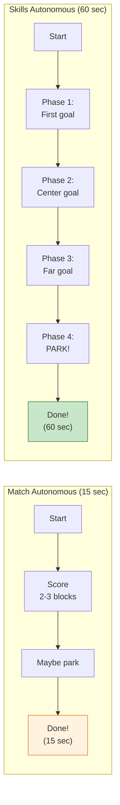
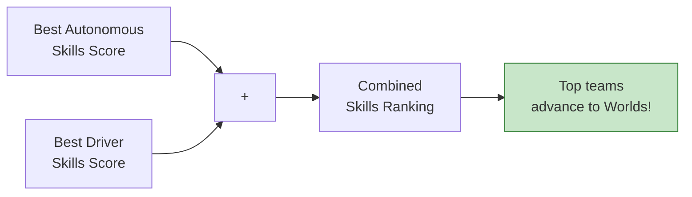
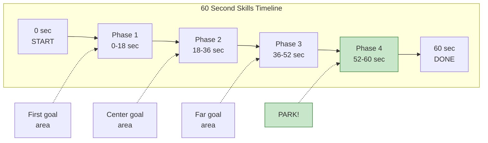
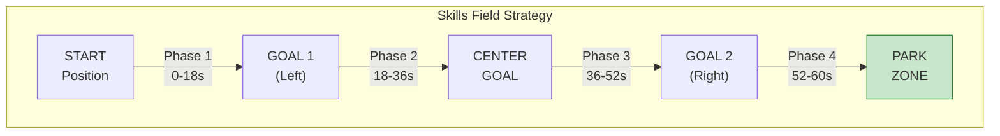
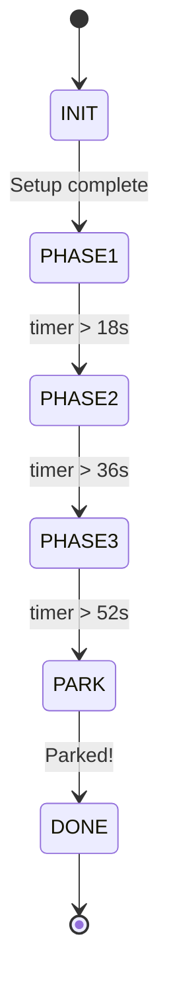
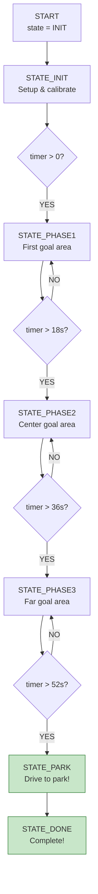
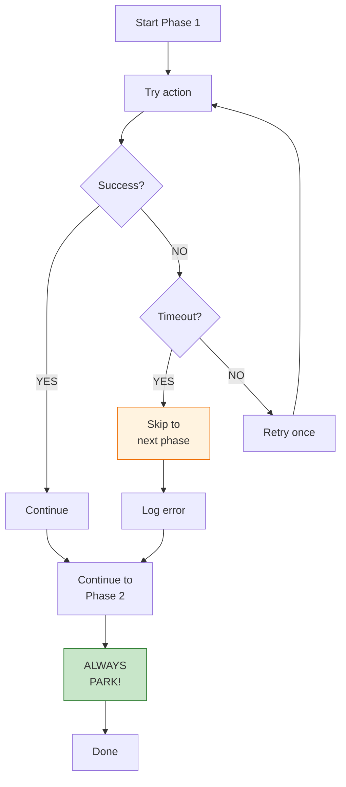
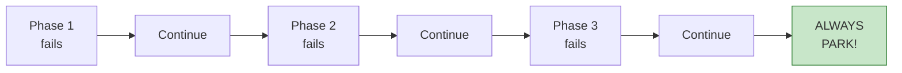
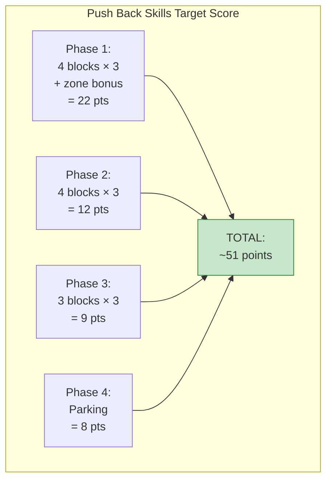
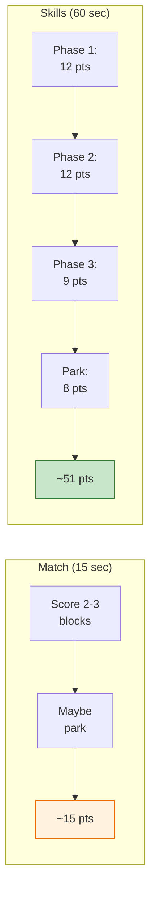

# Tutorial 7.3: Skills Autonomous (Advanced)

**Time:** ~20 minutes
**Prerequisites:** Tutorial 7.2: Sensor Integration
**Level:** Bonus/Advanced

---

## What is Skills?

**Skills** is a special competition format where one robot runs solo for **60 seconds** (instead of 15). It's your chance to show off what your robot can do independently!

### Match vs Skills Comparison



### Real-World Analogies

#### The Restaurant Kitchen Analogy

Think of Skills like a chef preparing multiple dishes:

| Kitchen Task | Skills Equivalent |
|--------------|-------------------|
| Prep station 1 (salads) | Phase 1: First goal area |
| Prep station 2 (entrees) | Phase 2: Center goal area |
| Prep station 3 (desserts) | Phase 3: Far goal area |
| Plating and serving | Phase 4: PARKING! |

A good chef **times everything** so it all comes together. You need to time your Skills routine the same way!

#### Video Game Levels Analogy

Skills is like speedrunning through 4 levels of a video game:

```
Level 1 (0-18 sec):  ⭐⭐⭐ Easy goals, build your score
Level 2 (18-36 sec): ⭐⭐⭐ Medium goals, keep going
Level 3 (36-52 sec): ⭐⭐⭐ Hard goals, clean up
Boss Level (52-60 sec): PARK for bonus points!
```

If you don't reach the boss level (parking), you lose major points!

#### Test-Taking Strategy Analogy

Managing 60 seconds in Skills is like managing time on a test:

- **Don't get stuck on one question** → Don't waste time on one stuck phase
- **Answer easy questions first** → Score easy blocks first
- **Save time for review** → Always save time for parking
- **Budget your time** → Time budget for each phase

## Why Skills Matters

Skills runs determine tournament rankings and qualification for higher-level competitions!

### Skills Scoring Formula



## Planning a 60-Second Routine

### Visual Time Budget



### Time Budget Summary

| Phase | Time Range | Duration | Goal |
|-------|------------|----------|------|
| **Phase 1** | 0-18 sec | 18 sec | First goal area |
| **Phase 2** | 18-36 sec | 18 sec | Center goal area |
| **Phase 3** | 36-52 sec | 16 sec | Far goal + cleanup |
| **Phase 4** | 52-60 sec | 8 sec | **PARK!** |

> **Critical:** Phase 4 (parking) is NON-NEGOTIABLE. Always budget 8 seconds for parking!

### Field Coverage Strategy



### Key Strategy Points

1. **Work in sequence** - Don't waste time crossing back and forth
2. **End near park zone** - Phase 3 should position you for Phase 4
3. **Don't get greedy** - Skip a block if it means missing parking
4. **Know your escape routes** - Have a path to park from any location

## State Machine Pattern

For complex routines, use a **state machine** - a way to organize code where your robot can be in different "states" and transitions between them based on conditions.

### What is a State Machine?

Think of it like a **flowchart in code**. Your robot is always in ONE state, and it moves to other states based on time or events.



### State Machine Flowchart



### State Machine Code

```python
# States - like chapters in a book
STATE_INIT = 0
STATE_PHASE1 = 1
STATE_PHASE2 = 2
STATE_PHASE3 = 3
STATE_PARK = 4
STATE_DONE = 5

def skills_autonomous():
    """60-second skills autonomous using state machine."""
    state = STATE_INIT  # Start in INIT state
    timer = Timer()

    while state != STATE_DONE:

        if state == STATE_INIT:
            # Setup: calibrate sensors, get ready
            setup_autonomous()
            timer.reset()
            state = STATE_PHASE1  # Move to next state

        elif state == STATE_PHASE1:
            # Score first area
            phase1_scoring()

            # Time-based transition
            if timer.time(SECONDS) > 18:
                state = STATE_PHASE2

        elif state == STATE_PHASE2:
            # Score second area
            phase2_scoring()

            if timer.time(SECONDS) > 36:
                state = STATE_PHASE3

        elif state == STATE_PHASE3:
            # Score third area
            phase3_scoring()

            # CRITICAL: Leave time for parking!
            if timer.time(SECONDS) > 52:
                state = STATE_PARK

        elif state == STATE_PARK:
            # Go to park zone - highest priority!
            drive_to_park()
            state = STATE_DONE

        wait(20, MSEC)  # Control loop rate
```

### Why Use a State Machine?

| Benefit | Explanation |
|---------|-------------|
| **Organized** | Clear separation of phases |
| **Flexible** | Easy to skip phases if behind |
| **Debuggable** | Know exactly which state failed |
| **Time-aware** | Easy to check time and transition |

## Breaking Into Functions

### Modular Design

```python
def phase1_scoring():
    """Score blocks in first goal area."""
    # Drive to first block cluster
    drivetrain.drive_for(FORWARD, 600, MM)
    wait(100, MSEC)

    # Turn toward goal
    drivetrain.turn_for(RIGHT, 45, DEGREES)
    wait(100, MSEC)

    # Push into goal
    drivetrain.drive_for(FORWARD, 400, MM)
    wait(100, MSEC)

    # Back up
    drivetrain.drive_for(REVERSE, 200, MM)


def phase2_scoring():
    """Score blocks in center goal."""
    # Navigate to center
    drivetrain.turn_for(LEFT, 90, DEGREES)
    wait(100, MSEC)

    drivetrain.drive_for(FORWARD, 800, MM)
    wait(100, MSEC)

    # Score in center goal
    drivetrain.turn_for(RIGHT, 45, DEGREES)
    drivetrain.drive_for(FORWARD, 300, MM)


def phase3_scoring():
    """Score remaining blocks."""
    # Clean up phase
    drivetrain.drive_for(REVERSE, 300, MM)
    drivetrain.turn_for(RIGHT, 90, DEGREES)
    drivetrain.drive_for(FORWARD, 500, MM)


def drive_to_park():
    """Navigate to park zone."""
    # Calculate path to park
    # Use GPS if available!
    drivetrain.turn_for(LEFT, 135, DEGREES)
    drivetrain.drive_for(FORWARD, 1000, MM)
```

## Using Timers

```python
# Create timer
timer = Timer()

# Reset timer
timer.reset()

# Read time
elapsed = timer.time(SECONDS)
elapsed_ms = timer.time(MSEC)

# Example: Time-limited action
timer.reset()
while timer.time(SECONDS) < 5:
    drivetrain.drive(FORWARD)
drivetrain.stop()
```

## Error Recovery

In Skills, things can go wrong - blocks get stuck, robots collide with field elements, etc. Good code **handles errors gracefully**.

### Error Recovery Analogy: Cooking with Backup Plans

Like cooking with backup plans:
- Recipe calls for ingredient you're out of → **substitute**
- Dish is taking too long → **skip to next course**
- Something burns → **don't serve it, move on**

### Error Recovery Flowchart



### Timeout Protection

```python
def safe_drive_for(distance, timeout=3):
    """
    Drive with timeout protection.
    Returns True if successful, False if timed out.
    """
    timer = Timer()
    timer.reset()

    # Start driving (non-blocking)
    drivetrain.drive_for(FORWARD, distance, MM, wait=False)

    while drivetrain.is_moving():
        # Check for timeout
        if timer.time(SECONDS) > timeout:
            drivetrain.stop()
            brain.screen.print("TIMEOUT!")
            return False  # Failed!

        wait(20, MSEC)

    return True  # Success!
```

### Recovery Actions

```python
def skills_with_recovery():
    """Skills with error recovery - NEVER skip parking!"""

    # Phase 1 with recovery
    if not phase1_scoring():
        # Phase 1 failed - skip to phase 2
        brain.screen.print("Phase 1 timeout!")
        # DON'T stop - continue to Phase 2!

    # Phase 2 with recovery
    if not phase2_scoring():
        brain.screen.print("Phase 2 timeout!")
        # Still continue!

    # Phase 3 with recovery
    if not phase3_scoring():
        brain.screen.print("Phase 3 timeout!")

    # ⚠️ ALWAYS try to park - this is NEVER skipped!
    drive_to_park()
    brain.screen.print("PARKED!")
```

### The Golden Rule



**No matter what goes wrong, ALWAYS execute the parking phase!**

## Skills Template

```python
def skills_autonomous():
    """
    60-second Skills Autonomous for Push Back.
    Template for building your routine.
    """
    brain.screen.print("Skills Started")

    setup_autonomous()
    timer = Timer()
    timer.reset()

    # ========================================
    # PHASE 1: First Goal (0-18 sec)
    # ========================================
    brain.screen.print("Phase 1")

    # YOUR PHASE 1 CODE HERE
    drivetrain.drive_for(FORWARD, 500, MM)
    # ...

    # ========================================
    # PHASE 2: Center Goal (18-36 sec)
    # ========================================
    if timer.time(SECONDS) < 36:
        brain.screen.print("Phase 2")

        # YOUR PHASE 2 CODE HERE
        # ...

    # ========================================
    # PHASE 3: Third Goal (36-52 sec)
    # ========================================
    if timer.time(SECONDS) < 52:
        brain.screen.print("Phase 3")

        # YOUR PHASE 3 CODE HERE
        # ...

    # ========================================
    # PHASE 4: PARK (52-60 sec)
    # ========================================
    brain.screen.print("PARKING!")

    # Navigate to park zone
    # YOUR PARKING CODE HERE
    # ...

    brain.screen.print("Skills Complete")
```

---

## Summary

| Aspect | Match Autonomous | Skills Autonomous |
|--------|------------------|-------------------|
| **Time** | 15 seconds | 60 seconds |
| **Complexity** | Simple | Complex |
| **Structure** | Linear | State machine |
| **Recovery** | Limited | Essential |
| **Parking** | Optional | Critical! |

---

## Skills in Push Back Competition

Skills runs can **make or break** your tournament ranking. Here's how to maximize your Push Back Skills score:

### Push Back Skills Point Calculator

```python
def calculate_skills_score():
    """Calculate expected Skills score for Push Back."""

    # Block scoring (3 points each)
    blocks_phase1 = 4  # First goal area
    blocks_phase2 = 4  # Center area
    blocks_phase3 = 3  # Far goal + cleanup
    total_blocks = blocks_phase1 + blocks_phase2 + blocks_phase3
    block_points = total_blocks * 3  # = 33 points

    # Zone control bonuses
    long_goal_control = 10   # If more blocks than opponent
    center_control = 8       # Center zone
    zone_points = long_goal_control + center_control  # = 18 points

    # Parking bonus
    parking_points = 8  # Solo parking

    total = block_points + zone_points + parking_points
    print(f"Expected Skills Score: {total} points")
    return total  # = 59 points!
```

### Complete Push Back Skills Autonomous

```python
def push_back_skills_autonomous():
    """
    Complete 60-second Skills autonomous for Push Back.
    Goal: ~50-60 points
    """

    # ═══════════════════════════════════════
    # SETUP
    # ═══════════════════════════════════════
    brain.screen.print("Skills Starting...")
    inertial_sensor.calibrate()
    wait(3, SECONDS)

    timer = Timer()
    timer.reset()

    # ═══════════════════════════════════════
    # PHASE 1: LONG GOAL (0-18 sec)
    # Target: 4 blocks + zone control = 22 points
    # ═══════════════════════════════════════
    brain.screen.print("Phase 1: Long Goal")

    # Drive to first block cluster
    safe_drive_for(600)
    turn_to_heading(45)

    # Push blocks into long goal
    safe_drive_for(400)
    drivetrain.drive_for(REVERSE, 200, MM)

    # Get more blocks
    turn_to_heading(90)
    safe_drive_for(300)
    turn_to_heading(45)
    safe_drive_for(300)

    # ═══════════════════════════════════════
    # PHASE 2: CENTER GOALS (18-36 sec)
    # Target: 4 blocks = 12 points
    # ═══════════════════════════════════════
    if timer.time(SECONDS) < 36:
        brain.screen.print("Phase 2: Center")

        # Navigate to center
        turn_to_heading(90)
        safe_drive_for(800)

        # Push into center goal
        turn_to_heading(0)
        safe_drive_for(400)
        drivetrain.drive_for(REVERSE, 200, MM)

        # Score additional blocks
        turn_to_heading(180)
        safe_drive_for(300)

    # ═══════════════════════════════════════
    # PHASE 3: FAR GOAL (36-52 sec)
    # Target: 3 blocks = 9 points
    # ═══════════════════════════════════════
    if timer.time(SECONDS) < 52:
        brain.screen.print("Phase 3: Far Goal")

        # Cross to far side
        turn_to_heading(135)
        safe_drive_for(600)

        # Push into far goal
        safe_drive_for(300)

    # ═══════════════════════════════════════
    # PHASE 4: PARK! (52-60 sec)
    # Target: 8 points GUARANTEED
    # ═══════════════════════════════════════
    brain.screen.print("PARKING!")

    # Calculate path to park zone
    # (Use GPS if available for accuracy)
    turn_to_heading(270)
    safe_drive_for(800)

    # Final positioning
    drivetrain.stop()
    brain.screen.print("Skills Complete!")
```

### Skills Score Breakdown



---

## Progressive Exercises

### Beginner: 2-Phase Skills with Timer

**Goal:** Create a simple skills routine with timing.

```python
def beginner_skills():
    """Simple 2-phase Skills routine."""
    timer = Timer()
    timer.reset()

    # PHASE 1: Score some blocks (0-30 sec)
    while timer.time(SECONDS) < 30:
        # YOUR CODE: Drive forward and push blocks
        drivetrain.drive_for(FORWARD, 500, MM)
        drivetrain.drive_for(REVERSE, 200, MM)

    # PHASE 2: PARK! (30-60 sec)
    # YOUR CODE: Navigate to park zone
    drivetrain.turn_for(RIGHT, 90, DEGREES)
    drivetrain.drive_for(FORWARD, 800, MM)

    drivetrain.stop()
```

**Success criteria:** Robot parks within the 60-second time limit

---

### Intermediate: 4-Phase State Machine

**Goal:** Implement a full state machine with 4 phases.

```python
STATE_INIT = 0
STATE_PHASE1 = 1
STATE_PHASE2 = 2
STATE_PHASE3 = 3
STATE_PARK = 4
STATE_DONE = 5

def intermediate_skills():
    """4-phase Skills with state machine."""
    state = STATE_INIT
    timer = Timer()

    while state != STATE_DONE:

        if state == STATE_INIT:
            # YOUR CODE: Setup and calibrate
            timer.reset()
            state = STATE_PHASE1

        elif state == STATE_PHASE1:
            # YOUR CODE: Score at first goal
            brain.screen.print("Phase 1")

            if timer.time(SECONDS) > 18:
                state = STATE_PHASE2

        elif state == STATE_PHASE2:
            # YOUR CODE: Score at center
            brain.screen.print("Phase 2")

            if timer.time(SECONDS) > 36:
                state = STATE_PHASE3

        elif state == STATE_PHASE3:
            # YOUR CODE: Score at far goal
            brain.screen.print("Phase 3")

            if timer.time(SECONDS) > 52:
                state = STATE_PARK

        elif state == STATE_PARK:
            # YOUR CODE: Drive to park zone
            brain.screen.print("PARKING!")
            state = STATE_DONE

        wait(20, MSEC)
```

**Test:** Does the robot transition between phases correctly?

---

### Challenge: Full Skills with Recovery and GPS

**Goal:** Complete Skills autonomous with error recovery and GPS parking.

```python
def advanced_skills():
    """Full Skills with error recovery and GPS."""

    # Setup
    inertial_sensor.calibrate()
    wait(3, SECONDS)
    timer = Timer()
    timer.reset()

    # Phase 1 with recovery
    success = phase1_scoring()
    if not success:
        brain.screen.print("Phase 1 FAILED - continuing")

    # Phase 2 with recovery
    if timer.time(SECONDS) < 36:
        success = phase2_scoring()
        if not success:
            brain.screen.print("Phase 2 FAILED - continuing")

    # Phase 3 with recovery
    if timer.time(SECONDS) < 52:
        success = phase3_scoring()
        if not success:
            brain.screen.print("Phase 3 FAILED - continuing")

    # ALWAYS PARK using GPS for accuracy
    park_x = 0    # Center X
    park_y = -700  # Near back wall

    # YOUR CODE: Use go_to_position() with GPS
    # go_to_position(park_x, park_y)

    drivetrain.stop()
    brain.screen.print("PARKED!")


def phase1_scoring():
    """Phase 1 with timeout protection."""
    phase_timer = Timer()
    phase_timer.reset()

    # YOUR CODE: Implement phase 1 with safe_drive_for()
    # Return False if phase takes too long

    return True  # or False on timeout
```

**Bonus:** Display current state and timer on Brain screen!

---

## Common Mistakes with Skills Autonomous

### Mistake 1: No Parking Phase

```python
# WRONG: Skills without parking
def bad_skills():
    phase1_scoring()
    phase2_scoring()
    phase3_scoring()
    # Where's parking? Lost 8-30 points!

# RIGHT: ALWAYS include parking
def good_skills():
    phase1_scoring()
    phase2_scoring()
    phase3_scoring()
    drive_to_park()  # Never skip this!
```

### Mistake 2: Poor Time Budgeting

```python
# WRONG: Spending too long on early phases
def bad_timing():
    # Phase 1 takes 45 seconds!
    while timer.time(SECONDS) < 45:
        score_blocks()
    # Only 15 seconds left for phases 2, 3, AND parking!

# RIGHT: Stick to time budget
def good_timing():
    while timer.time(SECONDS) < 18:  # 18 seconds max
        score_blocks()
    # Move on even if not done
```

### Mistake 3: No Error Recovery

```python
# WRONG: One failure stops everything
def fragile_skills():
    drive_forward(500)  # What if robot gets stuck?
    # Robot is stuck forever!

# RIGHT: Timeout protection
def robust_skills():
    if not safe_drive_for(500, timeout=3):
        # Move on if stuck
        brain.screen.print("Skipping...")
    # Continue with next action
```

### Mistake 4: Blocking Function Calls

```python
# WRONG: Can't check time while driving
drivetrain.drive_for(FORWARD, 1000, MM)  # Blocks for 5+ seconds!
# Can't check timer during this time

# RIGHT: Non-blocking with monitoring
drivetrain.drive_for(FORWARD, 1000, MM, wait=False)
while drivetrain.is_moving():
    if timer.time(SECONDS) > 52:
        drivetrain.stop()
        break  # Time for parking!
    wait(20, MSEC)
```

### Mistake 5: Forgetting Calibration

```python
# WRONG: No calibration
def skills_no_calibrate():
    turn_to_heading(90)  # Inaccurate!

# RIGHT: Calibrate first
def skills_with_calibrate():
    inertial_sensor.calibrate()
    wait(3, SECONDS)  # Must wait!
    turn_to_heading(90)  # Accurate!
```

---

## How Skills Connects to Push Back

| Skills Concept | Push Back Application | Points Impact |
|----------------|----------------------|---------------|
| **Time budgeting** | Cover all 3 goals | More blocks scored |
| **State machine** | Organized 4-phase routine | Reliable execution |
| **Error recovery** | Skip stuck blocks, continue | Don't waste time |
| **Parking phase** | ALWAYS park at end | 8-30 guaranteed points |
| **Field coverage** | Visit all goal areas | Zone control bonuses |

### Skills vs Match Strategy



### Why Skills Matters for Tournament Success

1. **Skills ranking** determines tiebreakers
2. **Top Skills scores** qualify for State/Worlds
3. **Consistent Skills** shows robot reliability
4. **Skills practice** improves Match autonomous

**Bottom line:** A good Skills autonomous can be the difference between qualifying for Worlds and going home!

---

**[← Previous: Sensor Integration](02-sensor-integration.md)** | **[Next: Review Q&A →](04-review-qa.md)**
